# Clasificación de la severidad del blanqueamiento coralino mediante aprendizaje automático

### Evaluación crítica de la transferibilidad espacial de modelos predictivos sobre datos globales de arrecifes

**Trabajo Fin de Máster**

| | |
|---|---|
| Autor | *(completar)* |
| Director/a | *(completar)* |
| Titulación | *(completar)* |
| Universidad | *(completar)* |
| Fecha de compilación | 10/09/2026 |

---

## Índice

- **1. Resumen / Abstract**
  - 1.1. Resumen
  - 1.2. Abstract

- **2. Introducción y Antecedentes**
  - 2.1. Los arrecifes de coral como ecosistema crítico
  - 2.2. La simbiosis coral–Symbiodiniaceae
  - 2.3. La base celular del blanqueamiento térmico
  - 2.4. Heterogeneidad de la respuesta y adaptación térmica
  - 2.5. Limitaciones del muestreo in situ
  - 2.6. La teledetección satelital como fuente complementaria
  - 2.7. Aprendizaje automático y el problema de la dependencia espacial
  - 2.8. Planteamiento del problema y aportación del trabajo
  - 2.9. Estructura de la memoria

- **3. Objetivos**
  - 3.1. Objetivo general
  - 3.2. Objetivos específicos
    - OE1. Ingesta y consolidación del conjunto de datos
    - OE2. Análisis exploratorio y caracterización ecológica de las variables
    - OE3. Construcción de un flujo de preprocesado libre de fuga de información
    - OE4. Modelado comparativo con compensación del desbalanceo de clases
    - OE5. Evaluación de la transferibilidad espacial mediante validación agrupada
    - OE6. Análisis de interpretabilidad mediante valores SHAP
    - OE7. Transferencia de los resultados a la gestión de Áreas Marinas Protegidas
  - 3.3. Correspondencia entre objetivos, fases metodológicas y productos
  - 3.4. Delimitación del alcance

- **4. Marco Teórico**
  - 4.1. Índices térmicos aplicados al seguimiento de arrecifes
    - 4.1.1. Climatología de referencia (ClimSST)
    - 4.1.2. Anomalía térmica superficial (SSTA)
    - 4.1.3. Anomalía de estrés térmico (TSA)
    - 4.1.4. Estrés térmico acumulado (DHW)
  - 4.2. Algoritmos de clasificación
    - 4.2.1. Regresión logística multinomial
    - 4.2.2. Random Forest
    - 4.2.3. XGBoost
    - 4.2.4. LightGBM
  - 4.3. Explicabilidad aditiva mediante valores SHAP
    - 4.3.1. Modelos de atribución aditiva
    - 4.3.2. Los valores de Shapley como solución única
    - 4.3.3. Interpretación de la importancia global y limitaciones
  - 4.4. Métricas de evaluación en problemas desbalanceados
    - 4.4.1. Precisión, exhaustividad y F1-Score
    - 4.4.2. Promediado macro
    - 4.4.3. Área bajo la curva ROC en problemas multiclase
  - 4.5. Autocorrelación espacial, pseudorreplicación y validación agrupada
    - 4.5.1. Dependencia espacial en datos ecológicos
    - 4.5.2. Pseudorreplicación
    - 4.5.3. Fuga de información a nivel de grupo
    - 4.5.4. Validación cruzada agrupada
    - 4.5.5. Agrupación por unidad frente a bloqueo geográfico

- **5. Material y Métodos**
  - 5.1. Enfoque metodológico: CRISP-DM
  - 5.2. Origen y estructura del conjunto de datos
  - 5.3. Preparación de los datos
    - 5.3.1. Filtrado de la variable objetivo
    - 5.3.2. Selección de variables predictoras
    - 5.3.3. Construcción de la variable objetivo categórica
    - 5.3.4. Pipeline de transformación y prevención del Data Leakage
  - 5.4. Estrategia de validación
    - 5.4.1. Partición estratificada
    - 5.4.2. Validación cruzada agrupada por emplazamiento
    - 5.4.3. Bloqueo geográfico: ecorregión y cuenca oceánica
    - 5.4.4. Ablación de predictores y de capacidad
    - 5.4.5. Corte temporal y regla de Coral Reef Watch
    - 5.4.6. Leave-one-program-out y contraste de protocolo
    - 5.4.7. Calibración de P(Severo) y área de aplicabilidad
    - 5.4.8. Contraste con Sully y transferencias de dominio
    - 5.4.9. Validación externa: Reef Check 2021–2026
  - 5.5. Algoritmos evaluados
  - 5.6. Métricas de evaluación
  - 5.7. Análisis de interpretabilidad
  - 5.8. Entorno de desarrollo y reproducibilidad

- **6. Resultados y Discusión**
  - 6.1. Análisis exploratorio de datos
    - 6.1.1. Calidad del registro y depuración
    - 6.1.2. Distribución de la variable objetivo
    - 6.1.3. Relaciones entre variables térmicas y blanqueamiento
    - 6.1.4. Autocorrelación espacial de la respuesta y de los predictores
  - 6.2. Preparación de los datos y partición
  - 6.3. Comparativa de modelos y la regla de Coral Reef Watch
    - 6.3.1. Lo que la validación aleatoria haría creer
    - 6.3.2. El competidor honesto: Coral Reef Watch
  - 6.4. Transferibilidad espacial: de Reef_Check al conjunto completo
    - 6.4.1. El 2,11 % de severos no es un detalle: `Reef_ID` es Reef_Check
    - 6.4.2. Validación agrupada por `Site_ID` sobre el conjunto completo
    - 6.4.3. Por qué colapsa el bosque libre y por qué resiste la logística
  - 6.5. Lectura crítica: capacidad, autocorrelación y protocolo
  - 6.6. Interpretabilidad mediante valores SHAP
    - 6.6.1. Importancia global de los predictores
    - 6.6.2. Dirección de los efectos
    - 6.6.3. Colinealidad del bloque térmico: SSTA, TSA y DHW
    - 6.6.4. El efecto protector de ClimSST
    - 6.6.5. Estrés térmico frente a identidad del emplazamiento
  - 6.7. Bloqueo geográfico, temporada futura y la regla de Coral Reef Watch
    - 6.7.1. Leave-one-ocean-out y validación por ecorregión
    - 6.7.2. Corte temporal: la temporada que aún no ha ocurrido
    - 6.7.3. Sensibilidad a los umbrales de discretización
    - 6.7.4. Calibración de P(Severo)
    - 6.7.5. Leave-one-program-out: el protocolo, no el océano
    - 6.7.6. Área de aplicabilidad sobre el ocean-out
    - 6.7.7. Contraste empírico con Sully et al. (2019)
    - 6.7.8. Entrenar en Caribe y Pacífico Central, evaluar el resto
    - 6.7.9. 2010–2017 frente a 2018–2020
    - 6.7.10. Validación externa: Reef Check 2021–2026
  - 6.8. Síntesis y limitaciones

- **7. Conclusiones**
  - 7.1. Aportaciones técnicas
  - 7.2. Implicaciones para la gestión de Áreas Marinas Protegidas
    - 7.2.1. Sitio conocido: interpolación dentro de una red
    - 7.2.2. Cuenca nueva: extrapolación biogeográfica
    - 7.2.3. Temporada futura: la regla que ya existe
    - 7.2.4. Recomendación operativa
  - 7.3. Limitaciones del estudio
  - 7.4. Líneas de trabajo futuras
  - 7.5. Agradecimientos

- **8. Referencias bibliográficas**
  - Nota sobre la procedencia del conjunto de datos
  - Tabla resumen de referencias y su función en la memoria
    - Biología del blanqueamiento y ecología coralina
    - Teledetección y caracterización del estrés térmico
    - Algoritmos de aprendizaje automático
    - Interpretabilidad
    - Dependencia espacial y diseño de la validación
    - Evaluación

---

> Documento generado automáticamente por `src/assemble_report.py` a partir de los
> capítulos individuales de `reports/`. No debe editarse directamente: cualquier
> corrección debe aplicarse al capítulo correspondiente y regenerarse el ensamblado.

---
# 1. Resumen / Abstract

## 1.1. Resumen

El blanqueamiento coralino constituye una de las manifestaciones más visibles del calentamiento
oceánico y una amenaza directa para la biodiversidad de los arrecifes tropicales
(Hoegh-Guldberg, 1999). El presente Trabajo Fin de Máster desarrolla un flujo de aprendizaje
automático orientado a clasificar la severidad del blanqueamiento coralino observado a escala
global, y a medir con honestidad cuánto de ese rendimiento se transfiere a un emplazamiento
nuevo, a una cuenca nueva y a una temporada que el modelo no ha visto.

Se ha empleado el conjunto *Global Bleaching and Environmental Data*, publicado como dataset
por van Woesik y Kratochwill (2022) en BCO-DMO (registro 773466) y procedente de la síntesis de
Sully, Burkepile, Donovan, Hodgson y van Woesik (2019), que integra observaciones de campo con
productos de estrés térmico de NOAA
Coral Reef Watch (Liu et al., 2014; Skirving et al., 2020). Tras la depuración, el conjunto de
trabajo quedó en **34 515 observaciones** de cinco cuencas. La variable `Percent_Bleaching` se
discretizó en tres niveles —Bajo, Moderado y Severo— y los predictores principales son `SSTA`,
`TSA`, **`TSA_DHW`**, `ClimSST`, `Depth_m`, `Distance_to_Shore` y la cuenca oceánica. El índice de
estrés acumulado entra en el modelo principal (completitud 99,65 %), no en un apéndice.

Bajo partición aleatoria, un Random Forest sin tope de profundidad alcanza un F1-macro de 0,7464
y un ROC-AUC de 0,9430. Esa última cifra **no abre este resumen**. Saito y Rehmsmeier (2015)
muestran que, con una prevalencia de 0,124, la curva ROC es optimista; la métrica operativa es el
recall de «Severo» y el PR-AUC.

La estructura del conjunto —34 515 filas, 11 068 emplazamientos— configura un caso de
pseudorreplicación (Hurlbert, 1984). Una primera validación agrupada por `Reef_ID` hacía caer el
F1 del bosque un 52,2 %. Ese experimento, sin embargo, se ejecuta **solo sobre Reef_Check**:
`Reef_ID` no está informado en Donner, McClanahan, FRRP ni Kumagai, que concentran los eventos
masivos. La submuestra tiene un 2,11 % de episodios severos frente al 12,42 % global. La CV por
`Reef_ID` mide transferencia dentro de un programa de monitoreo rutinario, no transferencia
global.

La corrección es agrupar por `Site_ID` (cobertura 100 %) sobre las 34 515 observaciones, acotar
el bosque a `max_depth` = 8 y poner `TSA_DHW` en el modelo. Entonces la caída de F1 del bosque
libre es del **19,5 %**, no del 52 %; con profundidad 8, del **4,4 %**. El I de Moran
($k = 8$ vecinos) explica por qué la ablación de contexto no mataba la brecha: el blanqueamiento
alcanza $I = 0{,}37$, `TSA` $I = 0{,}33$ y `TSA_DHW` $I = 0{,}53$. Los índices térmicos están
más agrupados que la propia respuesta.

En CV por sitio, el recall de «Severo» de la logística sube de 0,266 a 0,386 al meter DHW, y a
**0,445** si además se retiran profundidad, distancia y cuenca —cifra espacial, sin contexto del
sitio—. El PR-AUC espacial es 0,345 (logística + DHW) y 0,514 (RF profundidad 8), frente a una
línea base de 0,124.

El competidor honesto para alerta temprana no es Random Forest, es la regla de Coral Reef Watch:
Severo si `TSA_DHW` ≥ 4 °C·semana. Esa regla, sin entrenamiento, detecta el 33,8 % de los
episodios severos (precisión 0,43). En un corte temporal distinto (entrena ≤ 2012, test ≥ 2013) la
regla y la logística térmica + DHW empatan en recall (0,398 frente a 0,399); el bosque se queda
en 0,243. Esa 0,398 no es la 0,445 del párrafo anterior. Medido en F1 de clase severa, la regla
(0,422) iguala a la logística térmica + DHW (0,416).

El *leave-one-ocean-out* del bosque acotado da F1 0,456 y recall 0,612: esa es la cifra de
**cuenca nueva dentro de Sully et al. (2019)**. No es una cifra de gestor ni un conjunto
externo. El índice de disimilitud de Meyer y Pebesma (2021), ponderado por TreeSHAP, deja
dentro del área de aplicabilidad el 37 % de los puntos de esa prueba; el Atlántico, el 0 %.
La CV por `Site_ID` evalúa transferibilidad entre arrecifes del mismo contexto biogeográfico; la
generalización a regiones nuevas es el ocean-out **y** ese porcentaje de soporte, no solo el F1.

El leave-one-program-out permanece dentro de Sully et al. (2019). Entrenar en monitoreo rutinario
(1,95 % de severos) y probar en documentación de evento (51,4 %) deja una P(Severo) media de
0,29–0,38. McClanahan (77,4 % observado, 0,40 predicho) mide sesgo de protocolo, no un océano
nuevo. En CV por sitio el Brier de P(Severo) del bosque acotado es 0,099; en el corte temporal
empata con la regla CRW (0,084). Recalibrar con isotónica mejora el ECE y hunde el recall.

El contraste con Sully replica el signo del desplazamiento de SST (28,29 °C a 28,50 °C en
cualquier blanqueamiento; más marcado en «Severo»), no la magnitud ni el Weibull de su
Figura 4. Entrenar en el Caribe (88 %) más Polinesia (12 %) y evaluar el resto deja a CRW
por delante del bosque en F1 (0,417 frente a 0,352) y a la logística por delante en
PR-AUC. El corte 2010–2017 / 2018–2020 —el ancla posible a «entrenar hasta 2021 y testar lo
siguiente», porque el CSV acaba en 2020— es íntegramente Reef_Check, con un 1,9 % de
severos y DHW máximo 3,26; CRW no dispara. Ninguno de esos bloqueos es un conjunto externo.

El export Belt de Reef Check 2021–2026 sí lo es. Entrenado solo en las 34 515 observaciones
internas, el modelo se evalúa sobre 2 555 encuestas ajenas a BCO-DMO (74 severos, 2,90 %;
DHW máximo 19,09). CRW recupera el 56,8 % de los severos —el 70,0 % en 2023–2024—; el bosque
el 24,3 %; la logística gana el PR-AUC (0,266). El protocolo sigue siendo Reef Check y la
tarea, concurrente. El 79,6 % de los censos cae a ≤ 1 km de un registro interno.

Las implicaciones de gestión se articulan en tres escenarios, no en dos. Sitio conocido: bosque
acotado, con potencial utilidad para priorizar campañas. Cuenca nueva: bosque acotado o logística
térmica, solo dentro del área de aplicabilidad. Temporada futura: la regla de NOAA no pierde
frente a estos clasificadores, y convertirlos en alerta a 1–3 meses exige un pronóstico térmico
ajeno, no otro algoritmo. En los tres casos se habla de potencial utilidad operativa, no de
despliegue inmediato.

**Palabras clave:** blanqueamiento coralino, Degree Heating Weeks, Coral Reef Watch, aprendizaje
automático, autocorrelación espacial, índice de Moran, validación cruzada agrupada,
validación externa, Reef Check, pseudorreplicación, Áreas Marinas Protegidas.

## 1.2. Abstract

Coral bleaching is one of the most visible manifestations of ocean warming and a direct threat to
tropical reef biodiversity (Hoegh-Guldberg, 1999). This Master's Thesis develops a machine
learning pipeline to classify observed bleaching severity at global scale, and to measure how
much of that performance transfers to a new site, a new ocean basin and a season the model has
not seen.

The working dataset comprises **34,515 observations** from the *Global Bleaching and
Environmental Data* release of van Woesik and Kratochwill (2022) on BCO-DMO (dataset 773466),
built on the Sully et al. (2019) synthesis
linked to NOAA Coral Reef Watch products (Liu et al., 2014; Skirving et al., 2020). The principal
predictors are `SSTA`, `TSA`, **`TSA_DHW`**, `ClimSST`, depth, distance to shore and ocean basin.
Accumulated heat stress is part of the main model (99.65 % complete), not an appendix.

A depth-unconstrained Random Forest reaches a macro F1 of 0.7464 and a ROC-AUC of 0.9430 under
random splits. That AUC is **not** the headline figure. With a 0.124 prevalence, PR-AUC and
severe-class recall are the operational metrics (Saito and Rehmsmeier, 2015).

A first grouped validation on `Reef_ID` cut Random Forest F1 by 52.2 %. That experiment runs
**only on Reef_Check**: `Reef_ID` is missing from Donner, McClanahan, FRRP and Kumagai, the
programmes that record mass events. Grouping by `Site_ID` on the full set, capping forest depth
at 8 and including `TSA_DHW` changes the picture. Unconstrained Random Forest F1 then drops by
**19.5 %**; with `max_depth` = 8, by **4.4 %**. Moran's *I* (*k* = 8) shows why context ablation
did not close the gap: bleaching *I* = 0.37, TSA *I* = 0.33, DHW *I* = 0.53. The thermal indices
are more spatially clustered than the response.

On site-grouped CV, logistic severe-class recall rises from 0.266 to 0.386 with DHW, and to
**0.445** without depth, distance and basin (a spatial figure, not a seasonal one). Spatial PR-AUC
is 0.345 (logistic + DHW) and 0.514 (depth-8 forest), against a 0.124 baseline.

The honest early-warning baseline is not Random Forest. It is Coral Reef Watch: Severe if
`TSA_DHW` ≥ 4 °C-weeks. That untrained rule recovers 33.8 % of severe episodes (precision 0.43).
On a separate temporal split (train ≤ 2012, test ≥ 2013) the rule and logistic + DHW tie on recall
(0.398 vs 0.399); the forest falls to 0.243. That 0.398 is not the 0.445 above. On severe-class F1
they remain indistinguishable (0.422 vs 0.416). Leave-one-ocean-out with a depth-8 forest yields F1 0.456 and recall 0.612 —
the figure for a **new basin inside Sully et al. (2019)**, not an independent corpus. Only 37 %
of those test points fall inside the Meyer and Pebesma (2021) area of applicability, weighted by
TreeSHAP rather than Gini impurity; none of the Atlantic does. Leave-one-program-out stays inside the
Sully et al. (2019) synthesis: training on routine monitoring (1.95 % severe) and testing on
event documentation (51.4 %) yields a mean P(Severe) of 0.29–0.38. Site-grouped Brier for the
capped forest is 0.099; on the temporal split it ties NOAA's rule (0.084). Training only on
the Greater Caribbean (88 % of that training set) plus a Polynesian appendix (Eastern
Indo-Pacific, 12 %) and testing the rest leaves Coral Reef Watch ahead of the forest on
severe F1 (0.417 vs 0.352); logistic leads on PR-AUC. The 2010–2017 /
2018–2020 split —the honest stand-in for “train to 2021 and test later”, because the file
ends in 2020— is entirely Reef_Check at 1.9 % severe and maximum DHW 3.26; CRW never fires.
None of these blocks is an independent corpus.

The Reef Check Belt export for 2021–2026 is. Trained only on the 34,515 internal records, the
official models are evaluated on 2,555 surveys outside BCO-DMO (74 severe, 2.90 %; maximum
DHW 19.09). CRW recovers 56.8 % of severe cases —70.0 % in 2023–2024—; the forest, 24.3 %;
logistic leads on PR-AUC (0.266). The protocol is still Reef Check and the task is still
concurrent. 79.6 % of surveys lie within 1 km of an internal record.

Management implications are stated as three scenarios: a known site, a new basin (only inside
the area of applicability), and a future season. Turning the classifier into a 1–3-month warning
requires an external SST forecast, not a different algorithm. For the year that has not yet
happened, NOAA's rule does not lose to these classifiers.

**Keywords:** coral bleaching, Degree Heating Weeks, Coral Reef Watch, machine learning, spatial
autocorrelation, Moran's I, grouped cross-validation, external validation, Reef Check,
pseudoreplication, Marine Protected Areas.

---

# 2. Introducción y Antecedentes

## 2.1. Los arrecifes de coral como ecosistema crítico

Los arrecifes de coral ocupan menos del 0,1 % de la superficie oceánica y, no obstante,
concentran una fracción desproporcionada de la biodiversidad marina (Fisher et al., 2015). Esa
riqueza se sostiene en aguas oligotróficas merced al reciclado interno de nutrientes.

Más allá de su valor intrínseco, prestan servicios de relevancia directa para las poblaciones
humanas. Moberg y Folke (1999) los sistematizan en bienes —producción pesquera, materias primas,
recursos ornamentales— y servicios —protección de la línea de costa, hábitats de cría, regulación
biogeoquímica y soporte del turismo—. La degradación de estos ecosistemas tiene, por tanto,
consecuencias que trascienden el ámbito estrictamente ecológico.

## 2.2. La simbiosis coral–Symbiodiniaceae

El fundamento biológico de la productividad arrecifal reside en una asociación mutualista entre el
pólipo coralino, un cnidario antozoo, y microalgas dinoflageladas de la familia **Symbiodiniaceae**
—históricamente denominadas zooxantelas— que habitan en el interior de sus tejidos gastrodérmicos.

Conviene precisar la nomenclatura, por cuanto condiciona la interpretación ecológica de los
resultados que se presentarán más adelante. Durante décadas la totalidad de estos simbiontes se
adscribió al género *Symbiodinium*, subdividido en «clados» designados con letras. La revisión
sistemática de LaJeunesse et al. (2018), fundada en datos moleculares, morfológicos, fisiológicos y
ecológicos, estableció que esos clados poseen rango genérico y describió formalmente siete géneros
dentro de la familia Symbiodiniaceae: *Symbiodinium* (antiguo clado A), *Breviolum* (B),
*Cladocopium* (C), *Durusdinium* (D), *Effrenium* (E), *Fugacium* (F) y *Gerakladium* (G). Los
autores recalibraron además el reloj molecular del grupo, situando su diversificación inicial hacia
mediados del Mesozoico, en coincidencia con la radiación adaptativa de los corales escleractinios.

Esta diversidad no es un matiz taxonómico sino un determinante de primer orden de la respuesta al
estrés térmico. Los distintos linajes difieren notablemente en termotolerancia, y una misma especie
hospedadora puede albergar composiciones diferentes según la localidad, la profundidad o su
historia térmica reciente. Berkelmans y van Oppen (2006) demostraron experimentalmente en
*Acropora millepora* que el desplazamiento de la comunidad simbionte dominante desde *Cladocopium*
hacia *Durusdinium* —el linaje de mayor resistencia térmica conocida— confiere un incremento de
tolerancia de entre 1 y 1,5 °C, y que dicho cambio se produce por reordenación de tipos ya
presentes en los tejidos y no por captación desde el medio. Se trata del primer estudio que
estableció una relación causal entre aclimatación térmica y tipo de simbionte.

La consecuencia metodológica es directa: **dos colonias sometidas a idéntica anomalía térmica
pueden presentar respuestas de blanqueamiento sustancialmente distintas** en función de su
composición de simbiontes, de la identidad de la especie hospedadora y de su historia de
exposición. Ninguna de estas dimensiones queda registrada en las variables satelitales que
constituyen los predictores de este trabajo, lo que fija un techo intrínseco a la capacidad
explicativa alcanzable y obliga a interpretar el error residual del modelo como reflejo, en parte,
de heterogeneidad biológica real y no únicamente de ruido de medición.

La relación es de beneficio recíproco. Las zooxantelas realizan la fotosíntesis y transfieren al
hospedador hasta el 90 % del carbono orgánico fijado, en forma de glicerol, glucosa y aminoácidos,
lo que puede cubrir la práctica totalidad de las necesidades energéticas del pólipo. El coral, en
contrapartida, proporciona a las microalgas un entorno protegido, acceso a la luz en aguas someras
y los compuestos nitrogenados y fosforados procedentes de su metabolismo. Esta economía cerrada
explica la viabilidad del arrecife en aguas nutricionalmente pobres.

La simbiosis sustenta asimismo la calcificación del esqueleto de carbonato cálcico. La actividad
fotosintética eleva localmente el pH y desplaza el equilibrio del sistema carbonatado hacia la
precipitación de aragonito, de modo que los corales simbióticos depositan carbonato a tasas muy
superiores a las de las formas azooxanteladas. La arquitectura tridimensional del arrecife, y con
ella el hábitat de miles de especies asociadas, es en última instancia producto de esta relación.

## 2.3. La base celular del blanqueamiento térmico

El blanqueamiento coralino consiste en la pérdida masiva de las zooxantelas simbiontes o de sus
pigmentos fotosintéticos, lo que deja traslucir el esqueleto calcáreo blanco a través del tejido
del pólipo y da nombre al fenómeno. La síntesis fundacional de Hoegh-Guldberg (1999) estableció
que el blanqueamiento se produce cuando se excede la tolerancia térmica del holobionte formado por
el coral y sus simbiontes fotosintéticos, y documentó que los episodios de blanqueamiento masivo
se asocian sistemáticamente a periodos de temperatura superficial elevada.

El mecanismo celular se articula en una secuencia bien caracterizada. Cuando la temperatura del
agua supera de forma sostenida el umbral de tolerancia de la comunidad simbiótica —habitualmente
en torno a 1 °C por encima de la media de los meses más cálidos—, el aparato fotosintético de las
zooxantelas experimenta una **fotoinhibición crónica** del fotosistema II (Hoegh-Guldberg, 1999).
El bloqueo del transporte electrónico fotosintético provoca la reducción incompleta del oxígeno
molecular y la consiguiente acumulación de **especies reactivas de oxígeno** (ROS): anión
superóxido, peróxido de hidrógeno y radical hidroxilo. Lesser (2006) sitúa este proceso en el
marco general del estrés oxidativo en organismos marinos y detalla los sistemas enzimáticos de
defensa —superóxido dismutasa, catalasa, ascorbato peroxidasa— cuya saturación determina el
tránsito desde una situación de estrés compensado hacia el daño celular. Estas moléculas, al
difundir desde el simbionte hacia los tejidos del hospedador, superan la capacidad del sistema
antioxidante del pólipo y desencadenan daño oxidativo sobre lípidos de membrana, proteínas y ADN.

La secuencia de acontecimientos que conduce desde ese daño hasta la pérdida efectiva del simbionte
fue sistematizada por Weis (2008), quien describe el blanqueamiento como un **colapso de la
simbiosis** mediado por vías celulares específicas. Los mecanismos documentados incluyen la
exocitosis del simbionte, el desprendimiento de células gastrodérmicas completas, la apoptosis y la
digestión autofágica; el autor propone además que la señalización por óxido nítrico y el
reconocimiento inmunitario innato del hospedador desempeñan un papel activo, de modo que el
blanqueamiento no constituye una degradación pasiva sino una respuesta fisiológica regulada.

Conviene retener una implicación de este marco para el presente trabajo: entre la anomalía térmica
—única dimensión que los predictores satelitales capturan— y la severidad finalmente observada
media una cadena de procesos regulados cuya eficiencia varía entre colonias, especies y
localidades.

Resulta esencial subrayar que el blanqueamiento **no equivale a la mortalidad inmediata**. Un coral
blanqueado permanece vivo, pero privado de su principal fuente de energía. Si las condiciones
térmicas se normalizan en un plazo suficientemente breve, la recolonización por zooxantelas
permite la recuperación. La persistencia del estrés, en cambio, conduce a la inanición, a una
mayor susceptibilidad a patologías y, finalmente, a la muerte de la colonia. La ventana temporal
entre el blanqueamiento y la mortalidad define el margen de actuación de las medidas de gestión, y
justifica el interés por los sistemas de alerta temprana.

La dimensión climática del problema fue igualmente anticipada por Hoegh-Guldberg (1999), quien
proyectó, a partir de tres modelos de circulación general, que los umbrales térmicos de los
corales hermatípicos serían superados anualmente en la mayoría de los océanos tropicales en un
plazo de pocas décadas, y que episodios de la magnitud del evento global de 1998 llegarían a ser
habituales.

El seguimiento posterior ha confirmado esas proyecciones. Hughes et al. (2018), a partir del
registro de blanqueamiento de cien localidades arrecifales distribuidas globalmente entre 1980 y
2016, documentaron que el intervalo mediano de retorno entre episodios severos se ha reducido
aproximadamente cinco veces, desde los veinticinco o treinta años característicos de comienzos de
la década de 1980 hasta los 5,9 años registrados en 2016. Los autores subrayan que las
temperaturas superficiales tropicales durante las fases actuales de La Niña superan ya a las que
se alcanzaban durante los episodios de El Niño de tres decenios atrás, de modo que el
blanqueamiento ha dejado de asociarse a una fase concreta del ciclo ENSO.

La relevancia de este hallazgo para el presente trabajo es doble. Por una parte, la verificación
empírica de las proyecciones convierte la anticipación del blanqueamiento en un problema de
interés operativo y no meramente prospectivo. Por otra, un intervalo de retorno inferior al tiempo
necesario para la recuperación de las asociaciones maduras implica que la magnitud del daño
depende de la **historia acumulada** de exposición y no únicamente de la anomalía concurrente,
consideración que se retomará al justificar la elección de predictores en el apartado 5.3.2.

## 2.4. Heterogeneidad de la respuesta y adaptación térmica

La respuesta al estrés térmico presenta una notable heterogeneidad geográfica. La síntesis global
de Sully et al. (2019), que analizó observaciones de campo en 3 351 emplazamientos de 81 países
entre 1998 y 2017, aportó dos evidencias de particular relevancia para el presente trabajo.

En primer lugar, el blanqueamiento resultó **significativamente menos frecuente en localidades con
elevada varianza en las anomalías de temperatura superficial**, lo que sugiere que la exposición
recurrente a fluctuaciones térmicas confiere una tolerancia adquirida a la comunidad coralina. En
segundo lugar, el umbral de aparición del blanqueamiento se desplazó al alza a lo largo del
periodo estudiado: la temperatura superficial media registrada durante episodios de blanqueamiento
pasó de 28,1 °C en el decenio 1998–2006 a 28,7 °C en el decenio 2007–2017, un incremento de
aproximadamente 0,5 °C. Los autores interpretan este desplazamiento como resultado del declive de
los genotipos térmicamente susceptibles y de la aclimatación o adaptación de las poblaciones
supervivientes, que presentarían así un umbral de blanqueamiento más elevado.

El mecanismo fisiológico que sustenta esta tolerancia diferencial ha sido caracterizado
experimentalmente. Palumbi, Barshis, Traylor-Knowles y Bay (2014), trabajando sobre poblaciones de *Acropora hyacinthus* de
las pozas intermareales de Ofu (Samoa Americana) sometidas de forma natural a regímenes térmicos
contrastados, distinguieron dos componentes: una **adaptación** de base genética, ligada a la
población de origen, y una **aclimatación** reversible adquirida por exposición previa. Ambos
contribuyeron de forma comparable a la resistencia observada, lo que implica que la tolerancia
térmica no es un rasgo fijo sino la suma de una herencia y de una historia. Esta distinción es
pertinente para el presente trabajo: `ClimSST` puede capturar la componente adaptativa de largo
plazo, pero no la aclimatación reciente, que dependería del historial térmico de los meses previos.

Conviene precisar que esta tolerancia adquirida tiene límites. Hughes et al. (2017), analizando los
episodios de 1998, 2002 y 2016 en la Gran Barrera de Coral, hallaron que la exposición previa al
blanqueamiento **no atenuó** la severidad del evento de 2016 y que ni la calidad del agua ni la
protección frente a la pesca ofrecieron resistencia apreciable frente al calor extremo. La
capacidad de aclimatación opera, por tanto, dentro de un intervalo acotado de estrés, por encima
del cual la respuesta queda determinada por la magnitud térmica.

Ambos hallazgos convergen en una misma conclusión ecológica: el régimen térmico histórico de un
arrecife condiciona su vulnerabilidad presente. Esta observación fundamenta el papel de la
climatología de referencia (`ClimSST`) como variable predictora y anticipa la interpretación del
efecto protector que se documenta en el capítulo 6. Heron, Maynard, van Hooidonk y Eakin (2016) formalizaron esta
aproximación en los productos de historia térmica del programa Coral Reef Watch, que caracterizan
para cada arrecife la tendencia de calentamiento y la frecuencia histórica de estrés a partir del
registro satelital 1985–2012. Justifica asimismo que los índices operativos
de seguimiento se formulen como desviaciones respecto a la climatología local, y no en términos de
temperatura absoluta, cuestión que se desarrolla en el capítulo 4.

## 2.5. Limitaciones del muestreo in situ

La caracterización tradicional del blanqueamiento descansa en campañas de observación submarina,
mediante transectos, cuadrículas o censos visuales realizados por buceadores. Estos protocolos
proporcionan información de gran precisión sobre la composición de la comunidad y la severidad de
la afectación, pero presentan limitaciones estructurales que condicionan su uso para el
seguimiento a escala global.

La **cobertura espacial** resulta necesariamente reducida. La observación directa exige presencia
física, lo que restringe el muestreo a arrecifes accesibles y próximos a infraestructuras de
investigación, e introduce un sesgo geográfico sistemático hacia determinadas regiones.

La **frecuencia temporal** es asimismo limitada. Las campañas se organizan de forma discreta, con
periodicidad estacional o anual, mientras que los eventos de blanqueamiento se desarrollan en
escalas de semanas. Un episodio agudo puede iniciarse y remitir entre dos visitas consecutivas.

Esta limitación no se reduce a una pérdida de cobertura: introduce un sesgo sistemático en la
severidad registrada. Claar y Baum (2019) demostraron que el momento del censo dentro de un
episodio prolongado de estrés térmico altera de forma sustancial la susceptibilidad aparente de los
distintos taxones, pues un muestreo tardío puede encontrar ya muertas a las especies más sensibles
—que dejan por tanto de contabilizarse como blanqueadas— mientras las tolerantes permanecen
blanqueadas pero vivas. El porcentaje de blanqueamiento observado es, en consecuencia, función
conjunta de la intensidad del estrés y del instante de observación. Esta consideración resulta
directamente aplicable a la variable de respuesta del presente trabajo y se retoma al delimitar su
naturaleza en el apartado 5.3.3.

La **heterogeneidad metodológica** entre programas de monitorización compromete la comparabilidad
de los registros. La evidencia de esta limitación se aprecia directamente en el conjunto de datos
analizado, cuya variable de respuesta presenta acumulaciones de observaciones en valores discretos
—0 %, 30 %, 75 % y 100 %—, atribuibles a protocolos que registran la afectación mediante categorías
predefinidas en lugar de mediciones continuas.

Finalmente, el **coste operativo** de las campañas subacuáticas es elevado, lo que limita la
extensión de las redes de seguimiento y obliga a priorizar los emplazamientos objeto de inspección.
Esta restricción presupuestaria constituye, precisamente, uno de los argumentos de mayor peso a
favor del desarrollo de herramientas predictivas de apoyo a la decisión.

## 2.6. La teledetección satelital como fuente complementaria

Los programas de observación satelital de la temperatura superficial del mar ofrecen una respuesta
a varias de las limitaciones anteriores. Los productos derivados de sensores infrarrojos y de
microondas proporcionan cobertura global, resolución temporal diaria y series históricas que
abarcan varias décadas, con un coste marginal nulo para el usuario final.

En el ámbito específico del blanqueamiento coralino, el programa **Coral Reef Watch** (CRW) de la
NOAA (*National Oceanic and Atmospheric Administration*) ha desarrollado un conjunto de productos
operativos diseñados expresamente para el seguimiento del estrés térmico en arrecifes. Liu et al.
(2014) documentan la transición desde los productos globales heredados de 50 km de resolución
hacia la generación de **5 km**, basada en el análisis diario global *geo-polar blended* de
temperatura superficial de la NOAA y en una climatología derivada del registro climático Pathfinder.
Este cambio de escala resultó decisivo para la aplicación arrecifal: el aumento de resolución
amplió la cobertura próxima a costa hasta permitir la monitorización directa del **95 % de los
arrecifes** del planeta y redujo sustancialmente las lagunas de datos causadas por la cobertura
nubosa.

El conjunto de productos descrito por Liu et al. (2014) comprende la anomalía de temperatura
superficial (*SST Anomaly*), los puntos calientes de blanqueamiento (*Coral Bleaching HotSpots*),
el estrés térmico acumulado (*Degree Heating Weeks*) y las áreas de alerta de blanqueamiento
(*Bleaching Alert Area*). Su validación frente a observaciones de campo de los años 2013 y 2014
confirmó la correspondencia entre los eventos de estrés térmico identificados por satélite y el
blanqueamiento observado *in situ*, lo que respalda el empleo de estos índices como predictores.

Esta correspondencia no debe entenderse, sin embargo, como equivalencia. Aun a 5 km de resolución,
el píxel satelital promedia una superficie muy superior a la del hábitat efectivo de una colonia y
registra la temperatura de la capa superficial, no la del estrato en que se sitúa el arrecife.
Claar, Cobb y Baum (2019) contrastaron durante dos años registros de temperatura *in situ* con los
productos satelitales en un atolón del Pacífico central y hallaron discrepancias sistemáticas
—dependientes de la posición en el atolón y de la profundidad— suficientes para modificar el
cómputo de estrés acumulado y, con él, la clasificación del nivel de alerta. La consecuencia para
este trabajo es que los predictores térmicos incorporan un error de medida no aleatorio y
espacialmente estructurado, consideración pertinente al interpretar tanto el rendimiento
alcanzable como la atribución de importancia entre variables.

La integración de estos productos con los registros de observación in situ ha dado lugar a
conjuntos de datos que asocian cada muestreo de campo con las condiciones oceanográficas
correspondientes. El empleado en el presente trabajo es el dataset de van Woesik y Kratochwill
(2022), registro BCO-DMO 773466, construido sobre la síntesis de Sully et al. (2019)
y se difunde a través de la infraestructura **BCO-DMO** (*Biological and Chemical Oceanography Data
Management Office*). Cabe advertir, no obstante, una implicación metodológica de esta procedencia:
las variables `SSTA`, `TSA`, `TSA_DHW` y `ClimSST` no constituyen mediciones independientes, sino
transformaciones de un mismo campo térmico obtenidas mediante los algoritmos descritos en Liu
et al. (2014). Esta dependencia estructural será determinante en la interpretación de los
resultados de explicabilidad.

## 2.7. Aprendizaje automático y el problema de la dependencia espacial

La relación entre el estrés térmico y la respuesta de blanqueamiento no es lineal ni uniforme:
depende de umbrales específicos de cada comunidad, de la duración de la exposición y de la
interacción con factores locales como la profundidad, la turbidez o la exposición hidrodinámica.
Los métodos de aprendizaje automático, y en particular los algoritmos de conjunto basados en
árboles de decisión —Random Forest (Breiman, 2001) y las implementaciones modernas de potenciación
del gradiente como XGBoost (Chen y Guestrin, 2016) o LightGBM (Ke et al., 2017)—, resultan
adecuados para capturar este tipo de estructuras complejas sin necesidad de especificar a priori la
forma funcional de la relación.

Cabe anticipar, no obstante, una limitación que no procede del método sino del fenómeno. Suggett y
Smith (2020) argumentan que el patrón de blanqueamiento observado en el campo es el resultado de
una red de interacciones entre la fisiología del hospedador, la identidad del simbionte, el
microbioma asociado y el contexto ambiental local, de modo que respuestas equivalentes pueden
originarse en combinaciones causales distintas. Existe por tanto un techo de predictibilidad que
ningún algoritmo puede superar mientras los predictores disponibles se limiten a la dimensión
térmica y a descriptores geográficos, sin información sobre la composición biológica de la
comunidad.

No obstante, su aplicación a datos ecológicos plantea una dificultad metodológica frecuentemente
soslayada. Las observaciones ecológicas rara vez son independientes: los registros procedentes de
un mismo emplazamiento comparten condiciones ambientales, composición de comunidad e historia
térmica. Hurlbert (1984) denominó **pseudorreplicación** al tratamiento de observaciones no
independientes como réplicas estadísticas legítimas, y documentó su elevada incidencia
—particularmente acusada, señaló, en los estudios de bentos marino—. La consecuencia es que el
tamaño muestral efectivo resulta muy inferior al número nominal de registros.

Roberts et al. (2017) trasladaron este problema clásico al ámbito de la validación de modelos
predictivos, demostrando que la validación cruzada aleatoria sobre datos con estructura espacial,
temporal o jerárquica **infraestima gravemente el error de predicción**. Advirtieron, además, de
un riesgo menos evidente: los datos estructurados ofrecen amplia oportunidad de sobreajuste con
predictores no causales, de manera que un modelo puede alcanzar métricas excelentes apoyándose en
variables desprovistas de relación mecanicista con el fenómeno estudiado.

La ilustración empírica más contundente de este riesgo la aportan Ploton et al. (2020) en el
contexto de la cartografía de biomasa forestal. Empleando un modelo Random Forest entrenado sobre
un inventario de 11,8 millones de árboles, los autores mostraron que la validación no espacial
convencional sugería que el modelo explicaba más de la mitad de la variación de biomasa, mientras
que la validación espacial revelaba una capacidad predictiva **prácticamente nula**. Concluyeron
que esta práctica, común en estudios de cartografía ecológica con grandes volúmenes de datos,
produce una apariencia de alta capacidad predictiva incluso cuando los predictores mantienen una
relación pobre con la variable ecológica de interés.

La consecuencia práctica para el presente trabajo es directa: un modelo de blanqueamiento puede
alcanzar métricas excelentes en validación aleatoria y, sin embargo, fracasar al aplicarse a
arrecifes nuevos. Esta cuestión se aborda de forma explícita contrastando el rendimiento obtenido
bajo partición aleatoria con el derivado de una validación agrupada por emplazamiento (`Site_ID`)
y, a grano más grueso, de un *leave-one-ocean-out*.

## 2.8. Planteamiento del problema y aportación del trabajo

De lo expuesto se desprende que el desarrollo de herramientas predictivas del blanqueamiento
coralino debe atender simultáneamente a dos exigencias: la capacidad de capturar relaciones
ecológicas complejas y la garantía de que el rendimiento estimado sea representativo del escenario
de aplicación previsto.

El presente Trabajo Fin de Máster se propone, en consecuencia, construir un flujo completo de
clasificación de la severidad del blanqueamiento observado y someterlo a un triple escrutinio: el
de la validación estadística convencional, el de la transferibilidad entre emplazamientos y el de
la transferencia a una cuenca o una temporada no observadas. La agrupación pertinente no es el
identificador de arrecife (`Reef_ID`), que en este conjunto cubre únicamente el programa
Reef_Check, sino el emplazamiento (`Site_ID`), informado en el 100 % de los registros. La
combinación de ambos análisis, complementada con un estudio de interpretabilidad basado en valores
SHAP (Lundberg y Lee, 2017) y con la regla operativa de Coral Reef Watch como término de
comparación, permite discernir qué fracción del rendimiento obedece a una señal ambiental genuina
y cuál procede del reconocimiento de sitios o protocolos previamente observados.

La aportación diferencial del trabajo no reside, por tanto, en la maximización de una métrica
agregada, sino en la **cuantificación explícita de la brecha** entre esas estimaciones de
rendimiento y en la derivación de recomendaciones de gestión diferenciadas según tres escenarios:
sitio conocido, cuenca nueva y temporada futura.

## 2.9. Estructura de la memoria

El documento se organiza en siete capítulos, seguidos de la relación de referencias
bibliográficas. El capítulo 1 recoge el resumen en español e inglés. El presente capítulo ha
expuesto el contexto ecológico y la justificación del trabajo. El capítulo 3 formula los objetivos
general y específicos. El capítulo 4 desarrolla el marco teórico, comprendiendo la definición
formal de los índices térmicos, la formulación matemática de los algoritmos empleados y los
fundamentos de la validación espacial. El capítulo 5 detalla el material y los métodos, conforme a
la metodología CRISP-DM. El capítulo 6 presenta y discute los resultados obtenidos. El capítulo 7
recoge las conclusiones, las implicaciones para la gestión y las líneas de trabajo futuras. El
capítulo 8 relaciona las fuentes bibliográficas citadas conforme a la quinta edición del manual
APA, que es el estilo exigido por las normas de presentación.

---

# 3. Objetivos

## 3.1. Objetivo general

Desarrollar y evaluar críticamente un sistema de clasificación de la severidad del blanqueamiento
coralino observado a escala global, construido sobre variables oceanográficas derivadas de teledetección
satelital (Liu et al., 2014) y observaciones de campo compiladas por Sully et al. (2019),
determinando de forma explícita en qué medida el rendimiento predictivo obtenido es transferible a
arrecifes no observados durante el entrenamiento.

La formulación del objetivo general incorpora deliberadamente la exigencia de transferibilidad
espacial. No se persigue únicamente maximizar una métrica de clasificación, sino establecer qué
fracción del rendimiento medido corresponde a conocimiento ecológico generalizable y cuál procede
del reconocimiento de emplazamientos previamente observados, en línea con las advertencias
metodológicas de Roberts et al. (2017) y Ploton et al. (2020).

## 3.2. Objetivos específicos

### OE1. Ingesta y consolidación del conjunto de datos

Incorporar al repositorio el conjunto *Global Bleaching and Environmental Data*, distribuido a
través de la infraestructura BCO-DMO, estableciendo una estructura de directorios que separe los
datos originales de los derivados y garantice la trazabilidad de las transformaciones aplicadas.
Comprende la identificación y normalización de los códigos de valor ausente presentes en el
fichero de origen, así como la caracterización de la completitud de cada campo.

*Fase CRISP-DM: Comprensión de los datos.*

### OE2. Análisis exploratorio y caracterización ecológica de las variables

Realizar un análisis exploratorio que documente la distribución de la variable de respuesta
`Percent_Bleaching`, cuantifique las asociaciones lineales entre los predictores ambientales y
dicha variable, y evalúe la estructura de correlación entre los propios índices térmicos. El
análisis debe interpretarse a la luz del mecanismo fisiológico descrito por Hoegh-Guldberg (1999),
identificando qué patrones resultan ecológicamente esperables y cuáles requieren explicación
adicional.

*Fase CRISP-DM: Comprensión de los datos.*

### OE3. Construcción de un flujo de preprocesado libre de fuga de información

Implementar un pipeline reproducible de imputación, escalado y codificación categórica cuyos
estadísticos se estimen **exclusivamente** sobre la partición de entrenamiento, y verificar
empíricamente la ausencia de contaminación del conjunto de prueba. Incluye la discretización
razonada de la variable de respuesta en tres niveles ordinales de severidad y la partición
estratificada que preserve la prevalencia de los episodios severos en ambos subconjuntos.

*Fase CRISP-DM: Preparación de los datos.*

### OE4. Modelado comparativo con compensación del desbalanceo de clases

Entrenar y comparar los competidores oficiales —regresión logística multinomial y Random Forest
(Breiman, 2001) con `max_depth` = 8— frente a la regla de Coral Reef Watch, incorporando
ponderación que compense la acusada asimetría de clases. XGBoost (Chen y Guestrin, 2016) y
LightGBM (Ke et al., 2017) se retienen únicamente en la comparativa aleatoria histórica del
apartado 6.3.1; LightGBM se ejecutó con parámetros por defecto y no entra en la validación
agrupada. La comparación oficial se apoya en métricas robustas al desbalanceo, con el F1-Score
macro y, sobre todo, el recall y el PR-AUC de la clase «Severo».

*Fase CRISP-DM: Modelado.*

### OE5. Evaluación de la transferibilidad espacial mediante validación agrupada

Diseñar y ejecutar un experimento de validación cruzada agrupada por emplazamiento
(`StratifiedGroupKFold` sobre `Site_ID`) que cubra el 100 % de las observaciones, y contrastarlo
con una validación aleatoria estratificada, con un *leave-one-ocean-out* y con un corte temporal.
La diferencia entre estimaciones proporciona una medida directa del grado de memorización espacial
de cada algoritmo, conforme al procedimiento recomendado por Roberts et al. (2017) y aplicado por
Ploton et al. (2020). El término de comparación operativo es la regla de Coral Reef Watch
(`TSA_DHW` ≥ 4 °C·semana), no un clasificador trivial. El mismo objetivo incluye un
*leave-one-program-out* —transferencia entre protocolos de monitoreo, todavía interna a la
síntesis— y el índice de disimilitud de Meyer y Pebesma (2021) sobre el ocean-out, de modo que
el F1 de cuenca nueva no se comunique como cifra única. Incluye asimismo el bloqueo Caribe +
apéndice polinesio (*Eastern Indo-Pacific*), el corte 2010–2017 / 2018–2020 —complemento del
corte térmico 2013–2020, no su sustituto— y la comparación empírica, en signo, de las dos
afirmaciones de Sully et al. (2019); ninguno de esos ejercicios es un conjunto externo. El
holdout Reef Check 2021–2026 del apartado 5.4.9 sí lo es: no se concatena al CSV interno y
no forma parte de BCO-DMO 773466.

*Fase CRISP-DM: Evaluación.*

### OE6. Análisis de interpretabilidad mediante valores SHAP

Descomponer las predicciones del **Random Forest recomendado** (`max_depth` = 8, con `TSA_DHW`)
mediante el marco de atribución aditiva de Lundberg y Lee (2017), sobre un holdout agrupado por
`Site_ID` de modo que ningún emplazamiento entre a la vez en el ajuste y en la explicación. El
análisis debe establecer no solo la jerarquía de importancia global, sino también la dirección del
efecto de cada variable, y confrontar dichas direcciones con el conocimiento ecológico disponible,
identificando aquellas atribuciones que constituyen artefactos de la colinealidad entre predictores
y no relaciones biológicas interpretables.

*Fase CRISP-DM: Evaluación.*

### OE7. Transferencia de los resultados a la gestión de Áreas Marinas Protegidas

Traducir los hallazgos técnicos en recomendaciones operativas diferenciadas para la gestión de
Áreas Marinas Protegidas, distinguiendo tres escenarios: sitio conocido, cuenca nueva y temporada
futura. El término de comparación en los dos últimos es la regla de Coral Reef Watch, no un
clasificador trivial.

*Fase CRISP-DM: Despliegue.*

## 3.3. Correspondencia entre objetivos, fases metodológicas y productos

| Objetivo | Fase CRISP-DM | Artefacto generado |
|---|---|---|
| OE1 | Comprensión de los datos | Conjunto de datos original de blanqueamiento y variables ambientales |
| OE2 | Comprensión de los datos | Análisis exploratorio; Figuras 6.1–6.4 |
| OE3 | Preparación de los datos | Flujo de preprocesado y conjuntos de modelado |
| OE4 | Modelado | Comparativa de algoritmos (apartado 6.3) |
| OE5 | Evaluación | Validación espacial, temporal, de protocolo y externa Reef Check 2021–2026; Figuras 6.5–6.7 y 6.11–6.17 |
| OE6 | Evaluación | Análisis SHAP del RF-8 + DHW; Figuras 6.8–6.10 |
| OE7 | Despliegue | Capítulo 7 de la presente memoria |

## 3.4. Delimitación del alcance

Conviene precisar los límites del trabajo para evitar expectativas no atendidas por el diseño
adoptado.

El estudio clasifica la **severidad del blanqueamiento observado de forma concurrente con el
muestreo**, y no la probabilidad de un evento futuro. No constituye, por tanto, un sistema de
predicción temporal, distinción que se desarrolla en el apartado 5.3.3 y que delimita el alcance de
las conclusiones sobre alerta temprana. El corte 1980–2012 / 2013–2020 del apartado 6.7 estima transferencia a una temporada no
observada, no un pronóstico operativo. El corte 2010–2017 / 2018–2020 acota esa pregunta a
los años posteriores a Sully et al. (2019); el fichero interno no contiene 2021. Esa laguna se
cierra en el apartado 5.4.9 con el export Belt de Reef Check 2021–2026, que no se concatena al
conjunto de 34 515 observaciones: se reserva como holdout externo. El experimento sigue siendo
una clasificación concurrente, no un sistema de alerta.

El diseño es de **naturaleza transversal**: cada observación se trata como un registro independiente
en el tiempo. La acumulación de estrés en la ventana previa —formalizada en el índice *Degree
Heating Weeks*— forma parte del conjunto principal de predictores (`TSA_DHW`).

El conjunto de predictores de la comparativa principal comprende **seis variables cuantitativas y
una categórica regional**, omitiendo descriptores de composición de la comunidad coralina,
cobertura bentónica, turbidez y presiones antrópicas locales.

Finalmente, el trabajo no persigue la **inferencia causal**. Las relaciones identificadas mediante
el análisis de interpretabilidad describen el comportamiento del modelo ajustado y admiten
interpretación ecológica como hipótesis compatibles con los datos, pero no constituyen evidencia
de causalidad.

---

# 4. Marco Teórico

## 4.1. Índices térmicos aplicados al seguimiento de arrecifes

El seguimiento operativo del estrés térmico en arrecifes de coral no se fundamenta en la
temperatura absoluta del agua, sino en índices que expresan la desviación respecto al régimen
térmico habitual de cada emplazamiento. Esta formulación relativa obedece a una razón ecológica
precisa, establecida por Hoegh-Guldberg (1999) y confirmada a escala global por Sully et al.
(2019): las comunidades coralinas se encuentran adaptadas a las condiciones locales, de modo que
una misma temperatura puede resultar inocua en una región y críticamente estresante en otra.

Las definiciones que siguen corresponden a la formulación operativa del programa Coral Reef Watch
de la NOAA, documentada en Liu et al. (2014). Sea $SST_{s,t}$ la temperatura superficial del mar
observada en el emplazamiento $s$ en el instante $t$, y sea $\mathcal{H}_s$ el conjunto de
observaciones históricas que definen el periodo climatológico de referencia.

### 4.1.1. Climatología de referencia (ClimSST)

La climatología $ClimSST$ se define como el valor esperado de la temperatura superficial para un
emplazamiento y un momento del año determinados, estimado sobre el periodo de referencia:

$$
ClimSST_{s,d} = \frac{1}{|\mathcal{Y}|} \sum_{y \in \mathcal{Y}} SST_{s,(y,d)}
$$

donde $d$ denota el día o mes del año y $\mathcal{Y}$ el conjunto de años del periodo
climatológico. Esta variable no describe un evento, sino el **régimen térmico basal** del arrecife,
y su interés radica precisamente en caracterizar el contexto de adaptación de la comunidad. En los
productos de 5 km descritos por Liu et al. (2014), la climatología se derivó del registro climático
Pathfinder (versión 5.2) para el periodo 1985–2012, con un ajuste de sesgo que garantizase la
consistencia con la serie operativa de temperatura superficial.

Reviste particular importancia la **media mensual máxima** (*Maximum Monthly Mean*, MMM), definida
como el valor más elevado de la climatología mensual:

$$
MMM_s = \max_{m \in \{1,\dots,12\}} ClimSST_{s,m}
$$

La MMM constituye una aproximación operativa al umbral térmico por encima del cual la comunidad
coralina local comienza a experimentar estrés fisiológico, en correspondencia con el umbral de
tolerancia descrito por Hoegh-Guldberg (1999).

### 4.1.2. Anomalía térmica superficial (SSTA)

La *Sea Surface Temperature Anomaly* cuantifica la desviación instantánea respecto a la
climatología correspondiente a la misma época del año:

$$
SSTA_{s,t} = SST_{s,t} - ClimSST_{s,d(t)}
$$

Un valor positivo indica aguas anómalamente cálidas para la estación considerada. Al eliminar el
ciclo estacional, $SSTA$ aísla la componente anómala del campo térmico. No obstante, un valor
positivo no implica necesariamente estrés: una anomalía de $+1{,}5$ °C en invierno puede situar la
temperatura muy por debajo del umbral de blanqueamiento. Liu et al. (2014) señalan que la utilidad
principal de este índice reside en la detección precoz de condiciones anómalas **con anterioridad**
a la temporada de blanqueamiento, más que en la cuantificación del estrés efectivo.

### 4.1.3. Anomalía de estrés térmico (TSA)

La *Thermal Stress Anomaly* se define en cambio respecto a la media mensual máxima:

$$
TSA_{s,t} = SST_{s,t} - MMM_s
$$

La diferencia conceptual con $SSTA$ resulta determinante. Mientras que $SSTA$ mide una desviación
respecto a lo esperable en cada estación, $TSA$ mide la **superación del umbral biológico de
tolerancia**. Únicamente los valores positivos de $TSA$ poseen significado en términos de estrés
térmico acumulable, motivo por el cual esta variable presenta habitualmente una asociación más
estrecha con la incidencia del blanqueamiento.

La relación entre ambos índices es directa:

$$
TSA_{s,t} = SSTA_{s,t} + \left( ClimSST_{s,d(t)} - MMM_s \right)
$$

de donde se deduce que, para un mismo emplazamiento, $SSTA$ y $TSA$ difieren en una cantidad que
depende exclusivamente de la época del año. Esta dependencia estructural —consecuencia de que ambos
índices se derivan del mismo campo de temperatura mediante los algoritmos de Liu et al. (2014)—
explica la elevada correlación empírica entre ambas variables, cuantificada en $r = 0{,}543$ en el
conjunto analizado, y anticipa los problemas de colinealidad que se discuten en el capítulo 6.

### 4.1.4. Estrés térmico acumulado (DHW)

El carácter acumulativo del daño fisiológico motiva la definición de índices integrados en el
tiempo. El más extendido es el *Degree Heating Weeks*, que acumula el exceso térmico sobre la MMM
a lo largo de una ventana móvil de doce semanas. Definido el *HotSpot* como

$$
HS_{s,t} = \max\left(0,\; SST_{s,t} - MMM_s\right)
$$

el índice se calcula, para observaciones diarias, mediante

$$
DHW_{s,t} = \frac{1}{7} \sum_{i=0}^{83} HS_{s,t-i} \cdot \mathbb{1}\left[HS_{s,t-i} \geq 1\right]
$$

donde $\mathbb{1}[\cdot]$ es la función indicadora, que restringe la acumulación a los excesos
iguales o superiores a 1 °C. Convencionalmente se considera que valores de $DHW$ próximos a
4 °C·semana anticipan blanqueamiento significativo, y que valores superiores a 8 °C·semana se
asocian a blanqueamiento severo con mortalidad (Liu et al., 2014). Skirving et al. (2020) ofrecen
la descripción operativa vigente de este producto dentro de la versión 3.1 del conjunto CoralTemp,
que armoniza el cálculo de la climatología y de la temperatura en tiempo casi real sobre una única
serie satelital.

La distinción entre $DHW$ y los índices instantáneos es conceptualmente central para este trabajo.
Mientras $SSTA$ y $TSA$ describen el estado térmico en un instante, $DHW$ integra intensidad y
duración, que es la combinación que la fisiología del holobionte determina como relevante
(Hoegh-Guldberg, 1999). Por esa razón `TSA_DHW` forma parte del **conjunto principal de
predictores**, y no de un apéndice experimental: su completitud en el conjunto de origen es del
99,65 %, y el apartado 6.4 cuantifica la señal transferible que aporta. Los umbrales operativos de
4 y 8 °C·semana se emplean además como **regla de referencia sin entrenamiento** frente a la que
debe justificarse cualquier clasificador (apartado 6.3).

## 4.2. Algoritmos de clasificación

Sea $\mathcal{D} = \{(\mathbf{x}_i, y_i)\}_{i=1}^{n}$ el conjunto de entrenamiento, donde
$\mathbf{x}_i \in \mathbb{R}^p$ representa el vector de predictores e
$y_i \in \{1, \dots, K\}$ la clase de severidad, con $K = 3$ en el presente estudio.

### 4.2.1. Regresión logística multinomial

La regresión logística multinomial modela la probabilidad de pertenencia a cada clase mediante la
función *softmax* aplicada a una combinación lineal de los predictores:

$$
P(y = k \mid \mathbf{x}) = \frac{\exp\left(\boldsymbol{\beta}_k^{\top}\mathbf{x} + \beta_{0k}\right)}
{\displaystyle\sum_{j=1}^{K} \exp\left(\boldsymbol{\beta}_j^{\top}\mathbf{x} + \beta_{0j}\right)}
$$

Los parámetros se estiman minimizando la entropía cruzada penalizada:

$$
\mathcal{L}(\boldsymbol{\beta}) = -\sum_{i=1}^{n} \omega_{y_i} \sum_{k=1}^{K}
\mathbb{1}[y_i = k] \log P(y = k \mid \mathbf{x}_i)
\;+\; \frac{1}{2C} \|\boldsymbol{\beta}\|_2^2
$$

donde $C$ es el parámetro de regularización y $\omega_k$ el peso asignado a la clase $k$. La
estrategia de compensación del desbalanceo empleada asigna

$$
\omega_k = \frac{n}{K \cdot n_k}
$$

siendo $n_k$ el número de observaciones de la clase $k$, de modo que las clases minoritarias
reciben un peso inversamente proporcional a su frecuencia.

La propiedad relevante de este modelo a efectos del presente trabajo es su **restricción
estructural**: la frontera de decisión es una función lineal de los predictores en el espacio de
las log-probabilidades relativas. Esta rigidez limita su capacidad de ajuste, pero le impide
simultáneamente memorizar combinaciones específicas de valores, característica cuya relevancia se
manifiesta en el análisis de transferibilidad espacial del capítulo 6.

### 4.2.2. Random Forest

Random Forest (Breiman, 2001) construye un conjunto de $B$ árboles de decisión ajustados sobre
muestras *bootstrap* del conjunto de entrenamiento. La predicción agregada se obtiene promediando
las probabilidades estimadas por los árboles individuales:

$$
\hat{P}(y = k \mid \mathbf{x}) = \frac{1}{B} \sum_{b=1}^{B} \hat{P}_b(y = k \mid \mathbf{x})
$$

Cada árbol selecciona en cada nodo la partición que maximiza la reducción de impureza, medida
habitualmente mediante el índice de Gini:

$$
G(\mathcal{N}) = 1 - \sum_{k=1}^{K} p_{k}^{2}(\mathcal{N})
$$

$$
\Delta G = G(\mathcal{N}) - \frac{n_{\text{izq}}}{n_{\mathcal{N}}} G(\mathcal{N}_{\text{izq}})
- \frac{n_{\text{der}}}{n_{\mathcal{N}}} G(\mathcal{N}_{\text{der}})
$$

La descorrelación entre árboles se logra mediante dos mecanismos: el remuestreo *bootstrap* y la
selección aleatoria de un subconjunto de $m \approx \sqrt{p}$ predictores candidatos en cada nodo.
Breiman (2001) demostró que el error de generalización del conjunto converge casi seguramente a un
límite al aumentar $B$, y que dicho límite depende de dos magnitudes: la fuerza individual $s$ de
los árboles y la correlación media $\bar{\rho}$ entre ellos. La cota superior del error verifica

$$
PE^{*} \leq \frac{\bar{\rho}\,\left(1 - s^{2}\right)}{s^{2}}
$$

expresión que formaliza el compromiso central del algoritmo: la aleatorización en la selección de
variables reduce $\bar{\rho}$ a costa de disminuir $s$, y la mejora neta depende del equilibrio
entre ambos efectos.

Debe destacarse que, en ausencia de restricción de profundidad, cada árbol puede particionar el
espacio hasta aislar observaciones individuales. Esta capacidad, que confiere al algoritmo una
notable flexibilidad, constituye asimismo el sustrato del fenómeno de memorización analizado en el
capítulo 6: si un conjunto reducido de variables identifica de manera unívoca un emplazamiento, los
árboles pueden construir hojas específicas para él. No es casual que Ploton et al. (2020) eligieran
precisamente Random Forest para ilustrar el colapso del rendimiento bajo validación espacial.

### 4.2.3. XGBoost

El marco general de la potenciación del gradiente fue formulado por Friedman (2001), quien
interpretó el ajuste aditivo por etapas como un **descenso de gradiente en el espacio de
funciones**: en cada iteración se incorpora un aprendiz débil ajustado al gradiente negativo de la
función de pérdida evaluado sobre el modelo acumulado hasta ese momento. Esta formulación permite
optimizar pérdidas arbitrarias diferenciables y separa conceptualmente la función objetivo del
tipo de aprendiz empleado.

XGBoost (Chen y Guestrin, 2016) implementa esta idea añadiendo una expansión de segundo orden de la
pérdida y un término explícito de regularización sobre la complejidad del árbol. La predicción tras
$M$ iteraciones se expresa como

$$
\hat{y}_i^{(M)} = \sum_{m=1}^{M} f_m(\mathbf{x}_i), \qquad f_m \in \mathcal{F}
$$

donde $\mathcal{F}$ denota el espacio de los árboles de regresión. La función objetivo incorpora un
término explícito de regularización:

$$
\mathcal{L} = \sum_{i=1}^{n} l\left(y_i, \hat{y}_i\right)
+ \sum_{m=1}^{M} \Omega(f_m), \qquad
\Omega(f) = \gamma T + \frac{1}{2}\lambda \|\mathbf{w}\|^2
$$

siendo $T$ el número de hojas del árbol y $\mathbf{w}$ el vector de pesos asignados a las mismas.

La particularidad del algoritmo reside en la aproximación de segundo orden del objetivo. Definidos
el gradiente y el hessiano de la pérdida,

$$
g_i = \frac{\partial l(y_i, \hat{y}^{(m-1)})}{\partial \hat{y}^{(m-1)}}, \qquad
h_i = \frac{\partial^2 l(y_i, \hat{y}^{(m-1)})}{\partial (\hat{y}^{(m-1)})^2}
$$

el peso óptimo de la hoja $j$, con conjunto de observaciones $I_j$, resulta

$$
w_j^{*} = -\frac{\sum_{i \in I_j} g_i}{\sum_{i \in I_j} h_i + \lambda}
$$

y la ganancia asociada a una partición candidata viene dada por

$$
\mathcal{G} = \frac{1}{2}\left[
\frac{\left(\sum_{i \in I_L} g_i\right)^2}{\sum_{i \in I_L} h_i + \lambda} +
\frac{\left(\sum_{i \in I_R} g_i\right)^2}{\sum_{i \in I_R} h_i + \lambda} -
\frac{\left(\sum_{i \in I} g_i\right)^2}{\sum_{i \in I} h_i + \lambda}
\right] - \gamma
$$

La tasa de aprendizaje $\eta$ (`learning_rate`) atenúa la contribución de cada árbol,
$\hat{y}^{(m)} = \hat{y}^{(m-1)} + \eta f_m(\mathbf{x})$, mientras que `max_depth` acota la
profundidad. Ambos hiperparámetros fueron objeto de optimización en el presente trabajo.

Entre las aportaciones sistémicas descritas por Chen y Guestrin (2016) figuran el algoritmo
consciente de la dispersión (*sparsity-aware*), que aprende una dirección por defecto para los
valores ausentes en cada nodo, y el esbozo cuantílico ponderado (*weighted quantile sketch*) para
la búsqueda aproximada de puntos de corte. La primera resulta especialmente pertinente en datos
ecológicos, donde la ausencia de valor rara vez es aleatoria.

### 4.2.4. LightGBM

LightGBM, propuesto por Ke et al. (2017), comparte el fundamento de la potenciación del gradiente e
introduce tres modificaciones orientadas a la eficiencia computacional. La motivación declarada por
los autores es el cuello de botella que supone, en las implementaciones convencionales, la
necesidad de recorrer todas las observaciones para cada variable con el fin de estimar la ganancia
de información de cada punto de corte candidato.

En primer lugar, el **crecimiento por hojas** (*leaf-wise*): en lugar de expandir simultáneamente
todos los nodos de un nivel, el algoritmo selecciona en cada iteración la hoja cuya división
produce la mayor reducción de pérdida. Esta estrategia alcanza menor error con igual número de
nodos, si bien tiende a generar árboles asimétricos y más propensos al sobreajuste.

En segundo lugar, el **muestreo unilateral basado en el gradiente** (*Gradient-based One-Side
Sampling*, GOSS), que conserva las observaciones con gradiente elevado —peor ajustadas— y
submuestrea aleatoriamente las restantes. Ke et al. (2017) demuestran que, dado que las
observaciones de mayor gradiente dominan el cálculo de la ganancia de información, este esquema
mantiene una estimación precisa con un tamaño muestral sensiblemente menor.

En tercer lugar, la **agrupación exclusiva de variables** (*Exclusive Feature Bundling*, EFB), que
combina predictores mutuamente excluyentes —situación frecuente tras una codificación *one-hot*—
en una única variable, disminuyendo la dimensionalidad efectiva. Los autores prueban que la
obtención del agrupamiento óptimo es un problema NP-difícil, si bien una heurística voraz alcanza
una aproximación suficiente en la práctica.

La combinación de ambas técnicas acelera el entrenamiento hasta en un factor de veinte respecto de
la potenciación del gradiente convencional, con una exactitud comparable (Ke et al., 2017). En el
presente trabajo LightGBM **no se reentrena** bajo validación agrupada ni entra en el análisis
SHAP: figura únicamente en la comparativa aleatoria histórica del apartado 6.3.1, con
hiperparámetros por defecto y sin `TSA_DHW`.

El tratamiento del desbalanceo se activa mediante el parámetro `is_unbalance`, que reescala
automáticamente los pesos en función de la frecuencia de cada clase.

## 4.3. Explicabilidad aditiva mediante valores SHAP

### 4.3.1. Modelos de atribución aditiva

Los algoritmos de conjunto descritos en el apartado anterior producen funciones de decisión cuya
inspección directa no resulta practicable. Lundberg y Lee (2017) propusieron un marco unificado que
resuelve esta dificultad mediante la noción de **modelo de explicación**: una aproximación local e
interpretable $g$ del modelo original $f$ en el entorno de una observación concreta $\mathbf{x}$.

Formalmente, un método de atribución aditiva de variables adopta la forma

$$
g(\mathbf{z}') = \phi_0 + \sum_{j=1}^{M} \phi_j\, z'_j,
\qquad \mathbf{z}' \in \{0,1\}^{M}
$$

donde $\mathbf{z}'$ es un vector binario que indica la presencia o ausencia de cada variable,
$M$ el número de predictores, $\phi_0$ el valor esperado de la salida del modelo y
$\phi_j \in \mathbb{R}$ la contribución atribuida a la variable $j$. Lundberg y Lee (2017)
demostraron que seis métodos de interpretabilidad previamente propuestos de forma independiente
—entre ellos LIME y DeepLIFT— pertenecen a esta misma clase.

### 4.3.2. Los valores de Shapley como solución única

La aportación teórica central del trabajo consiste en establecer que, dentro de esta clase, existe
una **única** asignación de coeficientes que satisface simultáneamente tres propiedades deseables:

- **Precisión local** (*local accuracy*): la suma de las atribuciones reproduce exactamente la
  salida del modelo, $f(\mathbf{x}) = \phi_0 + \sum_{j} \phi_j$.
- **Ausencia** (*missingness*): una variable no presente en la observación recibe atribución nula.
- **Consistencia** (*consistency*): si al modificar un modelo la contribución marginal de una
  variable aumenta o se mantiene para toda posible coalición, su atribución no puede disminuir.

Dicha solución única corresponde a los **valores de Shapley** de la teoría de juegos cooperativos.
Shapley (1953) planteó el problema de repartir la ganancia total de una coalición entre sus
participantes y demostró que los axiomas de eficiencia, simetría, jugador nulo y aditividad
determinan una asignación única, dada por la contribución marginal media de cada jugador sobre
todos los órdenes posibles de formación de la coalición. Lundberg y Lee (2017) establecen la
correspondencia entre ambos marcos identificando las variables del modelo con los jugadores y la
predicción con la ganancia a repartir:

$$
\phi_j = \sum_{S \subseteq F \setminus \{j\}}
\frac{|S|!\,\left(|F| - |S| - 1\right)!}{|F|!}
\left[ f_{S \cup \{j\}}\!\left(\mathbf{x}_{S \cup \{j\}}\right) - f_{S}\!\left(\mathbf{x}_{S}\right) \right]
$$

donde $F$ denota el conjunto completo de predictores y $S$ un subconjunto cualquiera que excluye la
variable $j$. La expresión promedia la contribución marginal de $j$ sobre todos los órdenes
posibles de incorporación de las variables, ponderando cada coalición por la probabilidad de que se
forme bajo una permutación aleatoria.

El cálculo exacto exige evaluar $2^{|F|}$ subconjuntos, lo que resulta inabordable salvo para
dimensionalidades reducidas. Para modelos basados en árboles, Lundberg et al. (2020) desarrollaron
la variante **TreeSHAP**, que reduce esta complejidad a un orden polinómico $O(T L D^{2})$, siendo
$T$ el número de árboles, $L$ el número máximo de hojas y $D$ la profundidad, lo que permite la
explicación exacta de conjuntos de datos de gran tamaño. El competidor oficial —Random Forest con
`max_depth` = 8— cae de lleno en ese régimen: la profundidad acotada hace el cálculo exacto
tratable, y no es necesario sustituirlo por XGBoost para poder explicarlo.

Lundberg et al. (2020) aportan además el argumento que justifica prescindir de las medidas de
importancia nativas de los modelos de árboles: tanto la basada en la reducción de impureza como la
derivada de la frecuencia de división resultan **inconsistentes**, en el sentido de que una
modificación del modelo que incremente la dependencia real respecto de una variable puede reducir
su importancia declarada. Los valores de Shapley, al satisfacer por construcción la propiedad de
consistencia, no presentan este comportamiento.

### 4.3.3. Interpretación de la importancia global y limitaciones

La agregación de los valores locales proporciona una medida de importancia global de cada
predictor:

$$
I_j = \frac{1}{n} \sum_{i=1}^{n} \left| \phi_j^{(i)} \right|
$$

y el signo de la correlación entre el valor de la variable y su atribución,
$\mathrm{corr}\left(x_j^{(i)}, \phi_j^{(i)}\right)$, informa sobre la dirección predominante del
efecto.

Debe advertirse, no obstante, una limitación de particular relevancia para este trabajo. Cuando dos
predictores están correlacionados, el reparto de la contribución conjunta entre ambos **no es
identificable de forma unívoca**: los valores de Shapley distribuyen la atribución conforme a la
estructura concreta del modelo ajustado, de manera que una variable puede recibir un signo contrario
al de su asociación marginal con la respuesta. Este fenómeno resulta determinante en la
interpretación del bloque $SSTA$–$TSA$–$TSA_{DHW}$, y se analiza en detalle en el apartado 6.6.3.

El origen formal de esta indeterminación fue caracterizado por Aas, Jullum y Løland (2021). La formulación
original de KernelSHAP aproxima el valor de la función sobre un subconjunto $S$ integrando las
variables ausentes conforme a su **distribución marginal**, lo que equivale a suponer independencia
entre predictores. Cuando tal supuesto no se cumple, el procedimiento evalúa el modelo sobre
combinaciones de valores que no pertenecen al soporte de la distribución conjunta —por ejemplo, una
anomalía térmica elevada acompañada de una anomalía de estrés nula—, y las atribuciones resultantes
pueden desviarse apreciablemente de los valores de Shapley definidos sobre la distribución
condicional. Los autores proponen estimaciones alternativas basadas en dicha distribución
condicional y muestran que la discrepancia crece con la magnitud de la correlación.

De ello se sigue una regla de lectura que se aplica de forma sistemática en el capítulo 6: en
presencia de predictores fuertemente correlacionados, la interpretación debe recaer sobre la
**contribución agregada del bloque** de variables relacionadas y no sobre el reparto interno entre
ellas, que es un artefacto de la estructura concreta del modelo ajustado.

## 4.4. Métricas de evaluación en problemas desbalanceados

Sea la matriz de confusión de un problema con $K$ clases, y denotemos por $TP_k$, $FP_k$ y $FN_k$
los verdaderos positivos, falsos positivos y falsos negativos de la clase $k$.

### 4.4.1. Precisión, exhaustividad y F1-Score

$$
\text{Precision}_k = \frac{TP_k}{TP_k + FP_k}, \qquad
\text{Recall}_k = \frac{TP_k}{TP_k + FN_k}
$$

$$
F1_k = 2 \cdot \frac{\text{Precision}_k \cdot \text{Recall}_k}
{\text{Precision}_k + \text{Recall}_k}
$$

La precisión responde a la pregunta «de las observaciones clasificadas como blanqueamiento severo,
¿qué proporción lo era realmente?», mientras que la exhaustividad responde a «de los eventos
severos ocurridos, ¿qué proporción fue detectada?». En el contexto de la alerta temprana, la
segunda cuestión resulta prioritaria, dado que el coste de un falso negativo —no activar el
protocolo de vigilancia ante un evento real— supera al de una falsa alarma.

### 4.4.2. Promediado macro

El promedio macro asigna idéntico peso a todas las clases con independencia de su frecuencia:

$$
F1_{\text{macro}} = \frac{1}{K} \sum_{k=1}^{K} F1_k
$$

Esta propiedad lo hace preferible al promedio ponderado en problemas desbalanceados. Considérese
un clasificador que asignase sistemáticamente la clase mayoritaria en el conjunto analizado: su
exactitud alcanzaría el 78,93 %, mientras que su $F1_{\text{macro}}$ sería

$$
F1_{\text{macro}} = \frac{1}{3}\left(0{,}88 + 0 + 0\right) \approx 0{,}29
$$

lo que refleja adecuadamente su nula utilidad práctica. Por este motivo el $F1_{\text{macro}}$ se
adopta como criterio principal de comparación entre modelos.

### 4.4.3. Área bajo la curva ROC en problemas multiclase

La curva ROC representa la tasa de verdaderos positivos frente a la tasa de falsos positivos al
recorrer el umbral de decisión. Su área,

$$
\text{AUC}_k = \int_{0}^{1} \text{TPR}_k\left(\text{FPR}_k^{-1}(u)\right) \, du
$$

admite la interpretación de probabilidad de que el modelo asigne mayor puntuación a una
observación positiva escogida al azar que a una negativa. La extensión multiclase adoptada es la
formulación *One-vs-Rest* con promediado ponderado por la prevalencia de cada clase:

$$
\text{AUC}_{\text{OvR}} = \sum_{k=1}^{K} \frac{n_k}{n} \cdot \text{AUC}_k
$$

Su principal ventaja reside en la independencia respecto al umbral de clasificación, lo que
permite evaluar la capacidad discriminante intrínseca del modelo.

Esta métrica exige, sin embargo, una cautela interpretativa que resulta pertinente en el presente
trabajo. Saito y Rehmsmeier (2015) demostraron que, ante un desbalance acusado, la curva ROC
transmite una impresión excesivamente optimista del rendimiento: al calcularse la tasa de falsos
positivos sobre el total de negativos —muy numerosos—, un incremento sustancial del número absoluto
de falsas alarmas apenas desplaza la curva. Los autores muestran que la representación de precisión
frente a exhaustividad, cuyo eje horizontal se refiere únicamente a la clase minoritaria, refleja
con mayor fidelidad la utilidad del clasificador en tales escenarios.

Esta observación explica una discordancia que se documenta en el capítulo 6: varios modelos
alcanzan valores de $\text{AUC}_{\text{OvR}}$ próximos a 0,9 mientras recuperan menos de un tercio
de los episodios severos. Por este motivo el AUC se reporta como métrica complementaria, y la
valoración de la utilidad práctica descansa sobre el $F1_{\text{macro}}$ y, de forma específica,
sobre la exhaustividad de la clase «Severo».

## 4.5. Autocorrelación espacial, pseudorreplicación y validación agrupada

### 4.5.1. Dependencia espacial en datos ecológicos

Los métodos estadísticos convencionales de estimación del error de generalización descansan sobre
el supuesto de que las observaciones son independientes e idénticamente distribuidas. En el
análisis de datos ecológicos este supuesto se incumple sistemáticamente, conforme al principio
enunciado por Tobler (1970) y conocido como **primera ley de la geografía**: todo guarda relación
con todo lo demás, pero las cosas próximas mantienen una relación más estrecha que las distantes.
Roberts et al. (2017) documentan que esta dependencia afecta, además de a la dimensión espacial, a
las estructuras temporal, jerárquica —de efectos aleatorios— y filogenética.

Legendre (1993) precisó una distinción conceptual necesaria para interpretar correctamente este
fenómeno. La estructura espacial observada puede obedecer a dos orígenes: la **dependencia
espacial inducida**, en la que la respuesta hereda la estructura de variables ambientales que a su
vez están autocorrelacionadas, y la **autocorrelación espacial verdadera**, generada por procesos
endógenos de contagio o dispersión. Ambas producen un patrón agregado semejante, pero solo la
primera resulta explicable mediante predictores ambientales. El autor argumentó asimismo que esta
estructura no debe tratarse únicamente como una violación de supuestos a corregir, sino como
información ecológica con valor propio. Esta distinción es la que se dirime experimentalmente en el
apartado 6.7.1, al contrastar si la degradación del rendimiento bajo validación agrupada procede de
las variables de contexto del emplazamiento o de la propia autocorrelación de los índices térmicos.

La magnitud de esta dependencia puede cuantificarse mediante el índice de Moran (Moran, 1950):

$$
I = \frac{n}{W} \cdot
\frac{\displaystyle\sum_{i=1}^{n}\sum_{j=1}^{n} w_{ij}\,(x_i - \bar{x})(x_j - \bar{x})}
{\displaystyle\sum_{i=1}^{n} (x_i - \bar{x})^2}, \qquad
W = \sum_{i=1}^{n}\sum_{j=1}^{n} w_{ij}
$$

donde $w_{ij}$ representa el peso de vecindad entre las observaciones $i$ y $j$. Valores de $I$
significativamente superiores a su esperanza bajo independencia, $\mathbb{E}[I] = -1/(n-1)$,
indican agrupamiento espacial.

Este índice no se deja aquí como formalismo. Sobre los 11 068 emplazamientos del conjunto, con
$k = 8$ vecinos más próximos y 999 permutaciones, el blanqueamiento observado alcanza
$I = 0{,}371$, la anomalía de estrés térmico $I = 0{,}330$ y el estrés acumulado
$I = 0{,}528$ ($p = 0{,}001$ en los tres casos). Los predictores térmicos están, por tanto,
**más agrupados espacialmente que la propia respuesta**. Esa ordenación explica por qué la ablación
de las variables de contexto no elimina la brecha entre validación aleatoria y agrupada: no existe
un subconjunto de predictores espacialmente neutro al que replegarse. El detalle del cálculo se
presenta en el apartado 6.1.4.

### 4.5.2. Pseudorreplicación

Hurlbert (1984) definió la **pseudorreplicación** como el empleo de estadística inferencial para
contrastar efectos con datos en los que las réplicas no son estadísticamente independientes o los
tratamientos no están replicados. En terminología de análisis de la varianza, consiste en evaluar
un efecto con un término de error inapropiado para la hipótesis considerada.

La revisión de 176 estudios experimentales publicados entre 1960 y 1984 reveló que el 27 % de ellos
—el 48 % de los que aplicaban estadística inferencial— incurrían en esta práctica, con incidencia
especialmente elevada, señaló el autor, en los estudios de **bentos marino**. La consecuencia
estadística es que el tamaño muestral efectivo resulta inferior al número nominal de registros y que
los intervalos de confianza calculados bajo el supuesto de independencia resultan indebidamente
estrechos.

En el conjunto analizado en este trabajo, las 34 515 observaciones proceden de 11 068
emplazamientos distintos, lo que arroja una media de 3,1 muestreos por arrecife. El número efectivo
de unidades independientes es, por tanto, sustancialmente menor que el número de filas del conjunto
de datos, configurando exactamente el escenario descrito por Hurlbert (1984).

### 4.5.3. Fuga de información a nivel de grupo

La consecuencia de mayor calado para el modelado predictivo se produce cuando los predictores
contienen información que identifica de manera aproximadamente unívoca la unidad espacial.
Formalmente, si existe una aplicación $\phi: \mathbb{R}^p \rightarrow \mathcal{S}$ tal que
$\phi(\mathbf{x}_i) \approx s_i$ para el emplazamiento $s_i$, entonces un modelo con capacidad
suficiente puede aprender la aplicación compuesta

$$
\mathbf{x} \;\longmapsto\; \phi(\mathbf{x}) \;\longmapsto\; \hat{y}
$$

esto es, predecir a partir de la identidad del emplazamiento en lugar de hacerlo a partir del
proceso ecológico subyacente. Bajo una partición aleatoria, en la que el mismo emplazamiento
aparece en ambos subconjuntos, esta estrategia produce métricas elevadas que no reflejan capacidad
alguna de generalización a localizaciones nuevas.

Roberts et al. (2017) identifican precisamente este mecanismo al advertir que los datos
estructurados «proporcionan amplia oportunidad de sobreajuste con predictores no causales», y
subrayan que el problema persiste aunque se recurra a modelos autorregresivos, mínimos cuadrados
generalizados o modelos mixtos, puesto que afecta al procedimiento de **evaluación** y no
únicamente al de ajuste.

Esta situación se denomina **fuga de información a nivel de grupo** (*group-level leakage*) y debe
distinguirse conceptualmente del *Data Leakage* clásico. En este último, los estadísticos de
preprocesado se estiman sobre datos de prueba; en aquél, el preprocesado puede ser
metodológicamente impecable y persistir, no obstante, la dependencia entre particiones a través de
la estructura de los propios datos.

### 4.5.4. Validación cruzada agrupada

La corrección consiste en imponer que las particiones respeten la estructura de agrupación. Sea
$g_i \in \mathcal{G}$ el grupo al que pertenece la observación $i$ —en el presente caso, el
identificador de emplazamiento (`Site_ID`)—. El procedimiento `StratifiedGroupKFold` construye una
partición $\{\mathcal{F}_1, \dots, \mathcal{F}_V\}$ del conjunto de datos que verifica

$$
\forall\, v \neq v': \quad
\{g_i : i \in \mathcal{F}_v\} \cap \{g_i : i \in \mathcal{F}_{v'}\} = \emptyset
$$

es decir, ningún grupo aparece en dos pliegues distintos. En consecuencia, al evaluar sobre el
pliegue $\mathcal{F}_v$, la totalidad de sus emplazamientos resulta completamente desconocida para
el modelo entrenado sobre el resto. Esta construcción constituye una forma de *block
cross-validation* en el sentido de Roberts et al. (2017), quienes concluyen, a partir de
simulaciones y estudios de caso, que la validación por bloques resulta «casi universalmente más
apropiada» que la aleatoria cuando el objetivo es predecir sobre datos nuevos o seleccionar
predictores causales. El identificador de arrecife (`Reef_ID`) no se emplea como unidad de
agrupación en el experimento principal: en este conjunto cubre únicamente Reef_Check, como se
detalla en el apartado 5.4.2.

La estimación del error se obtiene promediando sobre los pliegues:

$$
\widehat{\text{Err}}_{\text{grupo}} = \frac{1}{V} \sum_{v=1}^{V}
\mathcal{M}\left(\mathcal{F}_v; \; \hat{f}^{(-v)}\right)
$$

donde $\hat{f}^{(-v)}$ denota el modelo ajustado excluyendo el pliegue $v$ y $\mathcal{M}$ la
métrica de evaluación.

La diferencia entre ambas estimaciones,

$$
\Delta = \widehat{\text{Err}}_{\text{grupo}} - \widehat{\text{Err}}_{\text{aleatoria}}
$$

admite una interpretación directa: cuantifica la fracción del rendimiento atribuible al
reconocimiento de unidades espaciales previamente observadas. Su magnitud constituye, por tanto,
una medida del grado de memorización espacial del modelo. Ploton et al. (2020) emplearon esta misma
lógica comparativa para demostrar que un modelo de cartografía de biomasa forestal aparentemente
capaz de explicar más de la mitad de la varianza carecía en realidad de capacidad predictiva fuera
del rango de autocorrelación de los datos. El análisis de esta brecha vertebra los resultados
expuestos en el capítulo 6.

El procedimiento principal es `StratifiedGroupKFold`: agrupa por emplazamiento y, en la medida en
que los grupos lo permiten, preserva las proporciones de clase entre pliegues. `GroupKFold`, que
respeta los grupos pero no la estratificación, se retiene únicamente como referencia conceptual.

### 4.5.5. Agrupación por unidad frente a bloqueo geográfico

La agrupación por identificador de unidad, adoptada en este trabajo, constituye una de las
estrategias posibles dentro de un espectro más amplio. Valavi, Elith, Lahoz-Monfort y Guillera-Arroita (2019) sistematizan las
alternativas disponibles en su paquete `blockCV` y distinguen tres procedimientos de asignación de
pliegues: el **bloqueo espacial**, que define bloques rectangulares o hexagonales de tamaño
determinado a partir del rango de autocorrelación estimado en las variables; el **bloqueo
ambiental**, que agrupa las observaciones por similitud en el espacio de predictores con
independencia de su proximidad geográfica; y la exclusión por **buffer** o *leave-one-out*
espacial, que retira de cada entrenamiento las observaciones situadas a menos de una distancia dada
del punto evaluado. Los autores subrayan que la elección del tamaño de bloque debe orientarse por
el rango de autocorrelación medido, y no fijarse arbitrariamente.

Situada en este marco, la agrupación por `Site_ID` equivale a un bloqueo de grano fino: separa las
réplicas de un mismo emplazamiento, pero no impide que sitios contiguos —y por tanto sometidos a un
régimen térmico prácticamente idéntico— queden repartidos entre entrenamiento y prueba. Por ello el
diseño de validación del apartado 5.4 añade dos esquemas de grano más grueso: validación cruzada
por ecorregión y *leave-one-ocean-out*. La cifra de «cuenca nueva» es la que debe comunicarse
cuando el gestor pregunta por un arrecife fuera de las regiones observadas.

Un desarrollo posterior de esta línea, propuesto por Meyer y Pebesma (2021), consiste en delimitar
el **área de aplicabilidad** del modelo: en lugar de resumir el rendimiento en una única cifra, los
autores definen un índice de disimilitud que mide, para cada localización objetivo, la distancia al
dato de entrenamiento más próximo en el espacio de predictores ponderado por su relevancia, y
restringen la validez de la estimación de error a la región que queda por debajo de un umbral de
dicho índice. Esta aproximación resulta especialmente pertinente para la pregunta que motiva el
presente trabajo —determinar sobre qué arrecifes nuevos cabe confiar en la predicción— y se
implementa sobre el *leave-one-ocean-out* en los apartados 5.4.7 y 6.7.6.

---

# 5. Material y Métodos

## 5.1. Enfoque metodológico: CRISP-DM

El desarrollo del presente Trabajo Fin de Máster se ha estructurado conforme a la metodología
CRISP-DM (*Cross-Industry Standard Process for Data Mining*), formulada por Wirth y Hipp (2000)
como modelo de proceso neutral respecto del sector de aplicación y de la herramienta empleada, y
consolidada desde entonces como estándar de referencia en proyectos de minería de datos y
aprendizaje automático. Los autores conciben el proceso como una secuencia de seis fases con
**retornos explícitos** entre ellas, de modo que los hallazgos de una etapa posterior pueden
motivar la revisión de las decisiones adoptadas en una anterior.

Este carácter iterativo resulta especialmente adecuado en el ámbito de la ecología marina, donde la
validación de los resultados exige un contraste continuo entre el rendimiento estadístico y la
plausibilidad biológica. El presente trabajo ilustra esa realimentación: constatar que `Reef_ID`
identifica un programa, no el conjunto, obligó a rehacer la validación por `Site_ID` y a incorporar
`TSA_DHW` al modelo principal, tal como se describe en los apartados 5.3.2 y 5.4.

La correspondencia entre las fases de la metodología y los artefactos desarrollados se recoge en
la tabla siguiente:

| Fase CRISP-DM | Descripción aplicada al estudio | Artefacto |
|---|---|---|
| Comprensión del negocio | Formulación del problema como clasificación de la severidad del blanqueamiento coralino observado, orientada a la gestión de Áreas Marinas Protegidas (AMP) | Capítulos 2 y 3 |
| Comprensión de los datos | Análisis exploratorio, caracterización de la variable objetivo y evaluación de la calidad del registro | Apartado 6.1; Figuras 6.1–6.4 |
| Preparación de los datos | Filtrado, ingeniería de la variable objetivo categórica, imputación, escalado y codificación | Apartado 5.3 |
| Modelado | Entrenamiento y optimización de cuatro algoritmos de clasificación | Apartados 5.5 y 6.3 |
| Evaluación | Comparativa frente a Coral Reef Watch, CV por `Site_ID`, leave-one-ocean-out y holdout Reef Check 2021–2026 | Apartados 5.4 y 6.3–6.7 |
| Despliegue | Interpretabilidad del modelo y traducción de los resultados a recomendaciones de gestión | Apartados 6.6 y 7.2 |

## 5.2. Origen y estructura del conjunto de datos

Se ha empleado el conjunto de datos *Global Bleaching and Environmental Data*, que compila
observaciones de blanqueamiento coralino a escala mundial acompañadas de las variables
oceanográficas asociadas a cada muestreo. El fichero original contiene **41 361 observaciones y 62
variables**, e integra registros procedentes de diversas fuentes de monitorización de arrecifes.

El conjunto procede de la síntesis global publicada por Sully et al. (2019), que agregó
observaciones de campo de 3 351 emplazamientos en 81 países durante el periodo 1998–2017. El
extracto de trabajo es el dataset *Global Bleaching and Environmental Data* de van Woesik y
Kratochwill (2022), difundido por **BCO-DMO** (registro 773466). Las variables térmicas asociadas
a cada muestreo derivan de los productos operativos de estrés térmico del programa Coral Reef
Watch de la NOAA, cuya formulación algorítmica documentan Liu et al. (2014).

Esta procedencia tiene una consecuencia metodológica que conviene explicitar desde ahora:
`ClimSST`, `SSTA`, `TSA` y `TSA_DHW` no constituyen mediciones independientes entre sí, sino transformaciones
sucesivas de un mismo campo de temperatura superficial. La colinealidad resultante condiciona la
interpretación del análisis de explicabilidad (apartado 6.6.3).

Las variables se agrupan en cinco bloques: identificadores del muestreo y del emplazamiento
(`Site_ID`, `Reef_ID`), descriptores geográficos y biogeográficos (`Latitude_Degrees`,
`Ocean_Name`, `Realm_Name`, `Ecoregion_Name`), características del hábitat (`Depth_m`,
`Distance_to_Shore`, `Turbidity`, `Exposure`), variables térmicas derivadas de teledetección
(`ClimSST`, `SSTA`, `TSA`, `TSA_DHW` y sus estadísticos asociados) y variables de respuesta biológica
(`Percent_Bleaching`, `Bleaching_Level`, `Percent_Cover`).

Debe señalarse que el fichero original codifica los valores ausentes mediante la cadena `nd`. Su
tratamiento explícito como valor nulo durante la lectura resulta imprescindible, dado que su
omisión conduciría a interpretar erróneamente como completas variables con proporciones
sustanciales de datos faltantes.

El apartado 5.4.9 describe un segundo corpus, ajeno a este fichero: el export Belt de Reef Check
Foundation (2026) para 2021–2026. No se concatena al conjunto de trabajo de 34 515 observaciones. Se
reserva como holdout de validación externa.

## 5.3. Preparación de los datos

### 5.3.1. Filtrado de la variable objetivo

La variable de respuesta principal es `Percent_Bleaching`, que expresa el porcentaje de cobertura
o de colonias coralinas afectadas por blanqueamiento en cada muestreo. Se descartaron las
observaciones carentes de este valor, al no permitir cuantificar la magnitud del evento. El
filtrado eliminó **6 846 registros (16,55 %)**, quedando un conjunto de trabajo de **34 515
observaciones**.

### 5.3.2. Selección de variables predictoras

Atendiendo tanto al criterio de completitud como a la relevancia ecológica, se seleccionaron seis
predictores cuantitativos y una variable categórica regional. Los cuatro primeros corresponden a
índices operativos del programa Coral Reef Watch, definidos formalmente en el apartado 4.1 conforme
a Liu et al. (2014) y Skirving et al. (2020):

| Variable | Naturaleza | Significado ecológico |
|---|---|---|
| `SSTA` | Continua (°C) | *Sea Surface Temperature Anomaly*: desviación de la temperatura superficial respecto a la climatología del emplazamiento |
| `TSA` | Continua (°C) | *Thermal Stress Anomaly*: exposición a temperaturas por encima del umbral de blanqueamiento |
| `TSA_DHW` | Continua (°C·semana) | *Degree Heating Weeks*: integral del estrés térmico en las doce semanas precedentes |
| `Depth_m` | Continua (m) | Profundidad del muestreo; condiciona la irradiancia recibida y la existencia de refugio térmico |
| `Distance_to_Shore` | Continua (m) | Distancia a la costa; aproxima presiones locales de origen terrestre como escorrentía y turbidez |
| `ClimSST` | Continua (K) | Temperatura superficial climatológica; describe el régimen térmico basal del arrecife |
| `Ocean_Name` | Categórica | Cuenca oceánica; proporciona contexto biogeográfico |

`TSA_DHW` se incorpora al conjunto principal y no a un experimento satélite. Su completitud es del
99,65 % —del mismo orden que `SSTA` y `TSA`— y su fundamento fisiológico está desarrollado en el
apartado 4.1.4: el blanqueamiento responde a la integral del estrés, no a la anomalía puntual.

La inclusión de `ClimSST` merece una justificación específica, pues no describe evento alguno sino
el régimen térmico basal del emplazamiento. Su relevancia predictiva se sustenta en la evidencia de
que la tolerancia térmica de una comunidad coralina depende de su historia climática:
Hoegh-Guldberg (1999) estableció que el blanqueamiento se desencadena al superarse un umbral
específico del holobionte, y Sully et al. (2019) documentaron a escala global que dicho umbral es
más elevado en localidades sometidas históricamente a mayor variabilidad térmica. `ClimSST`
introduce, por tanto, el contexto adaptativo que `SSTA` y `TSA` no capturan por sí solos.

Se excluyeron deliberadamente las variables con porcentajes de ausencia superiores al 30 %
(`Bleaching_Level`, `Substrate_Name`, `Percent_Cover`) y los campos de texto libre
(`Site_Comments`, `Sample_Comments`, `Bleaching_Comments`), cuya cumplimentación supera el 92 % de
valores ausentes y que no constituyen predictores válidos.

En la nomenclatura de las variables transformadas se ha preservado el nombre original del
descriptor oceanográfico, evitando los prefijos genéricos que introduce por defecto la
implementación de `ColumnTransformer`. Esta decisión, de apariencia menor, garantiza que el
contexto marino de cada variable permanezca explícito a lo largo de todo el flujo analítico.

### 5.3.3. Construcción de la variable objetivo categórica

**Naturaleza de la variable de respuesta.** Antes de describir la discretización procede delimitar
con precisión qué predice el modelo, por cuanto de ello depende el alcance legítimo de las
conclusiones. `Percent_Bleaching` registra el porcentaje de colonias blanqueadas **observado en el
momento del muestreo**, y los predictores térmicos describen las condiciones asociadas a ese mismo
registro. La tarea es, en consecuencia, una **clasificación de la severidad del blanqueamiento
observado en función de las condiciones ambientales concurrentes**, y no una predicción de
naturaleza temporal.

La distinción no es terminológica. Un sistema de alerta temprana en sentido estricto requeriría
estimar $P(\text{blanqueamiento en } t + \Delta \mid \text{condiciones en } t)$, lo que exige un
diseño longitudinal con desfase explícito entre predictores y respuesta. El presente diseño es
transversal y estima $P(\text{clase de severidad} \mid \text{condiciones concurrentes})$. Por ello
se emplea a lo largo de la memoria la expresión «severidad de blanqueamiento observada» en lugar de
«riesgo», reservándose este último término para el ámbito de la priorización de recursos de gestión,
donde su uso sí resulta apropiado. Las implicaciones prácticas de esta delimitación se retoman en
el apartado 7.2.

**Umbrales de discretización.** Se derivó la variable ordinal `Bleaching_Class` a partir de
`Percent_Bleaching` con tres niveles de severidad:

| Clase | Criterio | Interpretación para la gestión |
|---|---|---|
| Bajo | `Percent_Bleaching` < 10 % | Arrecife sin evento agudo detectable |
| Moderado | 10 % ≤ `Percent_Bleaching` ≤ 30 % | Episodio incipiente que requiere seguimiento |
| Severo | `Percent_Bleaching` > 30 % | Evento de blanqueamiento masivo con riesgo de mortalidad |

Los cortes responden a un criterio operativo. El umbral inferior separa el fondo de blanqueamiento
crónico de baja intensidad —presente de forma casi permanente en cualquier arrecife y carente de
significado como evento— de una afectación apreciable en la inspección visual. El superior delimita los episodios de carácter
masivo, que son los que comprometen la supervivencia de la colonia si el estrés persiste
(Hoegh-Guldberg, 1999) y los que motivan la intervención de gestión.

Debe reconocerse, no obstante, que cualquier discretización de una variable continua conlleva
pérdida de información y que la elección concreta de los cortes admite discusión. Por ello el
apartado 6.7.3 somete esta decisión a un análisis de sensibilidad, contrastando la configuración
adoptada con otras tres alternativas razonables para verificar que las conclusiones del trabajo no
dependen de ella.

### 5.3.4. Pipeline de transformación y prevención del Data Leakage

El preprocesado se implementó mediante un `ColumnTransformer` que encadena tres operaciones: la
imputación de valores ausentes de las variables numéricas por la mediana, su estandarización con
`StandardScaler` y la codificación *one-hot* de `Ocean_Name`.

El aspecto metodológicamente crítico reside en que **todos los estadísticos de transformación se
estiman exclusivamente sobre el conjunto de entrenamiento** y se aplican posteriormente al
conjunto de prueba. Si las medianas de imputación o los parámetros de escalado se calculasen sobre
la totalidad de los datos, la información del conjunto de prueba se filtraría en el proceso de
entrenamiento (*Data Leakage*), produciendo estimaciones de rendimiento optimistas y no
reproducibles en un despliegue real.

Las medianas empleadas en la imputación, estimadas únicamente sobre el conjunto de entrenamiento,
fueron: `SSTA` = 0,2700 °C; `TSA` = −0,7100 °C; `TSA_DHW` = 0,0000 °C·semana;
`Depth_m` = 6,0000 m; `Distance_to_Shore` = 475,9200 m; y `ClimSST` = 300,8000 K.

La verificación empírica de la ausencia de fuga de información se obtiene al comprobar que las
variables estandarizadas presentan media nula y desviación típica unitaria exactas en el conjunto
de entrenamiento, mientras que en el conjunto de prueba se desvían ligeramente de dichos valores
(por ejemplo, `SSTA` presenta una media de −0,0051 y una desviación de 1,0140), comportamiento
esperable cuando los parámetros proceden únicamente de la partición de entrenamiento.

## 5.4. Estrategia de validación

### 5.4.1. Partición estratificada

La partición principal reserva el **80 % de las observaciones para entrenamiento (27 612
registros) y el 20 % para prueba (6 903 registros)**, aplicando estratificación sobre
`Bleaching_Class`. La estratificación resulta indispensable ante el marcado desbalanceo del
conjunto, y garantiza que la proporción de episodios severos se mantenga en ambas particiones.

### 5.4.2. Validación cruzada agrupada por emplazamiento

**Precisión sobre la unidad experimental.** El conjunto de datos define dos niveles de agregación
espacial que conviene no confundir, pues la elección entre ellos determina la interpretación de
todo el diseño de validación:

| Identificador | Nivel | Recuento | Cobertura |
|---|---|---|---|
| Observación (fila) | Registro individual de muestreo | 34 515 | 100 % |
| `Site_ID` | Emplazamiento o punto de muestreo concreto | 11 068 | 100 % |
| `Reef_ID` | Arrecife, que agrupa varios emplazamientos próximos | 4 115 | 65,3 % |

La unidad de observación es la fila. La unidad **experimental** que este trabajo considera
pertinente para la transferencia entre sitios es el emplazamiento (`Site_ID`): está informado en el
100 % de los registros y no selecciona un programa de monitoreo concreto. Un mismo emplazamiento
agrupa en promedio 3,1 observaciones.

`Reef_ID` solo está informado en 22 531 registros, y esos registros pertenecen **íntegramente** al
programa Reef_Check. Donner, McClanahan, FRRP, Kumagai y el resto de fuentes —precisamente las que
concentran los eventos masivos— quedan fuera de cualquier experimento agrupado por `Reef_ID`. La
validación por arrecife no estima, por tanto, la transferencia global: estima la transferencia
dentro de un protocolo de monitoreo rutinario. El diagnóstico de esta asimetría y sus consecuencias
se desarrollan en el apartado 6.4.1. La corrección adoptada es agrupar por `Site_ID` sobre las
34 515 observaciones.

Esta circunstancia plantea dos problemas metodológicos bien documentados en la literatura
ecológica. El primero es la **pseudorreplicación**, definida por Hurlbert (1984) como el empleo de
estadística inferencial sobre datos en los que las réplicas no son estadísticamente independientes:
las observaciones de un mismo emplazamiento no constituyen unidades muestrales independientes,
supuesto sobre el que descansa la estimación convencional del error de generalización. Resulta
pertinente señalar que aquel autor identificó los estudios de bentos marino entre los de mayor
incidencia de esta práctica. El segundo es la **autocorrelación espacial** de los propios índices
térmicos, cuantificada en el apartado 4.5.1: `TSA_DHW` alcanza $I = 0{,}528$, por encima del
blanqueamiento observado. Un algoritmo con capacidad de memorización suficiente puede reconocer la
región de procedencia a través del régimen térmico, sin haber aprendido el mecanismo ecológico
subyacente.

Roberts et al. (2017) demostraron que, ante estructuras de dependencia de esta naturaleza, la
validación cruzada aleatoria infraestima gravemente el error de predicción, y recomiendan la
validación por bloques (*block cross-validation*) siempre que el objetivo sea predecir sobre datos
nuevos o seleccionar predictores causales.

Para cuantificar la magnitud de este efecto se diseñó un experimento basado en
`StratifiedGroupKFold` con `Site_ID` como variable de agrupación, de manera que la totalidad de las
observaciones de un emplazamiento se confina en un único pliegue. Ambos esquemas de validación
—aleatorio estratificado y agrupado— se ejecutaron con cinco pliegues sobre **exactamente el mismo
conjunto completo**, a fin de que las diferencias observadas sean atribuibles al criterio de
partición y no a una variación en los datos analizados. Este diseño pareado reproduce el
procedimiento empleado por Ploton et al. (2020).

### 5.4.3. Bloqueo geográfico: ecorregión y cuenca oceánica

La agrupación por `Site_ID` garantiza que ningún emplazamiento aparezca en dos pliegues, pero no
impone separación geográfica entre sitios distintos. En la tipología de Valavi et al. (2019),
corresponde al extremo de grano más fino del espectro. Por ello se añadieron dos esquemas de grano
más grueso:

- **Validación cruzada por ecorregión** (113 ecorregiones, cinco pliegues agrupados): estima la
  transferencia entre regiones biogeográficas del mismo océano.
- ***Leave-one-ocean-out*** (cinco cuencas): el modelo se entrena en cuatro cuencas y se evalúa en
  la quinta. `Ocean_Name` se excluye de los predictores por ser constante en cada conjunto de
  prueba. La cifra resultante es la de «cuenca nueva».

La agrupación por `Reef_ID` se retiene únicamente como diagnóstico del sesgo de protocolo, no como
estimación de transferibilidad.

### 5.4.4. Ablación de predictores y de capacidad

La comparación entre esquemas de validación cuantifica la magnitud de la degradación, pero no
identifica su origen. Se contrastaron tres conjuntos de predictores —base, base con `TSA_DHW`, y
únicamente índices térmicos más `TSA_DHW`, sin profundidad, distancia ni cuenca— bajo ambos
esquemas sobre datos idénticos. Si la señal que se pierde al separar los emplazamientos procediera
de los descriptores del sitio, un modelo privado de ellos debería degradarse menos.

En paralelo se contrastó la **capacidad** del Random Forest: profundidad máxima 8, profundidad
máxima 16 y sin tope, con la misma semilla y el mismo conjunto de predictores. El bosque sin
restricción de profundidad se interpreta como ablación de capacidad, no como competidor oficial.

### 5.4.5. Corte temporal y regla de Coral Reef Watch

La validación agrupada mide transferencia en el espacio. La pregunta operativa añade la dimensión
temporal: se entrena con las campañas hasta 2012 y se evalúa sobre 2013–2020, temporada que el
modelo no ha visto. El término de comparación no es un clasificador trivial, sino la **regla
operativa de Coral Reef Watch**: alerta de nivel 1 si `TSA_DHW` ≥ 4 °C·semana y de nivel 2 si
`TSA_DHW` ≥ 8 (Liu et al., 2014; Skirving et al., 2020). Esa regla no requiere entrenamiento, ajuste
de hiperparámetros ni histórico del emplazamiento.

Complementariamente se ejecutó un corte **restringido a la década reciente**: entrenamiento
2010–2017 y prueba 2018–2020. El conjunto interno no contiene 2021 ni años posteriores (máximo 2020,
n = 90). Esa prueba cae **después** de la ventana 1998–2017 de Sully et al. (2019). No es un
corpus externo: el 100 % de 2018–2020 es Reef_Check, y ninguno de sus 49 «Severo» alcanza
DHW ≥ 4. El corte 1980–2012 / 2013–2020 permanece como el test térmico de referencia
**dentro** de BCO-DMO. El holdout 2021–2026, ya ajeno a ese fichero, se describe en 5.4.9.

### 5.4.6. Leave-one-program-out y contraste de protocolo

`Data_Source` identifica el programa de origen, no un conjunto externo. Se retuvo como prueba,
uno a uno, cada programa con al menos 200 observaciones y se entrenó con el resto. El experimento
permanece dentro de la síntesis de Sully et al. (2019): estima transferencia **entre protocolos**,
no validación externa. Complementariamente se contrastó el monitoreo rutinario (Reef_Check y
AGRRA) frente a la documentación de eventos (Donner, McClanahan y Kumagai). La métrica de lectura
principal no es el F1, sino la distancia entre la prevalencia observada y la P(Severo) media: un
desfase sistemático delata un cambio del proceso de etiquetado, no solo una pérdida de
discriminación.

### 5.4.7. Calibración de P(Severo) y área de aplicabilidad

Sobre las probabilidades de la clase «Severo» se calcularon el índice de Brier y el error
esperado de calibración (ECE) en diez bins de cuantiles, bajo CV por `Site_ID` (probabilidades
fuera de pliegue) y bajo el corte temporal. El diagrama de fiabilidad compara esas curvas con
la diagonal. Una regresión isotónica, ajustada únicamente sobre el entrenamiento, se retiene
como diagnóstico: si mejora el Brier a costa del recall a umbral 0,5, no sustituye al
clasificador oficial.

El área de aplicabilidad se calculó sobre el *leave-one-ocean-out* del Random Forest de
profundidad 8, siguiendo a Meyer y Pebesma (2021). Los seis predictores numéricos se
estandarizan en el entrenamiento y se ponderan por la media del valor absoluto SHAP del propio
bosque de esa cuenca —TreeSHAP exacto, no la reducción de impureza Gini, que Lundberg et al.
(2020) demuestran inconsistente (apartado 4.3.2)—. El índice de disimilitud (DI) de cada punto
de prueba es la distancia euclídea ponderada al vecino de entrenamiento más próximo. El umbral
del AOA es el bigote superior (Q3 + 1,5 IQR) del DI de cada punto de entrenamiento a su vecino.
Dentro de ese umbral la estimación de error se considera anclada al soporte; fuera, no.

### 5.4.8. Contraste con Sully y transferencias de dominio

Tres experimentos cierran el contraste con Sully et al. (2019) y las transferencias que un
gestor reconocería como «entrenar aquí, aplicar allá». Ninguno usa un conjunto ajeno a
BCO-DMO.

**Replicación empírica.** Sully et al. (2019) estimaron 28,1 °C y 28,7 °C sobre Reef Check
(9 215 puntos, 3 351 sitios), CoRTAD y un ajuste Weibull de la SST en episodios de
blanqueamiento (su Figura 4), no sobre este extracto BCO-DMO. Aquí se calcula la media
aritmética de `Temperature_Kelvin` − 273,15 en observaciones con `Percent_Bleaching` > 0,
en 1998–2006, 2007–2017 y 2018–2020, sobre todas las fuentes y, como análogo más cercano,
solo sobre Reef_Check. En paralelo, Spearman a nivel de emplazamiento entre
`Temperature_Kelvin_Standard_Deviation` y la proporción de episodios severos. No se
reajusta el modelo jerárquico ni se reproduce el Weibull de su Figura 4.

**Bloqueo Caribe + Pacífico Central.** El entrenamiento se restringe a las ecorregiones del
Gran Caribe (Bahamas–Florida, Belize, Antillas, Jamaica, Cuba, Caribe sur y Campeche) y al
reino *Eastern Indo-Pacific* (campo `Realm_Name`: Polinesia, Hawái, Line, Phoenix,
Marshall). Ese reino **no** es el *Central Indo-Pacific* de Spalding —ese es, precisamente,
el grueso de la prueba (Gran Barrera, Triángulo de Coral)—. `Ocean_Name` se excluye para
que la dummy «Pacífico» no filtre identidad de Polinesia hacia la Gran Barrera. El
competidor es de nuevo CRW. Sobre ese bosque se calcula el AOA ponderado por TreeSHAP.

**Corte 2010–2017 / 2018–2020.** Se reportan dos lecturas: todas las observaciones de
prueba, y solo los `Site_ID` ausentes del entrenamiento. El año 2020 aporta 90 registros:
el corte es, en la práctica, 2018–2019 más un stub. La segunda lectura aísla sitios nuevos
en años posteriores a Sully; no aísla un fenómeno térmico nuevo.

### 5.4.9. Validación externa: Reef Check 2021–2026

El CSV interno termina en 2020. Reef Check Foundation (2026) facilitó, bajo licencia CC BY-NC 4.0,
el export Belt del programa tropical para 2021–2026 (acceso el 10 de septiembre de 2026). Ese
fichero **no** forma parte de BCO-DMO 773466 (van Woesik y Kratochwill, 2022) ni del recorte
1998–2017 de Sully et al. (2019). No se recibió la hoja Site ni la de Substrate; el Belt ya informa
coordenadas, fecha, profundidad, país y región.

La unidad es la encuesta (`survey_id`), ligada al emplazamiento por `site_id`. El transecto de
100 m se divide en cuatro segmentos de 20 m (S1–S4). La etiqueta homóloga de `Percent_Bleaching`
es `Bleaching (% Of Population)`: porcentaje de colonias blanqueadas sobre el conjunto de corales
del segmento. Si el blanqueamiento está presente, el protocolo estima además el porcentaje medio
de cada colonia afectada (`Bleaching (% Of Colony)`); ese segundo campo se retiene como auxiliar
y **no** entra en el umbral del 30 %. Los blancos no se imputan a cero: significan que el dato no
se registró (Reef Check Foundation, comunicación de los metadatos). Se toma la media de los
segmentos con valor; 83 encuestas con los cuatro segmentos vacíos se descartan. Las cinco
categorías de basura y daño coralino, medidas en escala 0–3, no se usan.

`Ocean_Name` no coincide con la `region` de Reef Check (`Indo-Pacific` no es una cuenca del
modelo). Se mapea por región (Atlantic, Red Sea, Arabian Gulf, Hawaii, East Pacific) y, en el
Indo-Pacífico, por país y longitud (Maldivas, Mozambique y Madagascar al Índico; Malasia,
Indonesia, Australia y Polinesia al Pacífico). `Distance_to_Shore` no viaja en Belt: queda
ausente y el `SimpleImputer` del pipeline oficial la rellena con la mediana del entrenamiento
BCO-DMO. En las 2 555 encuestas evaluadas esa imputación es una **constante**: el bosque no
dispone de variación de distancia a costa en este holdout. No se inventa un valor por sitio.

`SSTA`, `TSA`, `TSA_DHW` y `ClimSST` se extraen del producto operativo diario de 5 km de Coral
Reef Watch (conjunto `NOAA_DHW` en ERDDAP; Skirving et al., 2020) en el día del censo: anomalía
respecto a la climatología diaria, HotSpot con signo —homólogo de `TSA`—, DHW y climatología
`SST − SSTA` convertida a kelvin. Es la misma familia de productos que Liu et al. (2014) y
Skirving et al. (2020), **no** el NetCDF embebido en el extracto BCO-DMO 773466. El modelo
oficial, la logística térmica y la regla `TSA_DHW` ≥ 4 se **entrenan solo** sobre las 34 515
observaciones internas y se evalúan sobre este holdout.
Se reportan dos lecturas: todas las encuestas con DHW informado, y las que distan más de 1 km
de cualquier registro BCO-DMO (haversine). La primera admite reencuestas del mismo sitio; la
segunda es la prueba espacial más estricta. El experimento sigue siendo concurrente —DHW del día
del censo, no un pronóstico— y el protocolo sigue siendo Reef Check. No es una prueba de alerta
en una AMP.

Los censos de Sabah (Malasia) permanecen en el conjunto. Su uso exige reconocer al Sabah
Biodiversity Centre (SaBC) y a Reef Check Malaysia, conforme a las condiciones de acceso
comunicadas con el export (apartado 7.5).

## 5.5. Algoritmos evaluados

Se seleccionaron algoritmos que cubren un espectro creciente de complejidad, desde un modelo lineal
de referencia y una regla operativa sin entrenamiento hasta implementaciones de conjunto con
capacidad acotada:

| Algoritmo | Configuración | Tratamiento del desbalanceo |
|---|---|---|
| Regla Coral Reef Watch | `TSA_DHW` ≥ 4 o ≥ 8 °C·semana; sin entrenamiento | No aplica |
| Regresión logística | `max_iter` = 1000 | `class_weight='balanced'` |
| Random Forest (competidor) | `n_estimators` = 200, `max_depth` = 8 | `class_weight='balanced'` |
| Random Forest (ablación de capacidad) | `n_estimators` = 200, `max_depth` ∈ {16, None} | `class_weight='balanced'` |

La regresión logística cumple la función de modelo de referencia interpretable y de **control
metodológico**: su restricción estructural —imposibilidad de aislar combinaciones específicas de
valores de los predictores— impide memorizar emplazamientos, de modo que su comportamiento bajo
ambos esquemas de validación acota la magnitud de la señal ambiental transferible.

Random Forest (Breiman, 2001) se presenta en dos papeles distintos. El competidor oficial lleva
`max_depth` = 8: profundidad suficiente para capturar interacciones térmicas no lineales, insuficiente
para construir hojas específicas de emplazamiento. El bosque sin tope de profundidad se retiene
como ablación de capacidad, que es lo que realmente era el modelo de la comparativa inicial. El
apartado 6.4.3 muestra que una parte sustancial del «colapso» documentado al agrupar por `Reef_ID`
era hiperparámetro, no destino de la familia de árboles.

XGBoost (Chen y Guestrin, 2016) y LightGBM (Ke et al., 2017) **no forman parte de la comparativa
oficial**. Aparecen únicamente en la tabla histórica del apartado 6.3.1 (partición aleatoria, sin
`TSA_DHW`, bosque libre). LightGBM se ejecutó con hiperparámetros por defecto; no se reentrena
bajo validación agrupada ni entra en el análisis SHAP. La formulación matemática de ambos se
conserva en el apartado 4.2 como trasfondo de aquella comparativa.

El tratamiento del desbalanceo constituye un requisito ineludible: la clase «Bajo» concentra cerca
del 79 % de las observaciones, por lo que un clasificador trivial que predijese siempre dicha
categoría alcanzaría una exactitud aparentemente elevada sin ninguna utilidad para la gestión.
En la comparativa histórica, XGBoost —cuya implementación multiclase no admite `class_weight`—
compensó el desbalanceo mediante pesos por muestra calculados exclusivamente sobre el conjunto
de entrenamiento.

Se optó de forma deliberada por la **reponderación** de las observaciones y no por técnicas de
remuestreo sintético. La alternativa canónica, SMOTE (Chawla, Bowyer, Hall y Kegelmeyer, 2002), genera observaciones
minoritarias artificiales interpolando entre cada registro y sus vecinos más próximos en el espacio
de predictores. Este procedimiento resulta desaconsejable en el presente diseño por dos razones
concretas. En primer lugar, la interpolación entre observaciones vecinas en un conjunto con fuerte
estructura espacial tiende a generar registros intermedios entre arrecifes próximos, lo que
introduciría una forma adicional de fuga de información precisamente en la dimensión que este
trabajo pretende aislar. En segundo lugar, las observaciones sintéticas carecen de identificador de
arrecife, por lo que no podrían asignarse de manera coherente a los pliegues de la validación
agrupada. La reponderación, al modificar únicamente la función de pérdida sin alterar el soporte
muestral, preserva íntegra la correspondencia entre observación y unidad espacial.

La búsqueda en rejilla de XGBoost que documenta el apartado 6.3.1 se ejecutó con validación
cruzada de tres particiones sobre el conjunto de entrenamiento aleatorio, empleando el F1-Score
macro como criterio. No se reutiliza como competidor bajo `Site_ID`.

## 5.6. Métricas de evaluación

Dada la naturaleza desbalanceada del problema, la exactitud global resulta insuficiente como
criterio único. Se adoptó por tanto el conjunto de métricas siguiente:

- **Accuracy**: proporción global de aciertos; se reporta por convención, con las reservas
  indicadas.
- **Precision, Recall y F1-Score macro**: promedian el rendimiento de las tres clases con igual
  peso, con independencia de su frecuencia.
- **Recall de la clase «Severo»**: métrica operativa principal. Un falso negativo equivale a no
  activar el protocolo de vigilancia en un arrecife que está sufriendo un evento masivo.
- **PR-AUC de la clase «Severo»** (`average_precision_score`): área bajo la curva de
  precisión-exhaustividad. Saito y Rehmsmeier (2015) muestran que, ante desbalanceo, esta curva es
  más informativa que la ROC. La línea base es la prevalencia, 0,124. El ROC-AUC se retiene como
  métrica complementaria y **no abre** la comunicación de resultados.
- **Índice de Brier y ECE de P(Severo)**: calibración de la probabilidad, no solo discriminación.
  Un 0,70 predicho debe ocurrir cerca del 70 % de las veces si la salida se usa como alerta.

## 5.7. Análisis de interpretabilidad

La interpretabilidad se abordó mediante valores SHAP (*SHapley Additive exPlanations*), marco
propuesto por Lundberg y Lee (2017) y fundamentado en la teoría de juegos cooperativos, que
atribuye a cada variable su contribución marginal a la predicción. Su justificación teórica reside
en que los valores de Shapley constituyen la única asignación dentro de la clase de métodos de
atribución aditiva que satisface simultáneamente las propiedades de precisión local, ausencia y
consistencia, según se detalla en el apartado 4.3.

Se empleó el algoritmo `TreeExplainer`, implementación de la variante TreeSHAP que proporciona una
solución exacta para modelos basados en árboles con complejidad polinómica en lugar de la
exponencial que exigiría el cálculo directo sobre todas las coaliciones de variables.

El análisis se aplicó al **Random Forest oficial** (`n_estimators` = 200, `max_depth` = 8,
`class_weight='balanced'`), con `TSA_DHW` en el conjunto de predictores. El conjunto de
explicación es el pliegue de prueba de un `StratifiedGroupKFold` por `Site_ID` (6 903
observaciones; 2 238 emplazamientos; solapamiento nulo de sitios entre ajuste y explicación).
La profundidad máxima de 8 hace el cálculo exacto tratable: no hay que sustituir el competidor
por XGBoost ni submuestrear. El mismo cálculo se repitió bajo partición aleatoria para comprobar
que la jerarquía de atribución no es un artefacto del esquema inflado.

Debe tenerse presente que los predictores numéricos llegan al modelo estandarizados, por lo que
los valores representados en los diagramas SHAP corresponden a desviaciones respecto a la media
del conjunto de entrenamiento y no a magnitudes absolutas en grados Celsius o metros.

Se advierte finalmente de una salvedad interpretativa relevante dada la naturaleza de los datos.
La propiedad de precisión local garantiza que las atribuciones sumen exactamente la salida del
modelo, pero cuando dos predictores están correlacionados el reparto de la contribución conjunta
entre ambos no queda unívocamente determinado: depende de la estructura concreta de los árboles
ajustados. `SSTA`, `TSA` y `TSA_DHW` derivan del mismo campo térmico (Liu et al., 2014); las
direcciones individuales deben leerse como bloque, cuestión que se retoma en el apartado 6.6.3.

## 5.8. Entorno de desarrollo y reproducibilidad

El análisis se implementó íntegramente en Python 3.13.7 sobre un entorno virtual aislado. El
armazón del flujo de trabajo lo proporciona scikit-learn (Pedregosa et al., 2011), del que se
emplean las abstracciones de `ColumnTransformer` y `Pipeline` para encapsular el preprocesado, los
generadores de particiones `StratifiedKFold` y `StratifiedGroupKFold` para los dos esquemas de
validación contrastados, y la implementación de la regresión logística multinomial y de Random
Forest. Las versiones de las bibliotecas empleadas son las siguientes:

| Biblioteca | Versión | Función |
|---|---|---|
| pandas | 3.0.5 | Manipulación de datos tabulares |
| NumPy | 2.5.2 | Cálculo numérico |
| scikit-learn | 1.9.0 | Preprocesado, modelado y validación |
| SHAP | 0.52.0 | Interpretabilidad del modelo |
| Matplotlib | 3.11.1 | Generación de figuras |
| seaborn | 0.13.2 | Visualización estadística |
| PyArrow | 25.0.1 | Serialización en formato Parquet |
| XGBoost | 3.4.1 | Solo comparativa aleatoria histórica (apartado 6.3.1); no es competidor oficial |
| LightGBM | 4.7.0 | Solo comparativa aleatoria histórica (apartado 6.3.1); no es competidor oficial |

La reproducibilidad se garantiza mediante la fijación de la semilla aleatoria (`random_state` = 42)
en todos los procesos estocásticos —partición de datos, inicialización de los modelos de conjunto
y validación cruzada—, así como mediante la persistencia de los conjuntos procesados en formato
Parquet. Las figuras se exportan a 300 puntos por pulgada, resolución adecuada para su
reproducción impresa. Los experimentos de *leave-one-program-out*, calibración y área de
aplicabilidad se documentan en los apartados 5.4.6, 5.4.7 y 6.7. El holdout Reef Check 2021–2026
se documenta en los apartados 5.4.9 y 6.7.10.

---

# 6. Resultados y Discusión

## 6.1. Análisis exploratorio de datos

### 6.1.1. Calidad del registro y depuración

La depuración inicial descartó las observaciones sin valor en la variable de respuesta, reduciendo
el conjunto de 41 361 a **34 515 observaciones** (16,55 % de registros eliminados). El examen de la
completitud reveló un patrón claramente estructurado: los campos de texto libre presentan entre un
92,85 % y un 94,54 % de valores ausentes, `Bleaching_Level` alcanza el 45,53 % y `Percent_Cover` el
30,11 %. Por el contrario, las variables térmicas derivadas de teledetección (`SSTA`, `TSA`,
`ClimSST` y los estadísticos asociados) muestran proporciones de ausencia inferiores al 0,45 %.

Este contraste resulta coherente con la naturaleza de las fuentes descrita en el apartado 2.6: los
descriptores obtenidos por satélite ofrecen la cobertura sistemática que Liu et al. (2014)
identifican como principal ventaja de los productos de 5 km —capaces de monitorizar directamente el
95 % de los arrecifes—, mientras que las variables que requieren observación directa *in situ*
dependen del protocolo de cada campaña. Dicha asimetría condicionó la selección de predictores
expuesta en el apartado 5.3.2.

### 6.1.2. Distribución de la variable objetivo

La distribución de `Percent_Bleaching` presenta una marcada asimetría positiva, evidenciada por la
divergencia entre sus medidas de tendencia central:

| Estadístico | Valor (%) |
|---|---|
| Media | 9,619 |
| Mediana | 0,250 |
| Desviación típica | 20,191 |
| Percentil 75 | 6,000 |
| Percentil 90 | 33,300 |
| Percentil 95 | 69,127 |
| Percentil 99 | 87,500 |
| Máximo | 100,000 |

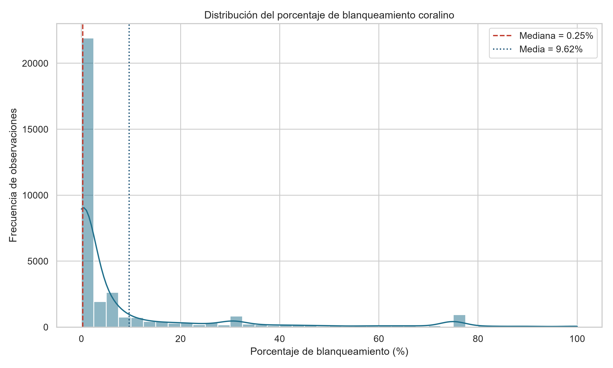

***Figura 6.1.*** *Distribución de la variable `Percent_Bleaching` sobre las 34 515 observaciones depuradas. La asimetría positiva refleja un régimen basal de estabilidad interrumpido por episodios agudos de estrés térmico.*

La mediana de 0,250 % frente a una media de 9,619 % indica que la mayoría de los muestreos
corresponden a arrecifes sin afectación apreciable, mientras que una minoría de registros alcanza
valores extremos próximos al 100 %. Este perfil es ecológicamente esperable y refleja la dinámica
característica del blanqueamiento coralino descrita por Hoegh-Guldberg (1999): un régimen basal de
estabilidad interrumpido por episodios agudos de estrés térmico asociados a olas de calor marinas.
El percentil 90 se sitúa en 33,300 %, de modo que aproximadamente uno de cada diez muestreos
documenta un evento masivo.

### 6.1.3. Relaciones entre variables térmicas y blanqueamiento

El análisis de correlación de Pearson entre los predictores numéricos oficiales y la variable de
respuesta muestra un gradiente, no un empate en la debilidad:

| Variable | r con `Percent_Bleaching` | Intensidad |
|---|---|---|
| `TSA_DHW` | 0,228 | Débil positiva (la más alta) |
| `Depth_m` | 0,165 | Débil positiva |
| `TSA` | 0,134 | Débil positiva |
| `SSTA` | 0,092 | Muy débil positiva |
| `Distance_to_Shore` | 0,006 | Prácticamente nula |
| `ClimSST` | −0,055 | Muy débil negativa |

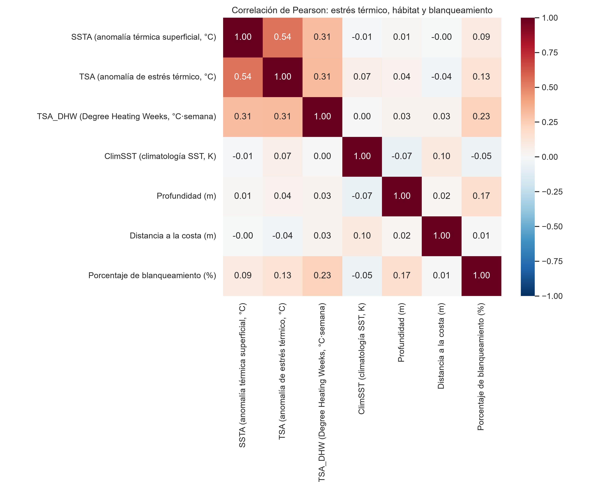

***Figura 6.2.*** *Matriz de correlación de Pearson entre los seis predictores numéricos oficiales y `Percent_Bleaching`. `TSA_DHW` encabeza la asociación con la respuesta (r = 0,228 listwise; 0,272 bivariante). Entre `SSTA` y `TSA` se mantiene r = 0,543.*

Los coeficientes de la tabla y de la Figura 6.2 son listwise sobre los seis predictores numéricos
oficiales. En correlación bivariante (solo pares completos) `TSA_DHW`–`Percent_Bleaching`
alcanza r = 0,272, la cifra que reporta la ablación del apartado 5.4.4. En ambos cálculos el
estrés acumulado duplica a `TSA` (0,134) y es el único índice térmico que supera a la
profundidad. Esa es la justificación empírica de meter `TSA_DHW` en el modelo principal, no
un apéndice.

La asociación de la profundidad no es un efecto ecológico misterioso. La correlación bruta
`Depth_m`–`Percent_Bleaching` es $r = 0{,}166$ en bivariante y $0{,}165$ en la matriz; dentro de
Reef_Check cae a $0{,}011$; residualizando ambas variables respecto a `Data_Source`, $r = 0{,}039`.
Reef_Check muestrea de rutina, en aguas someras (media 6,5 m) y con un 2,11 % de episodios
severos. Donner muestrea eventos, un poco más profundo (9,8 m) y con un 35 % de blanqueamiento
medio. La asociación agregada recoge la diferencia **entre protocolos** —una manifestación de la
paradoja de Simpson— y no un efecto de la profundidad dentro de ellos. En consecuencia, la
contribución SHAP de `Depth_m` documentada en el apartado 6.6 no admite lectura ecológica
directa: la variable opera en gran medida como indicador del programa de procedencia.

Merece destacarse la correlación de **0,543 entre `SSTA` y `TSA`**, previsible a partir de la
identidad algebraica establecida en el apartado 4.1.3: ambos descriptores se derivan del mismo campo
de temperatura superficial mediante los algoritmos de Liu et al. (2014) y difieren únicamente en el
término $ClimSST_{s,d} - MMM_s$, dependiente de la época del año. `TSA_DHW` correlaciona 0,312
con `SSTA` y 0,314 con `TSA`: comparte familia, no es un duplicado de la anomalía puntual. Esta
colinealidad resultará determinante en la interpretación del análisis de interpretabilidad
(apartado 6.6).

El diagrama de dispersión con ajuste lineal entre `SSTA` y `Percent_Bleaching` (Figura 6.3)
confirma una pendiente positiva, coherente con el mecanismo de estrés térmico, si bien de escasa
magnitud. La nube de puntos presenta heterocedasticidad manifiesta y bandas horizontales en los
valores 0 %, 30 %, 75 % y 100 %, atribuibles a protocolos de campo que registran la afectación
mediante umbrales discretos en lugar de mediciones continuas.

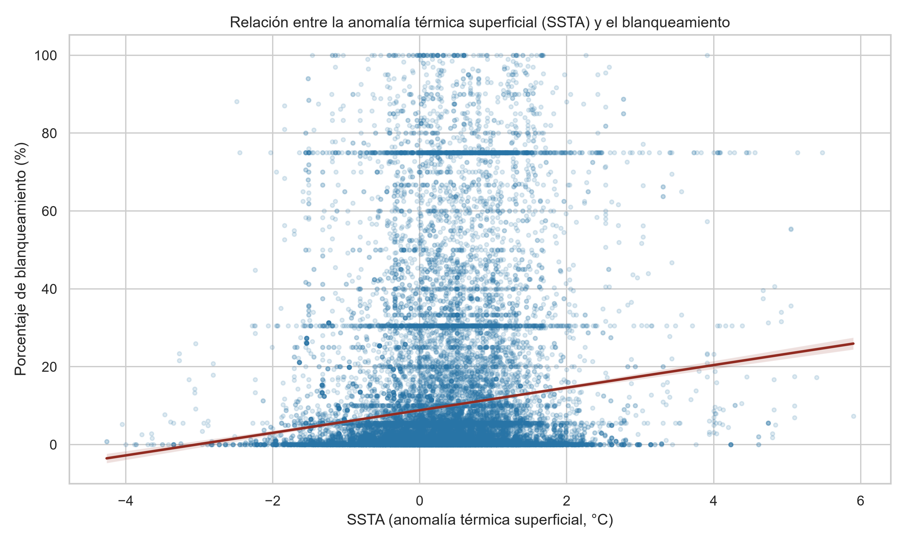

***Figura 6.3.*** *Relación entre la anomalía térmica superficial (`SSTA`) y el porcentaje de blanqueamiento, con ajuste lineal. Las bandas horizontales evidencian protocolos de campo con registro por umbrales discretos.*

Las anomalías puntuales (`SSTA`, `TSA`) son linealmente débiles; el estrés acumulado no lo es
en la misma medida. Esa asimetría admite dos lecturas complementarias. Por una parte, el
blanqueamiento responde a la integral del calor, no al instante (apartado 4.1.4). Por otra,
incluso r = 0,228 deja la mayor parte de la varianza fuera de cualquier recta, de modo que
siguen haciendo falta umbrales e interacciones —y, con ellos, algoritmos no lineales— sin
confundir «no lineal» con «ningún predictor lineal útil».

Conviene retener este resultado frente a las métricas de clasificación del apartado 6.3: el
predictor lineal más asociado a la respuesta es `TSA_DHW` ($r = 0{,}228$ listwise; $0{,}272$
bivariante), no `Depth_m`.

### 6.1.4. Autocorrelación espacial de la respuesta y de los predictores

El índice de Moran del apartado 4.5.1, calculado sobre los centroides de 11 068 emplazamientos con
$k = 8$ vecinos más próximos y 999 permutaciones, confirma que la dependencia espacial no es una
hipótesis de trabajo sino una propiedad medida:

| Variable | n emplazamientos | I de Moran | p |
|---|---|---|---|
| Blanqueamiento observado (%) | 11 068 | 0,371 | 0,001 |
| Anomalía de estrés térmico (`TSA`) | 11 047 | 0,330 | 0,001 |
| Anomalía de temperatura (`SSTA`) | 11 047 | 0,279 | 0,001 |
| Estrés térmico acumulado (`TSA_DHW`) | 11 047 | 0,528 | 0,001 |
| Climatología (`ClimSST`) | 11 058 | 0,543 | 0,001 |
| Profundidad (`Depth_m`) | 9 586 | 0,456 | 0,001 |

*Fuente: elaboración propia.*

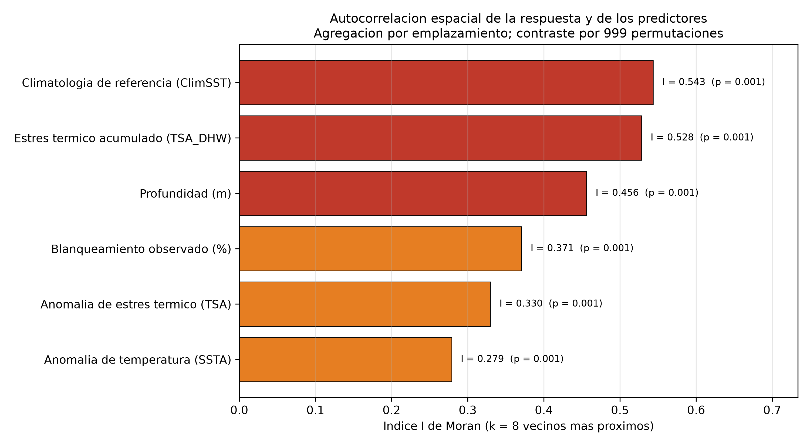

***Figura 6.4.*** *Índice I de Moran sobre centroides de emplazamiento (k = 8 vecinos). Los predictores térmicos, en particular `TSA_DHW`, están más agrupados espacialmente que el blanqueamiento observado.*

El resultado de mayor relevancia metodológica es la **ordenación**. `TSA_DHW` ($I = 0{,}528$) y
`ClimSST` ($I = 0{,}543$) están más agrupados que el propio blanqueamiento ($I = 0{,}371$). Los
índices térmicos portan estructura espacial suficiente para que un algoritmo con capacidad de
memorización identifique la región de procedencia. No existe, en consecuencia, un subconjunto de
predictores espacialmente neutro: esa es la razón por la que la ablación de profundidad, distancia
y climatología no mata la brecha entre validación aleatoria y agrupada.

## 6.2. Preparación de los datos y partición

La discretización de la variable de respuesta en tres niveles de severidad produjo una distribución
marcadamente desbalanceada, que la estratificación preservó con notable fidelidad en ambas
particiones:

| Clase | Conjunto completo | Entrenamiento | Prueba |
|---|---|---|---|
| Bajo | 78,93 % | 78,93 % | 78,94 % |
| Moderado | 8,64 % | 8,64 % | 8,63 % |
| Severo | 12,42 % | 12,42 % | 12,43 % |
| **Total** | **34 515** | **27 612** | **6 903** |

La concordancia entre las tres columnas confirma la correcta aplicación del muestreo estratificado.
El desbalanceo resultante —con la clase mayoritaria concentrando cerca del 79 % de los registros—
determinó la adopción del F1-Score macro como criterio principal de evaluación, conforme al
argumento desarrollado en el apartado 4.4.2.

## 6.3. Comparativa de modelos y la regla de Coral Reef Watch

### 6.3.1. Lo que la validación aleatoria haría creer

Los cuatro algoritmos de una comparativa **histórica** —partición aleatoria estratificada, Random
Forest sin tope de profundidad y **sin** `TSA_DHW`— arrojaron los resultados siguientes. No es el
sistema recomendado: las matrices de confusión de aquel ejercicio no se reproducen en el cuerpo,
porque describirían otro modelo. LightGBM entra solo en esta tabla, con hiperparámetros por
defecto, y no se reentrena bajo validación agrupada.

| Modelo | Accuracy | Precision (Macro) | Recall (Macro) | F1-Score (Macro) | ROC-AUC (OvR ponderado) |
|---|---|---|---|---|---|
| **Random Forest (sin tope, sin DHW)** | **0,8763** | **0,7364** | **0,7588** | **0,7464** | **0,9430** |
| XGBoost (GridSearchCV) | 0,7944 | 0,6224 | 0,7370 | 0,6585 | 0,9001 |
| LightGBM | 0,8250 | 0,6962 | 0,4919 | 0,5364 | 0,8810 |
| Regresión Logística | 0,5456 | 0,4126 | 0,4682 | 0,3893 | 0,6992 |

Random Forest obtuvo el mejor rendimiento en todas las métricas de esta tabla, con un F1-Score
macro de 0,7464. El ROC-AUC de 0,9430 **no se comunica como resultado principal**: Saito y
Rehmsmeier (2015) muestran que, con una prevalencia de 0,124, esa curva transmite una impresión
excesivamente optimista. El desglose por clases confirma la cautela:

| Modelo | Recall «Severo» | Recall «Moderado» | Recall «Bajo» |
|---|---|---|---|
| Random Forest | 0,68 | 0,67 | 0,93 |
| XGBoost | 0,69 | 0,70 | 0,82 |
| LightGBM | 0,34 | 0,16 | 0,97 |
| Regresión Logística | 0,24 | 0,57 | 0,59 |

LightGBM alcanza una exactitud del 82,50 % recuperando únicamente el 34 % de los eventos severos.
Un lector que detuviera aquí la lectura concluiría que el bosque libre constituye el modelo de
elección. Los apartados siguientes muestran que esa conclusión no sobrevive ni a un emplazamiento
nuevo, ni a una cuenca nueva, ni a una temporada futura, ni a la inclusión de `TSA_DHW`.

### 6.3.2. El competidor honesto: Coral Reef Watch

Todo modelo de alerta debe justificarse frente al procedimiento que las agencias ya emplean.
Interpretada como clasificador binario de la clase «Severo», la regla de Coral Reef Watch no
requiere entrenamiento:

| Regla | Alertas emitidas | Sobre el total | Recall | Precisión | F1 de la clase severa |
|---|---|---|---|---|---|
| DHW ≥ 4 °C·semana | 3 401 | 9,85 % | 0,3379 | 0,4261 | 0,3769 |
| DHW ≥ 8 °C·semana | 945 | 2,74 % | 0,1031 | 0,4677 | 0,1689 |

*Fuente: elaboración propia.*

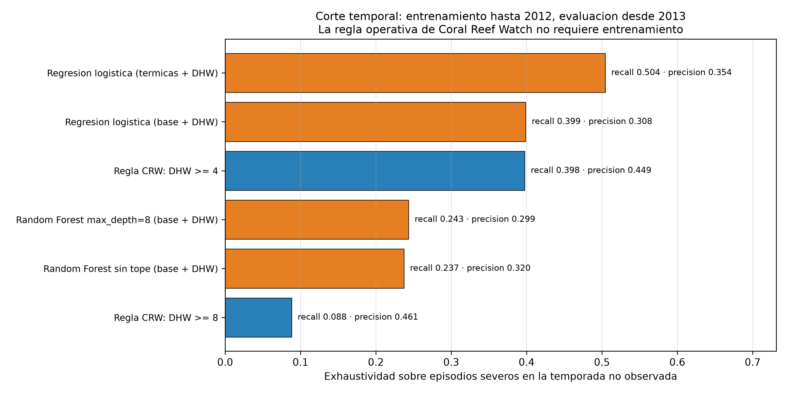

***Figura 6.5.*** *Detección de episodios severos: regla de Coral Reef Watch (DHW ≥ 4 °C·semana) frente a regresión logística y Random Forest en el corte temporal 2013–2020.*

El umbral de 4 °C·semana recupera el **33,8 %** de los episodios severos con una precisión de 0,43,
emitiendo alerta sobre el 9,9 % de las observaciones. Esa es la línea de base operativa. Cualquier
clasificador que no la supere de forma clara, en el escenario de aplicación pertinente, no justifica
su despliegue como sistema de alerta.

## 6.4. Transferibilidad espacial: de Reef_Check al conjunto completo

### 6.4.1. El 2,11 % de severos no es un detalle: `Reef_ID` es Reef_Check

La validación agrupada de la versión anterior de este trabajo se restringía a la submuestra con
`Reef_ID` informado: 22 531 observaciones, 2,11 % de episodios severos frente al 12,42 % del
conjunto completo. Esa asimetría no es un artefacto de muestreo. `Reef_ID` está informado **solo**
en Reef_Check. Donner (51,9 % de severos), McClanahan (77,4 %), FRRP, Kumagai y el resto de
programas —precisamente los que concentran los eventos masivos— quedan íntegramente fuera.

| Programa (`Data_Source`) | n | Severo (%) | Blanqueamiento medio (%) | `Reef_ID` informado (%) |
|---|---|---|---|---|
| Reef_Check | 22 531 | 2,11 | 2,53 | 100,0 |
| Donner | 5 770 | 51,89 | 35,05 | 0,0 |
| AGRRA | 2 848 | 0,74 | 3,31 | 0,0 |
| FRRP | 2 394 | 14,41 | 15,31 | 0,0 |
| Kumagai | 660 | 38,03 | 17,46 | 0,0 |
| McClanahan | 226 | 77,43 | 57,33 | 0,0 |

*Fuente: elaboración propia.*

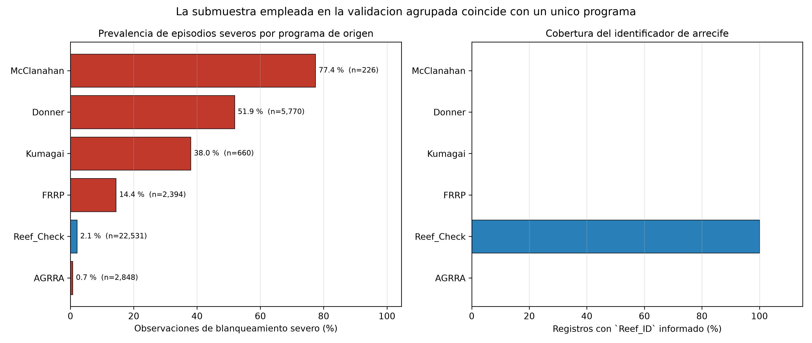

***Figura 6.6.*** *Prevalencia de episodios severos y profundidad media según el programa de origen. `Reef_ID` está informado únicamente en Reef_Check.*

La CV por `Reef_ID` mide transferencia **dentro de un programa de monitoreo rutinario**. No estima
transferencia global. La corrección es agrupar por `Site_ID` (11 068 sitios, cobertura 100 %) sobre
las 34 515 observaciones. El apartado 6.7.5 pregunta qué ocurre cuando el programa de prueba es
otro: McClanahan, Donner o el bloque de documentación de eventos.

### 6.4.2. Validación agrupada por `Site_ID` sobre el conjunto completo

`StratifiedGroupKFold` por emplazamiento, cinco pliegues, prevalencia de «Severo» 12,42 %. PR-AUC
con línea base 0,124.

| Modelo | F1 aleatoria | F1 por sitio | Δ relativa | Recall «Severo» | PR-AUC «Severo» |
|---|---|---|---|---|---|
| Logística (base) | 0,393 | 0,392 | −0,4 % | 0,266 | 0,222 |
| Logística + DHW | 0,451 | 0,449 | −0,5 % | 0,386 | 0,345 |
| Logística térmica + DHW | 0,456 | 0,454 | −0,4 % | 0,445 | 0,323 |
| RF `max_depth`=8 + DHW | 0,557 | 0,532 | −4,4 % | 0,559 | 0,514 |
| RF `max_depth`=16 + DHW | 0,724 | 0,603 | −16,7 % | 0,645 | 0,632 |
| RF sin tope + DHW | 0,759 | 0,612 | −19,5 % | 0,644 | 0,656 |

*Fuente: elaboración propia.*

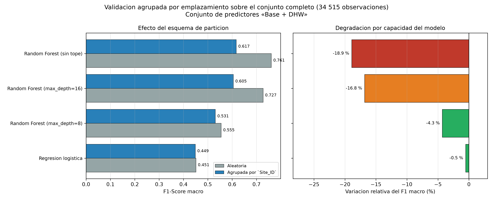

***Figura 6.7.*** *F1-Score macro bajo validación aleatoria y agrupada por `Site_ID`, según la capacidad del Random Forest y la inclusión de `TSA_DHW`.*

Tres lecturas se imponen.

**El estrés acumulado es señal transferible, no un adorno.** En CV por sitio, el recall de
«Severo» de la logística sube de 0,266 a 0,386 al incorporar `TSA_DHW`, y a **0,445** si además se
retiran profundidad, distancia y cuenca. Esa mejora se obtiene añadiendo el índice fisiológico y
quitando descriptores del emplazamiento.

**El RF libre ya no cae un 52 %: cae un 19,5 %.** La caída de F1 con la misma semilla y el mismo
DHW es −4,4 % con profundidad 8, −16,7 % con 16 y −19,5 % sin tope. Una parte grande del «colapso»
documentado al agrupar por `Reef_ID` era hiperparámetro —un bosque de profundidad ilimitada sobre
un programa de monitoreo rutinario—, no destino de los árboles.

**PR-AUC, no ROC-AUC.** Con prevalencia 0,124, la logística + DHW alcanza 0,345 y el RF de
profundidad 8 alcanza 0,514 bajo agrupación por sitio. Ambas cifras superan la línea base; ninguna
se parece al 0,943 de la partición aleatoria.

La logística térmica + DHW (recall 0,445) supera a la regla CRW de 4 °C·semana (0,338) en
detección de episodios severos sobre sitios no observados. Ese es el valor añadido espacial
medible. El apartado 6.7 pregunta si sobrevive a una cuenca nueva y a una temporada futura.

### 6.4.3. Por qué colapsa el bosque libre y por qué resiste la logística

La divergencia no es un accidente empírico. Random Forest sin tope de profundidad particiona el
espacio hasta hojas de pureza máxima (apartado 4.2.2). Acotar `max_depth` a 8 impide construir
esas hojas específicas de emplazamiento y reduce la degradación a un 4,4 %. El bosque libre se
queda, por tanto, como lo que es: una ablación de capacidad.

La regresión logística está estructuralmente impedida de memorizar. Su frontera es lineal en el
espacio de las log-probabilidades relativas. Carente de esa vía, se ve **obligada** a apoyarse en
la señal térmica, por débil que sea. De ahí que su F1 apenas se mueva al cambiar de esquema
(−0,4 %) y que su recall de «Severo» mejore al retirar el contexto del sitio.

El fenómeno sigue siendo la manifestación, en aprendizaje automático, de la pseudorreplicación de
Hurlbert (1984) y de la infraestimación del error que Roberts et al. (2017) y Ploton et al. (2020)
documentan bajo validación aleatoria. La diferencia respecto de Ploton et al. se mantiene: aquí
**sí existe señal ambiental transferible**. Su magnitud, una vez medido el I de Moran y sustituido
`Reef_ID` por `Site_ID`, es más modesta y más honesta que el −52 % de la submuestra Reef_Check.

## 6.5. Lectura crítica: capacidad, autocorrelación y protocolo

La CV por `Reef_ID` que abría este trabajo —F1 de Random Forest de 0,8981 a 0,4297, −52,2 %—
sigue siendo un resultado real. Lo que cambia es su interpretación. Ese experimento se ejecuta
sobre Reef_Check, con un 2,11 % de episodios severos, y con un bosque de profundidad ilimitada.
Sustituir la agrupación por `Site_ID` sobre el conjunto completo y acotar `max_depth` a 8 reduce
la caída a un 4,4 %. El −52 % medía, a la vez, un protocolo, un hiperparámetro y una
autocorrelación térmica que el I de Moran ahora cuantifica ($I = 0{,}528$ en `TSA_DHW` frente a
$I = 0{,}371$ en la respuesta).

La formulación de Legendre (1993) encaja sin forzarla. Hay dependencia espacial *inducida* por
variables de contexto —el tercio de brecha que la ablación suprime en Reef_Check— y autocorrelación
*en los propios campos térmicos*, que es la que sobrevive cuando solo quedan `SSTA`, `TSA` y
`TSA_DHW`. No hay subconjunto espacialmente neutro.

La logística sigue siendo el control metodológico: su F1 no se mueve al agrupar por sitio
(−0,4 %). El bosque acotado es el competidor; el bosque libre, la ablación de capacidad. El
paralelismo con Ploton et al. (2020) se mantiene en el diagnóstico —la validación aleatoria
infraestima el error— y se matiza en la magnitud: aquí queda señal transferible, y su tamaño
honesto es el recall 0,445 de la logística térmica + DHW, no el ROC-AUC 0,943.

## 6.6. Interpretabilidad mediante valores SHAP

### 6.6.1. Importancia global de los predictores

El análisis SHAP (Lundberg y Lee, 2017) se aplica al clasificador que el resto del capítulo
recomienda: Random Forest con `n_estimators` = 200, `max_depth` = 8 y `class_weight='balanced'`,
predictores `SSTA`, `TSA`, `TSA_DHW`, `Depth_m`, `Distance_to_Shore`, `ClimSST` y `Ocean_Name`.
El conjunto de explicación es el pliegue de prueba de un `StratifiedGroupKFold` por `Site_ID`:
6 903 observaciones, 2 238 emplazamientos, **cero** sitios compartidos con el entrenamiento.
TreeSHAP exacto; la profundidad 8 hace innecesario sustituir el bosque por XGBoost.

| Variable | Bajo | Moderado | Severo | Media global |
|---|---|---|---|---|
| `TSA_DHW` | 0,0894 | 0,0197 | 0,0997 | **0,0696** |
| `Ocean_Name_Atlantic` | 0,0849 | 0,0666 | 0,0213 | 0,0576 |
| `Distance_to_Shore` | 0,0420 | 0,0294 | 0,0258 | 0,0324 |
| `Ocean_Name_Pacific` | 0,0421 | 0,0262 | 0,0185 | 0,0289 |
| `Depth_m` | 0,0328 | 0,0146 | 0,0339 | 0,0271 |
| `ClimSST` | 0,0293 | 0,0149 | 0,0262 | 0,0235 |
| `TSA` | 0,0308 | 0,0186 | 0,0163 | 0,0219 |
| `SSTA` | 0,0110 | 0,0073 | 0,0085 | 0,0089 |

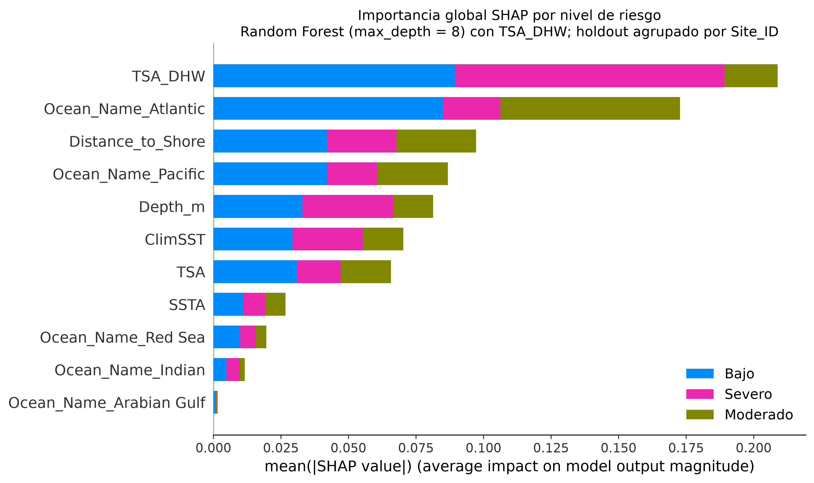

***Figura 6.8.*** *Importancia global SHAP del Random Forest recomendado (`max_depth` = 8, con `TSA_DHW`) sobre un holdout agrupado por `Site_ID`.*

`TSA_DHW` se erige como el predictor de mayor peso global y, de forma más marcada, de la clase
«Severo» (0,0997). El resultado es el que la fisiología y el protocolo operativo hacían esperar:
es el índice de estrés acumulado que Coral Reef Watch emplea como umbral de alerta (Liu et al.,
2014; apartado 4.1.4). `TSA` y `SSTA` conservan signo térmico, pero una fracción sustancial de
la señal puntual queda absorbida por el acumulado. `Ocean_Name_Atlantic` sigue siendo el segundo
predictor global, con peso concentrado en «Bajo» y «Moderado»; sobre «Severo» su contribución es
casi cuatro veces menor.

### 6.6.2. Dirección de los efectos

| Variable | Efecto medio \|SHAP\| | Correlación valor–SHAP | Dirección |
|---|---|---|---|
| `TSA_DHW` | 0,0997 | **0,6671** | Incrementa la probabilidad de clase severa |
| `Depth_m` | 0,0339 | 0,2275 | Incrementa la probabilidad de clase severa |
| `ClimSST` | 0,0262 | −0,4124 | Reduce la probabilidad de clase severa |
| `Distance_to_Shore` | 0,0258 | 0,1427 | No monótona |
| `TSA` | 0,0163 | 0,7934 | Incrementa la probabilidad de clase severa |
| `SSTA` | 0,0085 | 0,7882 | Incrementa la probabilidad de clase severa |

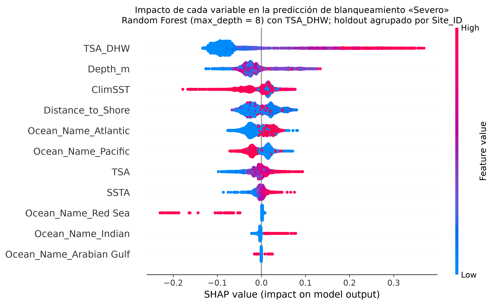

***Figura 6.9.*** *Diagrama SHAP de resumen para la clase «Severo» del Random Forest de profundidad 8. El color codifica el valor estandarizado; `TSA_DHW` encabeza la contribución.*

`TSA_DHW` presenta una relación positiva consistente (correlación de 0,6671 entre el valor
estandarizado y su contribución SHAP): más semanas de calor por encima del umbral desplazan la
predicción hacia el blanqueamiento severo. `TSA` y `SSTA` apuntan en la misma dirección, con
correlaciones aún más altas (0,7934 y 0,7882) y una magnitud media mucho menor. El bloque
térmico, leído en conjunto, reproduce la cadena de Hoegh-Guldberg (1999) —superación del umbral,
fotoinhibición del fotosistema II, especies reactivas de oxígeno, expulsión de los simbiontes—
sin la inversión de signo que el análisis anterior atribuía a `SSTA` cuando el modelo explicado
era un XGBoost sin DHW.

### 6.6.3. Colinealidad del bloque térmico: SSTA, TSA y DHW

`SSTA`, `TSA` y `TSA_DHW` son transformaciones del mismo campo de temperatura superficial
(Liu et al., 2014). La colinealidad `SSTA`–`TSA` ($r = 0{,}543$, apartado 4.1.3) se extiende al
acumulado, que integra `TSA` a lo largo de doce semanas. Como se advirtió en el apartado 4.3.3,
el reparto SHAP entre predictores correlacionados **no es identificable de forma unívoca**: los
valores de Shapley satisfacen la precisión local sobre la suma, pero distribuyen la contribución
conjunta conforme a los árboles ajustados.

En este bosque, `TSA_DHW` absorbe la mayor parte de esa contribución conjunta: su efecto medio
sobre «Severo» es seis veces el de `TSA` y once veces el de `SSTA`. Las tres correlaciones
valor–SHAP son positivas. No hay, por tanto, un coeficiente que pueda citarse como evidencia de
que el calentamiento reduzca el blanqueamiento. El artefacto de signo que Aas et al. (2021)
asocian a la integración marginal de variables colineales **sí aparecía** cuando se explicaba un
XGBoost sin DHW sobre la partición aleatoria; al explicar el competidor oficial, el bloque
térmico queda alineado con la física del sistema. El reparto interno entre las tres variables
sigue sin ser único; el signo del bloque, no.

### 6.6.4. El efecto protector de ClimSST

`ClimSST` presenta dirección negativa (correlación de −0,4124): los arrecifes situados en aguas
con un régimen térmico basal más cálido reciben menor probabilidad predicha de blanqueamiento
severo. A diferencia del reparto interno del bloque térmico, esta relación admite una
interpretación biológica respaldada por la literatura.

Las comunidades coralinas adaptadas a regímenes históricamente cálidos presentan **umbrales de
blanqueamiento más elevados**, resultado tanto de la selección de genotipos termotolerantes de
zooxantelas como de procesos de aclimatación fisiológica del hospedador. Una misma anomalía
térmica genera, por tanto, un estrés efectivo menor en dichas comunidades.

La convergencia con Sully et al. (2019) se mantiene **en el signo**: aquellos autores, sobre
Reef Check 1998–2017 (no sobre las 34 515 filas de este extracto) y con un modelo jerárquico
bayesiano, documentaron menor frecuencia de blanqueamiento en localidades de elevada varianza
térmica y un desplazamiento al alza del umbral de unos 0,5 °C entre 1998–2006 y 2007–2017
(Weibull de su Figura 4: 28,1 °C a 28,7 °C). El signo negativo de `ClimSST` es la expresión,
en este Random Forest, de un fenómeno de tolerancia compatible con el suyo; el apartado 6.7.7
muestra que la media aritmética de este CSV no recupera esas dos cifras.

Este mecanismo justifica que los índices operativos de alerta se definan como desviaciones
respecto a la climatología local y no en temperatura absoluta (Liu et al., 2014). Sigue siendo
una hipótesis compatible con el modelo, no una relación causal. Una explicación alternativa —no
excluyente— es que `ClimSST` opere en parte como sustituto de la identidad geográfica.

### 6.6.5. Estrés térmico frente a identidad del emplazamiento

La agrupación de los predictores según su naturaleza ecológica, ahora **con** `TSA_DHW` y sobre
el holdout por `Site_ID`, invierte el diagnóstico que se obtenía al explicar un XGBoost sin DHW:

| Grupo de variables | Contribución SHAP acumulada | Peso relativo |
|---|---|---|
| Estrés térmico (`SSTA`, `TSA`, `TSA_DHW`) | 0,1004 | 35,8 % |
| Contexto del emplazamiento (`Depth_m`, `Distance_to_Shore`, `ClimSST`) | 0,0830 | 29,5 % |
| Cuenca (`Ocean_Name`) | 0,0975 | 34,7 % |

El bloque térmico supera al contexto estático (35,8 % frente a 29,5 %; razón contexto/térmicas
de 0,83). Las dummies de cuenca acumulan otro tercio. El modelo recomendado se apoya, por tanto,
tanto en el estrés acumulado como en la identidad biogeográfica; ya no es cierto que el contexto
del sitio pese 1,64 veces más que las térmicas. Esa proporción era un artefacto de explicar otro
clasificador.

**Precisión necesaria sobre la lectura de estas cifras.** Los porcentajes miden la magnitud
agregada de las atribuciones de **este** bosque bajo una agrupación concreta. No son la fracción
del blanqueamiento atribuible a cada factor. Un valor SHAP cuantifica cuánto se apoya un modelo
ya ajustado en una variable, no cuánta varianza del fenómeno biológico depende de ella.

`Depth_m` deja de ser la variable dominante de «Severo» (ahora 0,0339, lejos de `TSA_DHW`).
Su correlación valor–SHAP es positiva (0,2275), pero el apartado 6.1.3 sigue cerrando la
lectura ecológica: $r$ bruta 0,166, $r = 0{,}011$ dentro de Reef_Check, $r$ parcial 0,039
residualizando respecto a `Data_Source`. El bosque usa la profundidad, en buena medida, como
indicador de programa.

`Ocean_Name_Atlantic` conserva el patrón de cuenca: peso alto en «Bajo» (0,0849) y «Moderado»
(0,0666) y bajo en «Severo» (0,0213). En el periodo cubierto el Atlántico concentra menos
eventos masivos que el Pacífico y el Índico (apartado 6.7.1); la dummy opera como sustituto de
un régimen de prevalencia. El *leave-one-ocean-out* no es un conjunto externo: sigue siendo
Sully et al. (2019) con una cuenca retenida.

La objeción de circularidad —explicar el esquema inflado— queda acotada de dos modos. Primero,
el cálculo principal ya se hace sobre emplazamientos disjuntos. Segundo, el mismo bosque
explicado sobre un pliegue aleatorio deja una razón contexto/térmicas de 0,78 frente a 0,83 en
el holdout por `Site_ID` (Figura 6.10). `TSA_DHW` encabeza ambas jerarquías (variación −2,2 %).
La estructura no es un artefacto de la partición aleatoria.

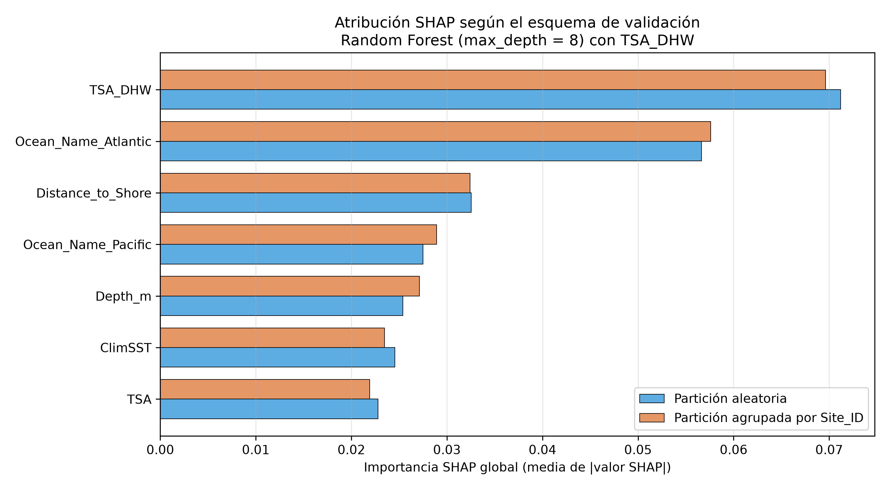

***Figura 6.10.*** *Importancia SHAP global del Random Forest de profundidad 8 con `TSA_DHW`, bajo partición aleatoria y bajo partición agrupada por `Site_ID`. `TSA_DHW` encabeza ambas.*

La lectura defendible es, por tanto, más estrecha que la de un XGBoost sin DHW: el competidor
oficial **sí** se apoya en el estrés acumulado, y al mismo tiempo reserva un tercio de la
atribución a la cuenca. Esa segunda parte es coherente con el 0 % de soporte atlántico del
apartado 6.7.6. Ninguna de las dos lecturas sustituye, por sí sola, un conjunto ajeno a
BCO-DMO; ese holdout se presenta en el apartado 6.7.10.

## 6.7. Bloqueo geográfico, temporada futura y la regla de Coral Reef Watch

El apartado 6.4 mide transferencia entre *sitios* del mismo contexto biogeográfico. Un gestor
que lea únicamente esa cifra puede interpretar que el modelo «funciona en arrecifes nuevos». La
salvedad es crucial: son sitios no observados, no cuencas no observadas, y no temporadas que aún
no han ocurrido.

### 6.7.1. Leave-one-ocean-out y validación por ecorregión

El bloqueo geográfico permanece **dentro** de la síntesis de Sully et al. (2019): se retiene una
cuenca o una ecorregión como prueba y se entrena con el resto del mismo corpus. No es un
conjunto independiente, ni una AMP que no figure en BCO-DMO. Sobre ese diseño, Random Forest con
`max_depth` = 8 alcanza, al dejar fuera una cuenca completa, un F1-macro de **0,456** y un recall
de «Severo» de **0,612**. Esa es la cifra de cuenca nueva *dentro de Sully*, no de validación
externa.

| Modelo | Bloqueo | F1 macro | Recall «Severo» | PR-AUC «Severo» |
|---|---|---|---|---|
| Logística térmica + DHW | Leave-one-ocean-out | 0,415 | 0,527 | 0,386 |
| Logística térmica + DHW | Ecorregión (5 pliegues) | 0,446 | 0,469 | 0,351 |
| RF profundidad 8 + DHW | Leave-one-ocean-out | 0,456 | 0,612 | 0,334 |
| RF profundidad 8 + DHW | Ecorregión (5 pliegues) | 0,428 | 0,507 | 0,358 |

*Fuente: elaboración propia. El detalle por cuenca se comenta en el texto.*

El detalle por cuenca del bosque acotado muestra heterogeneidad biogeográfica, no un rendimiento
uniforme: el Atlántico (13 319 observaciones, 18,0 % de severos) rinde un recall de 0,417; el
Índico, 0,662; el Pacífico, 0,573. El Mar Rojo, con un 0,57 % de severos, produce un F1 de 0,300
pese a un recall alto sobre una clase casi vacía. Esa dispersión es exactamente el síntoma que
Meyer y Pebesma (2021) formalizan como **área de aplicabilidad**: el error estimado no es una
cifra única, sino una función de la disimilitud del punto de predicción respecto del soporte de
entrenamiento. Un arrecife del Golfo Pérsico no es intercambiable con uno del Atlántico; comunicar
un único F1 de 0,456 a un gestor oculta esa heterogeneidad. El apartado 6.7.6 sustituye esa cifra
única por el índice de disimilitud de Meyer y Pebesma (2021).

### 6.7.2. Corte temporal: la temporada que aún no ha ocurrido

Se entrena con 1980–2012 (24 109 observaciones, 14,45 % de severos) y se evalúa sobre 2013–2020
(10 406 observaciones, 7,74 % de severos).

| Método | Entrenamiento | Recall | Precisión | F1 severa | Alertas |
|---|---|---|---|---|---|
| Regla CRW: DHW ≥ 4 | No requiere | 0,3975 | 0,4494 | 0,4219 | 6,8 % |
| Regresión logística (térmicas + DHW) | 1980–2012 | 0,5043 | 0,3540 | 0,4160 | 11,0 % |
| Regresión logística (base + DHW) | 1980–2012 | 0,3988 | 0,3078 | 0,3474 | 10,0 % |
| Random Forest `max_depth`=8 (base + DHW) | 1980–2012 | 0,2435 | 0,2988 | 0,2683 | 6,3 % |

*Fuente: elaboración propia.*

Medido sobre el **F1 de la clase severa**, la regla de 4 °C·semana (0,422) y la logística térmica
+ DHW (0,416) son indistinguibles. El bosque, no: recall 0,243. Para «alerta temprana» el
competidor honesto no es Random Forest, es esa regla.

La equivalencia en F1 encubre un intercambio. La logística recupera más episodios (0,504 frente a
0,398) a costa de menos precisión (0,354 frente a 0,449) y del doble de alertas. Si el gestor
prioriza no omitir eventos, el modelo aporta valor; si prioriza no movilizar recursos en falso,
la regla resulta preferible. La estadística no dirime esa elección.

Hughes et al. (2018) documentan que la frecuencia de blanqueamiento masivo se ha incrementado en
el intervalo cubierto por el conjunto; Sully et al. (2019) hallan un desplazamiento al alza del
umbral. El corte temporal no demuestra que el umbral se haya movido —la prevalencia de prueba
cae al 7,74 %, no sube—, pero sí que **el año que aún no ha ocurrido no premia al modelo de
conjunto**. NOAA no pierde frente a estos clasificadores.

### 6.7.3. Sensibilidad a los umbrales de discretización

El contraste con tres alternativas sobre la submuestra Reef_Check —el experimento más adverso—
reproduce el signo del fenómeno: el bosque libre se degrada en torno al 50 % y la logística no.
La magnitud absoluta de las métricas cambia con la prevalencia; el diagnóstico, no. La elección
de 10 % y 30 % no es un supuesto del que dependan las conclusiones.

### 6.7.4. Calibración de P(Severo)

Discriminar no basta. Un gestor que lea «probabilidad 0,70 de episodio severo» necesita saber si
ese 0,70 ocurre cerca del 70 % de las veces. El índice de Brier y el diagrama de fiabilidad se
calcularon sobre P(Severo) en dos escenarios: probabilidades fuera de pliegue de la CV por
`Site_ID` y el corte temporal 2013–2020. La regla CRW entra como clasificador duro (0 o 1).

| Modelo | Brier (sitio) | ECE (sitio) | Brier (2013–2020) | ECE (2013–2020) | Recall argmax (2013–2020) |
|---|---|---|---|---|---|
| Logística térmica + DHW | 0,132 | 0,182 | 0,115 | 0,231 | 0,504 |
| RF profundidad 8 + DHW | 0,099 | 0,130 | 0,084 | 0,126 | 0,243 |
| RF profundidad 8 + isotónica | — | — | 0,068 | 0,024 | 0,037 |
| Regla CRW DHW ≥ 4 | 0,139 | 0,139 | 0,084 | 0,051 | 0,398 |

*Fuente: elaboración propia. La isotónica se ajusta solo sobre el entrenamiento.*

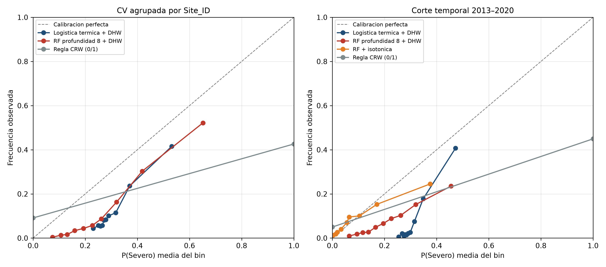

***Figura 6.11.*** *Diagrama de fiabilidad de P(Severo) bajo CV agrupada por Site_ID y bajo el corte temporal 2013–2020. La isotónica se ajusta solo sobre el entrenamiento.*

Tres lecturas. Primera: en CV por sitio el bosque está **mejor calibrado** que la logística (Brier
0,099 frente a 0,132) y que la regla (0,139). La logística, con P media 0,307 frente a una
prevalencia de 0,124, sobrepredice «Severo». Segunda: en el corte temporal el Brier del bosque
(0,084) y el de la regla (0,084) empatan; el ECE de NOAA (0,051) es el más bajo de los
clasificadores no recalibrados. Tercera: la isotónica mejora Brier (0,068) y ECE (0,024) y hunde
el recall a 0,037. Tras calibrar, las probabilidades se contraen hacia la prevalencia de prueba
(7,74 %) y el umbral 0,5 deja de disparar. **Calibrar sin reelegir el umbral operativo no es un
sistema de alerta.** Por eso 7.2.3 sigue siendo una función de coste del gestor, no un 0,5
mágico. La isotónica no sustituye las cifras de F1 del apartado 6.7.2.

### 6.7.5. Leave-one-program-out: el protocolo, no el océano

El experimento retiene un programa (n ≥ 200) como prueba y entrena con el resto. Sigue siendo
Sully et al. (2019). Lo que cambia es el **proceso de etiquetado**.

| Programa | n | Severo (%) | P media (RF-8) | Recall (RF-8) | Brier (RF-8) |
|---|---|---|---|---|---|
| Reef_Check | 22 531 | 2,1 | 0,442 | 0,459 | 0,217 |
| AGRRA | 2 848 | 0,7 | 0,295 | 0,000 | 0,099 |
| FRRP | 2 394 | 14,4 | 0,396 | 0,429 | 0,177 |
| Kumagai | 660 | 38,0 | 0,209 | 0,127 | 0,225 |
| Donner | 5 770 | 51,9 | 0,311 | 0,280 | 0,297 |
| McClanahan | 226 | 77,4 | 0,402 | 0,411 | 0,319 |

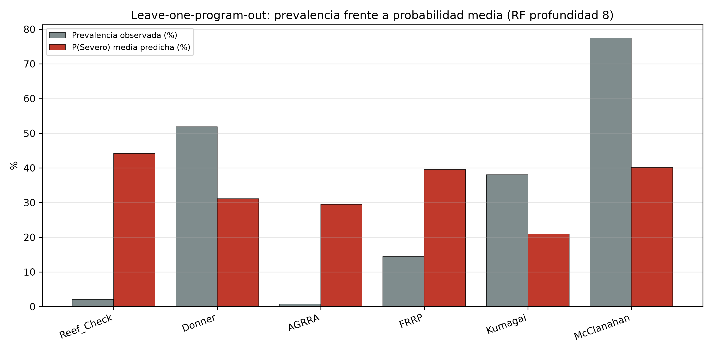

***Figura 6.12.*** *Leave-one-program-out del Random Forest de profundidad 8: prevalencia observada frente a probabilidad media predicha. El desfase mide el sesgo de protocolo, no un océano nuevo.*

McClanahan no es un océano nuevo: es un programa que documenta eventos (77,4 % de severos). El
bosque predice de media 0,402. Donner: 51,9 % observado, 0,311 predicho. A la inversa, sobre
Reef_Check (2,1 % de severos) el mismo bosque predice 0,442. El modelo no «falla en McClanahan»
como si fuera un arrecife atípico; **arrasa la prevalencia del protocolo con la del otro**.

El contraste rutinario → evento lo deja en una sola línea. Se entrena con Reef_Check + AGRRA
(25 379 observaciones, 1,95 % de severos) y se evalúa en Donner + McClanahan + Kumagai (6 656
observaciones, 51,4 % de severos). La logística térmica + DHW predice de media 0,379; el bosque,
0,290. Recall 0,278 y 0,164. Un gestor que desplegara el modelo entrenado en monitoreo rutinario
sobre campañas de evento recibiría una probabilidad anclada al 2 %, no al 50 %. Eso es más
informativo que el ocean-out para la pregunta que el apartado 6.4.1 había dejado abierta.

### 6.7.6. Área de aplicabilidad sobre el ocean-out

El F1 0,456 de cuenca nueva resume cinco océanos **del mismo corpus**. Meyer y Pebesma (2021)
exigen otra pregunta: para **este** arrecife, ¿la predicción cae dentro del soporte de
entrenamiento? El DI se calculó en el espacio de los seis predictores numéricos, estandarizados
y ponderados por la media |SHAP| del Random Forest de profundidad 8 de esa cuenca —TreeSHAP,
no la impureza Gini que el apartado 4.3.2 declara inconsistente—, dejando fuera una cuenca cada
vez.

| Cuenca | n | Dentro del AOA (%) | Recall dentro | Recall fuera | Brier dentro | Brier fuera |
|---|---|---|---|---|---|---|
| Pacífico | 17 446 | 69,3 | 0,194 | 0,544 | 0,075 | 0,148 |
| Atlántico | 13 319 | 0,0 | n/d | 0,302 | n/d | 0,139 |
| Índico | 2 327 | 22,9 | 0,116 | 0,493 | 0,080 | 0,129 |
| Mar Rojo | 1 054 | 14,3 | 0,000 | 0,333 | 0,050 | 0,128 |
| Golfo Pérsico | 369 | 8,1 | 0,000 | 0,531 | 0,022 | 0,091 |

*Fuente: elaboración propia. Umbral: bigote superior del índice de disimilitud de entrenamiento. Pesos: TreeSHAP del bosque de cada cuenca.*

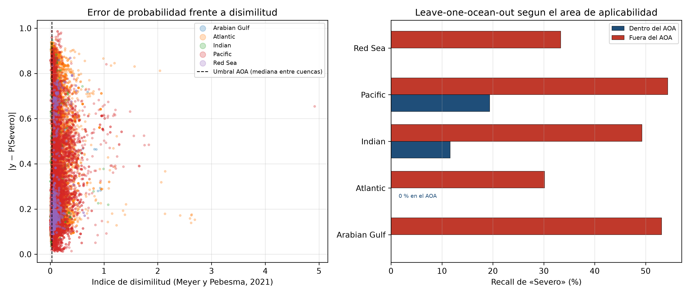

***Figura 6.13.*** *Índice de disimilitud de Meyer y Pebesma (2021) sobre el leave-one-ocean-out, ponderado por TreeSHAP del Random Forest de profundidad 8. Fuera del área de aplicabilidad el error de probabilidad aumenta; el Atlántico queda íntegramente fuera del soporte. El experimento permanece dentro de Sully et al. (2019).*

El **37,1 %** de las observaciones de prueba, ponderadas por tamaño de cuenca, cae dentro del AOA.
Cuando el Atlántico es la cuenca nueva, **ningún** punto está dentro: un gestor atlántico no
puede usar el 0,456 como estimación de error. El Pacífico es el único caso con mayoría dentro
(69,3 %). `TSA_DHW` es el predictor con mayor peso SHAP medio entre cuencas (0,073), por delante
de la distancia a la costa (0,049) y de la profundidad (0,040): el espacio de aplicabilidad se
estira sobre todo a lo largo del estrés acumulado, no de la impureza Gini.

El recall es más alto **fuera** del AOA. No es una contradicción. Fuera están los extremos
térmicos, más fáciles de etiquetar como «Severo». El Brier, que es la métrica del AOA, empeora
fuera en todas las cuencas con soporte interno (Pacífico 0,075 frente a 0,148; Índico 0,080
frente a 0,129). Dentro del área la probabilidad está anclada; fuera, el modelo sigue
detectando calor extremo y deja de estar calibrado. Comunicar un único F1 de cuenca nueva oculta
las dos cosas: el Atlántico sin soporte y el error inflado en los puntos disímiles.

### 6.7.7. Contraste empírico con Sully et al. (2019)

Sully et al. (2019) analizaron Reef Check (9 215 puntos, 3 351 emplazamientos, 1998–2017)
con un modelo jerárquico bayesiano y CoRTAD. Dos resultados anclan el capítulo 2: la SST
en episodios de blanqueamiento pasó de 28,1 °C (1998–2006) a 28,7 °C (2007–2017) —medias
de la distribución que su Figura 4 ajusta con Weibull—, y el blanqueamiento fue menos
frecuente donde la varianza térmica es alta. El presente trabajo no reajusta su modelo ni
reproduce ese Weibull. Lo que sí hace es **medir las dos magnitudes como medias
aritméticas** sobre este extracto BCO-DMO (34 515 observaciones; Reef Check 1998–2017 ya
son 20 010 puntos y 3 702 sitios, más del doble que el recorte del artículo).

| Periodo | Definición | n | SST media (°C) |
|---|---|---|---|
| 1998–2006 | Cualquier blanqueamiento | 9 081 | 28,29 |
| 1998–2006 | «Severo» | 2 955 | 28,38 |
| 2007–2017 | Cualquier blanqueamiento | 7 907 | 28,50 |
| 2007–2017 | «Severo» | 1 182 | 29,22 |
| 2018–2020 | Cualquier blanqueamiento | 710 | 28,68 |
| 2018–2020 | «Severo» | 45 | 29,83 |

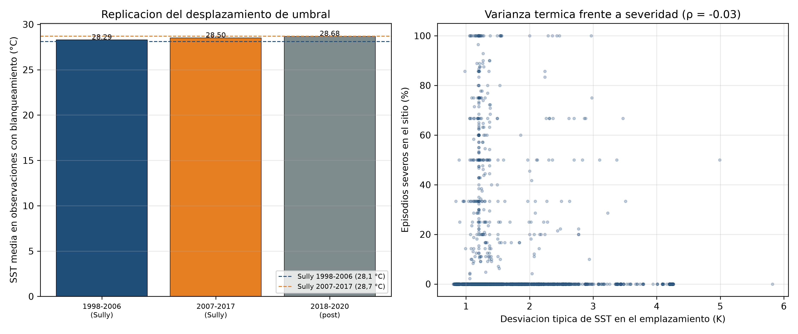

***Figura 6.14.*** *Media aritmética de SST (`Temperature_Kelvin`) en observaciones con blanqueamiento sobre este extracto BCO-DMO, no el Weibull de Sully et al. (2019); y relación emplazamiento a emplazamiento entre la desviación de SST y la proporción de episodios severos.*

El signo del desplazamiento se reproduce. La magnitud, no. Sobre todas las fuentes, la media
aritmética sube +0,21 °C en cualquier blanqueamiento (28,29 °C a 28,50 °C) frente a los
+0,6 °C de Sully; +0,84 °C si se restringe a «Severo». El umbral 10 % / 30 % **no entra**
en el cálculo de «cualquier blanqueamiento». Tampoco basta con achacarlo a Donner o
McClanahan: restringida a Reef_Check, la media es 27,82 °C (n = 2 031) y 28,12 °C
(n = 4 870), todavía +0,30 °C y por debajo de 28,1 / 28,7. La discrepancia esperable es
otra: recorte distinto (9 215 frente a 20 010 puntos Reef Check), producto SST distinto
(CoRTAD frente a `Temperature_Kelvin` de CRW) y estadístico distinto (Weibull de su
Figura 4 frente a media aritmética). En 2018–2020 la SST de los 45 episodios severos sigue
alta (29,83 °C), con n demasiado pequeño para leer un nuevo salto de umbral.

La segunda afirmación —menos blanqueamiento donde la SST varía más— se confirma **en signo y
se atenúa en magnitud**, y solo para la desviación de la SST absoluta.
`Temperature_Kelvin_Standard_Deviation` (2 972 sitios con al menos tres censos): ρ = −0,079
con el blanqueamiento medio y ρ = −0,032 con la proporción de «Severo». `ClimSST` frente a
«Severo»: ρ = −0,132. La desviación de la anomalía (`SSTA_Standard_Deviation`) correlaciona
incluso en positivo con P(Severo) (ρ = 0,272): una Spearman incondicional **no** replica el
coeficiente protector de Sully sobre la varianza de anomalías. El SHAP de `ClimSST` del
bosque oficial (apartado 6.6.4) sigue siendo el análogo a nivel de modelo. Lo que Sully
aisló con efectos aleatorios aparece aquí como correlación incondicional débil; no como una
replicación del jerárquico.

### 6.7.8. Entrenar en Caribe y Pacífico Central, evaluar el resto

Un gestor no entrena en cuatro océanos y retiene el quinto. Entrena en las redes que tiene
—el Gran Caribe, Polinesia, Hawái— y pregunta por la Gran Barrera o el Triángulo de Coral.
Ese bloqueo usa 14 628 observaciones (5 598 sitios, 16,9 % de severos) y prueba 19 887
(5 470 sitios, 9,2 % de severos). Sigue siendo Sully et al. (2019). El nombre «Caribe y
Pacífico Central» no describe un diseño equilibrado: **12 914 observaciones (88 %)** son
Tropical Atlantic / Gran Caribe y **1 714 (12 %)** son *Eastern Indo-Pacific*, de las que
1 299 caen en las islas de la Sociedad. Hawái aporta 131. Es, en la práctica, entrenar en
el Caribe con un apéndice polinesio y preguntar por el *Central Indo-Pacific* (14 843
observaciones de prueba, el 75 %). El entrenamiento mezcla Reef_Check (37 %, 3,6 % de
severos), Donner (27 %, 48 % de severos), AGRRA y FRRP; la prueba es un 86 % Reef_Check
(1,6 % de severos), con McClanahan y Kumagai enteros en el lado de prueba. Es más adverso
que el ocean-out, y no solo por geografía: también por protocolo.

| Modelo | Recall | Precisión | F1 severa | PR-AUC | Brier |
|---|---|---|---|---|---|
| Regla CRW DHW ≥ 4 | 0,439 | 0,397 | **0,417** | 0,226 | 0,113 |
| Logística térmica + DHW | 0,169 | 0,472 | 0,248 | 0,335 | 0,125 |
| RF profundidad 8 + DHW | 0,346 | 0,358 | 0,352 | 0,280 | 0,103 |

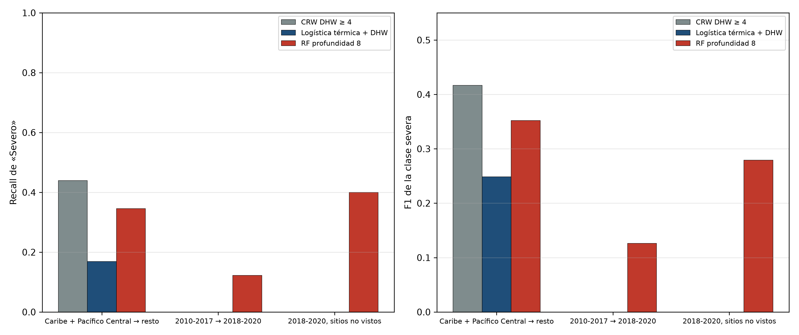

***Figura 6.15.*** *Recall y F1 de «Severo» al entrenar en el Caribe más un apéndice polinesio y al cortar 2010–2017 / 2018–2020, frente a Coral Reef Watch. El corpus interno acaba en 2020; 2018–2020 no contiene DHW ≥ 4 entre los 49 episodios severos.*

CRW gana el F1 de clase severa en el punto de operación DHW ≥ 4 / umbral 0,5. El bosque no
alcanza a la regla que no se entrena. Medido en **PR-AUC**, el orden se invierte: la
logística térmica (0,335) supera al bosque (0,280) y a CRW (0,226). La regla binaria ordena
peor que un modelo de probabilidad; gana cuando hay que emitir o no una alerta. El 72,6 %
de los puntos de prueba cae dentro del AOA de ese bosque: el soporte térmico de Caribe y
Polinesia **sí cubre** buena parte del Indo-Pacífico central. El fallo no es tanto «fuera
de mapa» como prevalencia y protocolo. Un gestor caribeño que desplegara este bosque en la
Gran Barrera estaría peor que Coral Reef Watch en F1, aun dentro del AOA; no peor en
capacidad de ranking que la logística.

### 6.7.9. 2010–2017 frente a 2018–2020

No hay 2021. El ancla honesta de «entrenar 2010–2021 y evaluar lo que sigue» es 2010–2017
(12 276 observaciones, 7,8 % de severos) contra 2018–2020 (2 521 observaciones, **1,9 %** de
severos, 49 episodios). Toda la prueba es Reef_Check. El año 2020 aporta 90 registros: el
corte es 2018 (1 243) y 2019 (1 188) más un stub. 344 de 567 sitios de prueba ya se
censaron en 2010–2017; **34 de los 49 severos** caen en esos sitios ya vistos.

| Modelo | Recall | F1 severa | PR-AUC | Brier |
|---|---|---|---|---|
| Regla CRW DHW ≥ 4 | 0,000 | 0,000 | 0,019 | 0,050 |
| Logística térmica + DHW | 0,000 | 0,000 | 0,040 | 0,077 |
| RF profundidad 8 + DHW | 0,122 | 0,126 | 0,074 | 0,040 |

CRW no dispara: ninguno de esos 49 «Severo» alcanza DHW ≥ 4 (máximo 3,26; media 1,03; 24 de
los 49 están en la plataforma de Sunda). Son censos rutinarios con el umbral 30 %, no los
eventos masivos que NOAA etiqueta. El bosque recupera 6 de 49 (recall 0,122); la logística,
cero. Sobre los 803 registros de sitios **no** vistos en 2010–2017 el bosque sube a recall
0,400 y F1 0,279 —quince etiquetas positivas: cifra inestable, no un despliegue.

La lectura conjunta con 6.7.2 es nítida. El corte 1980–2012 / 2013–2020 **sigue siendo el
test térmico más informativo**: todavía contenía eventos con DHW alto y CRW empataba a la
logística. El corte 2018–2020 no sustituye a ese experimento ni a 2021–hoy. Es la prueba más
próxima a «los años que el artículo de Sully no vio», y avisa de que el etiquetado rutinario
sin ola de calor (DHW < 4) no es el fenómeno que Donner, McClanahan o la regla de NOAA
describen. No es validación externa. El holdout 2021–2026, ya fuera de BCO-DMO, se presenta
en el apartado 6.7.10.

### 6.7.10. Validación externa: Reef Check 2021–2026

Reef Check Foundation facilitó el export Belt 2021–2026 (acceso el 10 de septiembre de 2026;
CC BY-NC 4.0). Ese fichero no está en BCO-DMO 773466. El RF-8 + DHW, la logística térmica y
la regla CRW se entrenaron **solo** sobre las 34 515 observaciones internas. La etiqueta es
la media de S1–S4 de `Bleaching (% Of Population)`; 83 encuestas con los cuatro segmentos
en blanco se descartaron, no se imputaron a cero. Faltó la hoja Site: `Distance_to_Shore`
queda ausente y el `SimpleImputer` del pipeline oficial la rellena con la mediana del
entrenamiento BCO-DMO. En las 2 555 encuestas evaluadas esa imputación es una **constante**:
el bosque no dispone de variación de distancia a costa en este holdout. `SSTA`, `TSA`,
`TSA_DHW` y `ClimSST` proceden del producto operativo diario de 5 km de Coral Reef Watch
(conjunto `NOAA_DHW` en ERDDAP; Skirving et al., 2020) en el día del censo. Es la misma
familia de productos que Liu et al. (2014), **no** el NetCDF embebido en el extracto
BCO-DMO 773466. 20 encuestas quedaron sin DHW —19 de ellas en 2026, posterior al último día del
producto usado (16 de junio de 2026)—. De las 2 555 restantes, 185 cayeron en un píxel
costero vecino.

Quedan **2 555 encuestas, 834 emplazamientos, 74 episodios severos (2,90 %)**. La media de
`Percent_Bleaching` es 3,20 %. Malasia aporta 1 310 encuestas del Belt bruto; Sabah, 589
(seis severos). El DHW mediano es 0; el máximo, 19,09 °C·semana. 241 censos alcanzan
DHW ≥ 4, y 42 de los 74 severos están entre ellos. 2021 se parece a 2018–2020: un severo,
DHW máximo 3,51, ninguna alerta. 2024 concentra la señal térmica (42 severos, 174 avisos
DHW ≥ 4, máximo 19,09). 2 033 encuestas caen a 1 km o menos de un registro BCO-DMO:
reencuestas temporales, no sitios nuevos. 522 distan más de 1 km (21 severos).

| Subconjunto | Modelo | n | Severo (%) | Recall | F1 | PR-AUC | Brier |
|---|---|---|---|---|---|---|---|
| Completo 2021–2026 | Regla CRW DHW ≥ 4 | 2 555 | 2,90 | 0,568 | 0,267 | 0,111 | 0,090 |
| Completo 2021–2026 | Logística térmica + DHW | 2 555 | 2,90 | 0,405 | 0,278 | 0,266 | 0,106 |
| Completo 2021–2026 | RF profundidad 8 + DHW | 2 555 | 2,90 | 0,243 | 0,220 | 0,165 | 0,060 |
| Sitios > 1 km | Regla CRW DHW ≥ 4 | 522 | 4,02 | 0,571 | 0,245 | 0,106 | 0,142 |
| Sitios > 1 km | Logística térmica + DHW | 522 | 4,02 | 0,571 | 0,329 | 0,367 | 0,113 |
| Sitios > 1 km | RF profundidad 8 + DHW | 522 | 4,02 | 0,429 | 0,353 | 0,233 | 0,069 |
| 2023–2024 | Regla CRW DHW ≥ 4 | 1 116 | 5,38 | 0,700 | 0,308 | 0,154 | 0,169 |
| 2023–2024 | Logística térmica + DHW | 1 116 | 5,38 | 0,500 | 0,316 | 0,317 | 0,129 |
| 2023–2024 | RF profundidad 8 + DHW | 1 116 | 5,38 | 0,283 | 0,279 | 0,221 | 0,082 |

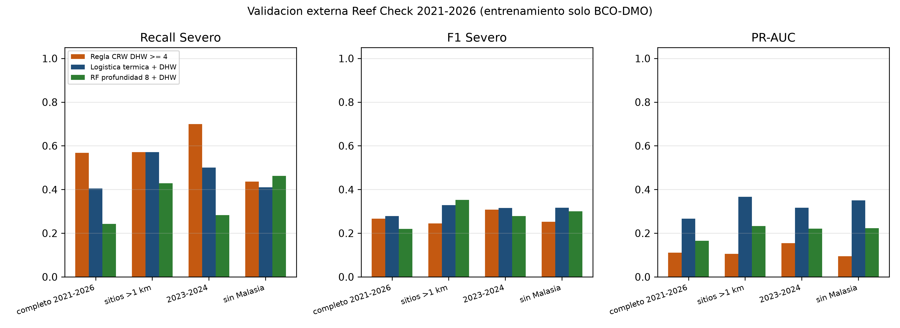

***Figura 6.16.*** *Recall, F1 y PR-AUC de «Severo» sobre Reef Check 2021–2026, con el RF-8, la logística térmica y la regla CRW entrenados solo en BCO-DMO. El holdout es ajeno a Sully et al. (2019); el protocolo sigue siendo Reef Check.*

En el conjunto completo CRW recupera 42 de 74 severos (recall 0,568) a costa de 199 falsos
positivos (precisión 0,174). El bosque acotado recupera 18 (TN 2 409, FP 72, FN 56, TP 18):
el mismo recall 0,243 que en el corte interno 2013–2020. La logística se sitúa en medio
(30 verdaderos positivos) y **gana el PR-AUC** (0,266 frente a 0,111 de CRW y 0,165 del
bosque). El Brier más bajo es el del bosque (0,060): vuelve a calibrar mejor de lo que
detecta. En 2023–2024, con DHW alto, CRW sube el recall a 0,700; el bosque se queda en
0,283. Sobre los 522 sitios a más de 1 km el bosque adelanta a CRW en F1 (0,353 frente a
0,245) y la logística adelanta a ambos en PR-AUC (0,367). Sin Malasia el recall del bosque
sube a 0,462: parte de su conservadurismo en el conjunto completo es composición geográfica,
no solo umbral.

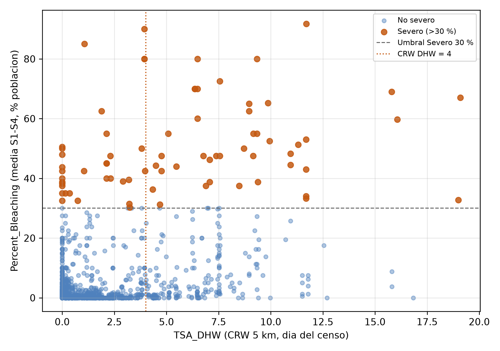

***Figura 6.17.*** *Porcentaje de colonias blanqueadas (media S1–S4 de Bleaching (% Of Population)) frente al DHW de Coral Reef Watch del día del censo, Reef Check 2021–2026. La línea vertical marca el umbral operativo de 4 °C·semana.*

Esto **es** validación externa respecto de Sully et al. (2019) y de BCO-DMO 773466: años
posteriores, fichero distinto, DHW extraído de nuevo. No es otra cosa. El protocolo sigue
siendo Reef Check —el mismo que domina el entrenamiento—. El 79,6 % de los censos
(2 033 de 2 555) revisita un entorno ya visto a 1 km. La tarea sigue siendo concurrente:
DHW del día del censo, no un pronóstico a 1–3 meses. No hay una AMP con umbral de coste
acordado. El agradecimiento a Reef Check Foundation, a Reef Check Malaysia y al Sabah
Biodiversity Centre se consigna en el apartado 7.5.

## 6.8. Síntesis y limitaciones

Los resultados permiten formular nueve conclusiones.

En primer lugar, el ROC-AUC de 0,943 bajo partición aleatoria no es la cifra que debe abrir un
resumen. La métrica operativa es el recall de «Severo» y el PR-AUC (línea base 0,124). En CV por
sitio, la logística + DHW alcanza 0,345 de PR-AUC y el RF de profundidad 8, 0,514.

En segundo lugar, `TSA_DHW` pertenece al modelo principal. Pasa el recall espacial de la logística
de 0,266 a 0,386, y a 0,445 sin contexto del sitio. Completitud 99,65 %; fisiología en el
apartado 4.1.4.

En tercer lugar, la CV por `Reef_ID` mide Reef_Check. La transferencia global se mide por
`Site_ID` y por cuenca. El RF libre cae un 19,5 % por sitio, no un 52 %.

En cuarto lugar, para una temporada futura la regla CRW de 4 °C·semana iguala a la logística en
F1 de clase severa (0,422 frente a 0,416) y deja atrás al bosque (recall 0,243).

En quinto lugar, `Depth_m` no es un efecto de hábitat: es estratificación por programa. El I de
Moran muestra que los índices térmicos están más agrupados que la respuesta; por eso la ablación
de contexto no mata la brecha.

En sexto lugar, el leave-one-program-out no es validación externa. Entrenar en monitoreo
rutinario (1,95 % de severos) y probar en documentación de evento (51,4 %) deja una P media de
0,29–0,38: el modelo arrastra la prevalencia del protocolo. McClanahan (77,4 % observado, 0,40
predicho) es el caso extremo de ese sesgo, no de un océano nuevo.

En séptimo lugar, el F1 0,456 de cuenca nueva no es una cifra de gestor. El 37 % de los puntos
del ocean-out cae dentro del área de aplicabilidad; el Atlántico, el 0 %. Fuera del AOA el
recall sube y el Brier empeora. El DI se pondera con TreeSHAP, no con Gini.

En octavo lugar, el contraste con Sully reproduce el signo del desplazamiento de SST, no la
magnitud ni el Weibull de su Figura 4; Reef Check en este CSV ya duplica su recorte. La
varianza de SST absoluta correlaciona en negativo y débil; la de la anomalía, no. Entrenar
en el Caribe (88 %) más un apéndice polinesio (12 %) deja a CRW por delante del bosque en F1
(0,417 frente a 0,352) y a la logística por delante en PR-AUC, con un AOA del 73 %. El corte
2018–2020 no sustituye 2021–hoy ni al corte 2013–2020: es Reef_Check al 1,9 % de severos, DHW
máximo 3,26, y CRW no dispara. Ese bloqueo sigue siendo interno.

En noveno lugar, el export Belt 2021–2026 **sí es un conjunto fuera de BCO-DMO**. 2 555
encuestas, 74 severos (2,90 %), DHW máximo 19,09. CRW recupera el 56,8 % de los severos
(el 70,0 % en 2023–2024); el bosque, el 24,3 % —el mismo recall que en 2013–2020—; la
logística gana el PR-AUC (0,266). El 79,6 % de los censos está a ≤ 1 km de un registro interno;
sobre los 522 sitios más lejanos el bosque gana el F1 (0,353) y la logística el ranking.
El protocolo sigue siendo Reef Check y la tarea, concurrente. No es una AMP ni una alerta a
1–3 meses.

Entre las limitaciones deben consignarse las siguientes.

**Naturaleza de la variable de respuesta.** El modelo clasifica severidad concurrente con el
muestreo, no un evento futuro. El corte 2013–2020 estima transferencia temporal retrospectiva, no
un pronóstico operativo. El acoplamiento a un pronóstico térmico se esboza en el apartado 7.4.

**Error irreducible biológico.** La variación en la composición simbiótica puede modificar la
tolerancia térmica del holobionte en hasta 1–1,5 °C (Berkelmans y van Oppen, 2006; LaJeunesse
et al., 2018). Dos colonias bajo la misma anomalía pueden responder de forma distinta. Esa
heterogeneidad no está en los predictores satelitales y fija un techo a cualquier modelo de esta
familia. No se cuantifica aquí como fracción de la brecha de transferibilidad —esa descomposición
no se ha calculado—; se consigna como cota cualitativa del error irreducible.

**Heterogeneidad del registro de campo.** Protocolos distintos, momento del censo (Claar y Baum,
2019) y discrepancia satélite–*in situ* (Claar et al., 2019). El apartado 6.7.5 cuantifica el
sesgo de protocolo; no lo elimina.

**Área de aplicabilidad.** El DI de Meyer y Pebesma (2021), ponderado por TreeSHAP, se calculó
sobre el ocean-out. No sustituye el holdout 2021–2026 del apartado 6.7.10, ni un mapa operativo
por arrecife para una AMP concreta.

---

# 7. Conclusiones

## 7.1. Aportaciones técnicas

El presente trabajo ha desarrollado un flujo de aprendizaje automático para clasificar la
severidad del blanqueamiento coralino observado, sobre 34 515 observaciones de cinco cuencas.
De su desarrollo se derivan nueve aportaciones. La novena es la validación externa sobre
Reef Check 2021–2026; las ocho primeras permanecen dentro de Sully et al. (2019). Lo que
sigue sin medirse —una AMP concreta y un pronóstico térmico— se formula en el apartado 7.4.

**Primera: `TSA_DHW` en el modelo principal.** El índice de estrés acumulado deja de ser un
apéndice. Completitud 99,65 %; fisiología en el apartado 4.1.4. En CV por `Site_ID`, el recall de
«Severo» de la logística pasa de 0,266 a 0,386 al incorporarlo, y a 0,445 si además se retiran
profundidad, distancia y cuenca.

**Segunda: la regla de Coral Reef Watch como término de comparación.** DHW ≥ 4 °C·semana detecta
el 33,8 % de los episodios severos (precisión 0,43) sin entrenamiento. En un corte temporal, esa
regla iguala a la logística en F1 de clase severa (0,422 frente a 0,416) y deja atrás al bosque
(recall 0,243). El competidor honesto de un sistema de alerta no es Random Forest.

**Tercera: la unidad experimental correcta y el I de Moran medido.** `Reef_ID` identifica
Reef_Check, no el conjunto. Agrupar por `Site_ID` sobre las 34 515 observaciones cambia la caída
del bosque libre de un 52 % a un 19,5 %. El I de Moran ($k = 8$) cuantifica por qué la ablación
no cerraba la brecha: `TSA_DHW` ($I = 0{,}53$) está más agrupado que el blanqueamiento
($I = 0{,}37$). El *leave-one-ocean-out* del bosque acotado —F1 0,456, recall 0,612— es la cifra
de cuenca nueva **dentro de Sully et al. (2019)**; su soporte se detalla en la séptima
aportación.

**Cuarta: la capacidad del modelo como parte del diagnóstico.** El competidor oficial es un
Random Forest con `max_depth` = 8 (caída de F1 −4,4 % por sitio). El bosque sin tope es una
ablación de capacidad (−19,5 %). Una parte grande del «colapso» era hiperparámetro.

**Quinta: PR-AUC en lugar de ROC-AUC como cifra de apertura.** Con prevalencia 0,124, el PR-AUC
espacial es 0,345 (logística + DHW) y 0,514 (RF profundidad 8). El 0,943 de ROC-AUC describe la
partición aleatoria y no el escenario de aplicación.

**Sexta: el leave-one-program-out cuantifica el sesgo de protocolo, no un océano nuevo.**
Entrenar en monitoreo rutinario (1,95 % de severos) y probar en documentación de evento
(51,4 %) deja una P(Severo) media de 0,29–0,38. McClanahan (77,4 % observado, 0,40 predicho)
mide el arrastre de la prevalencia del etiquetado. El experimento sigue siendo interno a la
síntesis.

**Séptima: el F1 de cuenca nueva no se comunica sin área de aplicabilidad.** El 37 % de los
puntos del ocean-out cae dentro del AOA de Meyer y Pebesma (2021); el Atlántico, el 0 %. Los
pesos del índice de disimilitud son TreeSHAP del propio bosque, no la impureza Gini que el
apartado 4.3.2 declara inconsistente. Un gestor atlántico no puede leer el 0,456 como su error
esperado.

**Octava: el contraste con Sully y las transferencias de dominio no abren un corpus nuevo.**
La media aritmética de SST en episodios de blanqueamiento sube de 28,29 °C (1998–2006) a
28,50 °C (2007–2017); el signo coincide con Sully, la magnitud y el Weibull de su Figura 4
no. En Reef_Check el salto es 27,82 °C a 28,12 °C, todavía distinto de 28,1 / 28,7. La
varianza de SST absoluta correlaciona en negativo y débil; la de la anomalía, no. Entrenar
en el Caribe (88 %) más Polinesia (12 %) y evaluar el resto deja a CRW con F1 0,417 frente
a 0,352 del bosque; la logística gana el PR-AUC (0,335 frente a 0,226 de CRW). El corte
2018–2020 tropieza con Reef_Check al 1,9 % de severos y DHW máximo 3,26: no hay 2021 en
BCO-DMO, y CRW no dispara. El jerárquico bayesiano de Sully no se ha reajustado.

**Novena: el holdout Reef Check 2021–2026, ajeno a BCO-DMO.** 2 555 encuestas, 74 severos
(2,90 %), DHW máximo 19,09 °C·semana. Entrenado solo en las 34 515 internas, CRW recupera
el 56,8 % de los severos (70,0 % en 2023–2024); el bosque, el 24,3 %; la logística gana el
PR-AUC (0,266). El 79,6 % de los censos revisita un entorno a ≤ 1 km; sobre 522 sitios más
lejanos el bosque gana el F1 (0,353). Sigue siendo Reef Check y concurrente.

A juicio del autor, la aportación de mayor solidez no es haber encontrado el mejor algoritmo,
sino haber corregido la unidad experimental, el competidor y la métrica a la luz de lo que los
datos permitían medir, y haber cerrado la laguna de un corpus posterior a 2020 sin fingir un
sistema de alerta.

## 7.2. Implicaciones para la gestión de Áreas Marinas Protegidas

Los resultados no admiten una lectura única. Exigen **tres escenarios**, no dos.

### 7.2.1. Sitio conocido: interpolación dentro de una red

En AMP con estaciones consolidadas, el escenario es interpolar dentro de una red. El bosque
acotado (`max_depth` = 8) con `TSA_DHW` conserva casi todo su F1 al agrupar por sitio (−4,4 %) y
alcanza un PR-AUC de 0,514 sobre «Severo». El Brier fuera de pliegue de P(Severo) es 0,099, mejor
que el de la logística (0,132) y que el de la regla CRW (0,139). Presenta **potencial utilidad
operativa** para priorizar campañas de inspección, no un uso inmediato: no hay prueba piloto en
una AMP concreta, y el umbral de decisión sigue siendo una función de coste del gestor.

### 7.2.2. Cuenca nueva: extrapolación biogeográfica

La CV por `Site_ID` evalúa transferibilidad entre arrecifes **del mismo contexto biogeográfico**.
La generalización a otra cuenca del mismo corpus es el *leave-one-ocean-out*: F1 0,456 y recall
0,612 para el bosque acotado; recall 0,527 para la logística térmica + DHW. Sigue siendo Sully
et al. (2019) con un océano retenido, no un conjunto independiente. Un gestor que lea solo el
recall 0,445 de la logística por sitio estaría leyendo sitios nuevos, no océanos nuevos.
La dispersión entre cuencas (Atlántico 0,417 de recall; Índico 0,662) no es un detalle: cuando el
Atlántico es la cuenca de prueba, el **0 %** de los puntos cae dentro del área de aplicabilidad
de Meyer y Pebesma (2021). El F1 0,456 no es intercambiable entre gestores. Entrenar solo en
Caribe y Pacífico Central y evaluar el Indo-Pacífico central es todavía más adverso para el
bosque en el punto de operación: CRW gana el F1 (0,417 frente a 0,352) aunque el 73 % de los
puntos esté en el AOA. El entrenamiento es un 88 % Caribe; el «Pacífico Central» es un
apéndice polinesio, no una segunda cuenca de peso comparable. La logística, con peor F1,
ordena mejor (PR-AUC 0,335 frente a 0,226 de CRW).

### 7.2.3. Temporada futura: la regla que ya existe

Para el año que aún no ha ocurrido, NOAA no pierde frente a estos clasificadores. En el corte
≤ 2012 / ≥ 2013, DHW ≥ 4 y la logística empatan en F1 de clase severa; el bosque cae a un recall
de 0,243. Si el criterio es no omitir eventos, la logística desplaza el equilibrio (más recall,
más alarmas). Si el criterio es no movilizar recursos en falso, la regla de 4 °C·semana es
preferible. El corte 2018–2020, ya posterior a Sully y entero Reef_Check, deja a CRW sin un
solo acierto: no hay DHW ≥ 4 en esos 49 «Severo» (máximo 3,26). No desplaza al corte
2013–2020 como test térmico; lo complementa como prueba de etiquetado rutinario sin ola de
calor. El holdout Reef Check 2021–2026 (apartado 6.7.10) ya está fuera de BCO-DMO y sí contiene
olas de calor: CRW recupera el 70,0 % de los severos en 2023–2024, el bosque el 28,3 %.
Eso confirma el corte 2013–2020, no lo convierte en un pronóstico a 1–3 meses. El Brier temporal del bosque y el de la regla empatan (0,084) en 2013–2020; el ECE
de NOAA (0,051) es menor. Recalibrar el bosque con isotónica
mejora el ECE (0,024) y deja el recall en 0,037: sin reelegir el umbral, la calibración no es
una alerta. Esa elección de umbral es una función de coste del gestor, no un resultado
estadístico.

### 7.2.4. Recomendación operativa

Reportar tres números, no uno: rendimiento en sitio conocido, en cuenca nueva **dentro del área
de aplicabilidad**, y frente a Coral Reef Watch en una temporada no observada. Añadir, como
salvedad, que un cambio de protocolo (rutinario frente a evento) desplaza la probabilidad más
que un cambio de cuenca. Añadir el holdout 2021–2026 cuando se hable de años posteriores a
Sully: CRW no pierde el recall cuando hay DHW ≥ 4. Comunicar exclusivamente el F1 aleatorio o el ROC-AUC de 0,943
transmitiría la falsa confianza de la que advierten Ploton et al. (2020).

## 7.3. Limitaciones del estudio

La interpretación de las conclusiones precedentes debe atender a las limitaciones siguientes.

**Alcance de la variable de respuesta.** El modelo clasifica la severidad del blanqueamiento
observado de forma concurrente con el muestreo. El corte 2013–2020 estima transferencia a una
temporada no observada en el entrenamiento, no un pronóstico operativo. Toda alerta temprana
sigue condicionada a un pronóstico térmico obtenido por otra vía (apartado 7.4).

**Error irreducible biológico.** El desplazamiento de la comunidad simbionte dominante puede
modificar la tolerancia térmica del holobionte en 1–1,5 °C (Berkelmans y van Oppen, 2006;
LaJeunesse et al., 2018). Dos colonias bajo la misma anomalía pueden responder de forma distinta.
Esa heterogeneidad no está en los predictores satelitales y fija un techo a cualquier modelo de
esta familia (Suggett y Smith, 2020). No se descompone aquí como fracción de la brecha de
transferibilidad: esa cifra no se ha calculado.

**Heterogeneidad del registro.** Protocolos distintos, momento del censo (Claar y Baum, 2019) y
discrepancia satélite–*in situ* (Claar et al., 2019). `Depth_m` hereda esa estratificación. El
leave-one-program-out del apartado 6.7.5 cuantifica el sesgo; no lo corrige. No es validación
externa.

**Área de aplicabilidad.** El DI de Meyer y Pebesma (2021), ponderado por TreeSHAP, se calculó
sobre el ocean-out. El 37 % de los puntos de prueba queda dentro del umbral; el Atlántico, el
0 %. Un mapa operativo por arrecife candidato, con umbral acordado con una AMP, no se ha
producido. El holdout 2021–2026 del apartado 6.7.10 no sustituye ese mapa.

## 7.4. Líneas de trabajo futuras

**El holdout Reef Check 2021–2026 ya está en el flujo principal.** Cierra la laguna de un
corpus ajeno a BCO-DMO 773466 (apartados 5.4.9 y 6.7.10). Lo que sigue abierto no es «otro
CSV del mismo programa», sino una campaña en una AMP concreta —con umbral de coste acordado— y
un segundo protocolo de campo (por ejemplo FRRP o AIMS LTMP) que no sea Reef Check. El 79,6 %
de este holdout revisita entornos a ≤ 1 km; una AMP con estaciones propias mediría otra cosa.

**Acoplamiento a un pronóstico térmico.** El clasificador de este trabajo es concurrente: estima
la severidad dada la SST (y el DHW) del momento del censo. El holdout 2021–2026 también lo es.
Convertirlo en alerta a 1–3 meses no exige otro algoritmo; exige **otra entrada**. La vía
operativa es alimentar el mismo clasificador con un DHW derivado de un pronóstico numérico ya
existente —por ejemplo, CFSv2 o el conjunto NMME de la NOAA—, no reentrenar un modelo «de
futuro» sobre las etiquetas de Sully et al. (2019) ni sobre Reef Check 2021–2026. El corte
2013–2020 y el holdout 2023–2024 miden transferencia a una temporada no vista, no ese
acoplamiento.

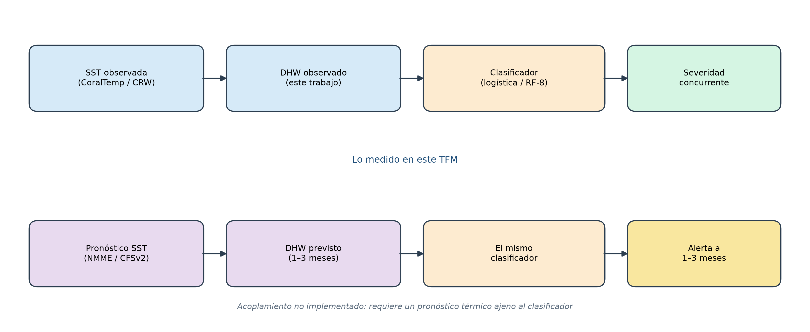

***Figura 7.1.*** *Acoplamiento conceptual entre el clasificador concurrente de este trabajo y un pronóstico térmico a 1–3 meses. La fila inferior no se ha implementado.*

La fila superior es lo que este TFM mide, ahora también sobre 2021–2026. La inferior no se ha
implementado: requiere un producto de pronóstico, una verificación del DHW previsto y un
umbral de alerta acordado con el gestor. Mientras esa fila no exista, «temporada futura»
significa lo que 6.7.2 y 6.7.10 dicen: un corte retrospectivo frente a Coral Reef Watch.

**Contraste con la modelización jerárquica bayesiana.** El apartado 6.7.7 muestra que la media
aritmética de este extracto no recupera las 28,1 °C / 28,7 °C de Sully et al. (2019), ni
siquiera en Reef_Check. Confrontar SHAP con la partición de varianza de *su* modelo, el
Weibull de su Figura 4 sobre el recorte de 9 215 puntos, y el signo de `ClimSST` condicionado
al efecto de sitio, sigue pendiente.

**Regresión para `[0, 1]` con exceso de ceros.** Conservaría la información que la
discretización descarta. Un experimento preliminar (beta inflada en cero u ordinal) cabe en un
apéndice; no es el núcleo que faltaba.

**Desfase temporal explícito.** Construir $P(\text{severidad en } t+\Delta \mid \text{DHW en } t)$
sobre observaciones repetidas del mismo sitio convertiría la tarea en predicción temporal
genuina, distinta del acoplamiento a un pronóstico ajeno. El Belt 2021–2026 contiene
reencuestas (`site_id` repetido) que permitirían ese diseño sin salir de Reef Check.

## 7.5. Agradecimientos

Se agradece a Reef Check Foundation, a sus capítulos y a los voluntarios que han dedicado
incontables horas a recoger estos datos. Esta memoria no habría sido posible sin su
contribución. Los datos del programa tropical 2021–2026 se usan bajo licencia Creative Commons
Reconocimiento–NoComercial 4.0 Internacional (CC BY-NC 4.0). Cita: Reef Check Foundation.
*Reef Check Global Reef Dataset*. data.reefcheck.org. Consultado el 10 de septiembre de 2026.

Una copia de esta memoria se compartirá con Reef Check Foundation, conforme a las condiciones
de uso del export.

Los censos realizados en Sabah (Malasia) se usan reconociendo al Sabah Biodiversity Centre
(SaBC) como autoridad de licencia para la investigación en biodiversidad en Sabah y a Reef
Check Malaysia (RCM) como titular de la licencia de acceso. Los resultados derivados de esos
datos se compartirán con SaBC.

---

# 8. Referencias bibliográficas

Las referencias se presentan conforme a la quinta edición del *Publication Manual* de la American
Psychological Association (APA, 2001), que es el estilo exigido por las normas de presentación
del máster. Se ordenan alfabéticamente por el apellido del primer autor. En la lista, las obras
con siete o más autores consignan los seis primeros seguidos de *et al.* Las citas en el texto
siguen el sistema autor-fecha y no se emplean notas a pie de página para la atribución
bibliográfica. Los identificadores persistentes se indican como localizador electrónico
(«Recuperado de»), de acuerdo con el tratamiento de fuentes en red de dichas normas.

---

Aas, K., Jullum, M. y Løland, A. (2021). Explaining individual predictions when the features are
dependent: More accurate approximations to Shapley values. *Artificial Intelligence, 298*, 103502.
Recuperado de https://doi.org/10.1016/j.artint.2021.103502

Berkelmans, R. y van Oppen, M. J. H. (2006). The role of zooxanthellae in the thermal tolerance
of corals: A «nugget of hope» for coral reefs in an era of climate change. *Proceedings of the
Royal Society B: Biological Sciences, 273*(1599), 2305–2312.
Recuperado de https://doi.org/10.1098/rspb.2006.3567

Breiman, L. (2001). Random forests. *Machine Learning, 45*(1), 5–32.
Recuperado de https://doi.org/10.1023/A:1010933404324

Chawla, N. V., Bowyer, K. W., Hall, L. O. y Kegelmeyer, W. P. (2002). SMOTE: Synthetic minority
over-sampling technique. *Journal of Artificial Intelligence Research, 16*, 321–357.
Recuperado de https://doi.org/10.1613/jair.953

Chen, T. y Guestrin, C. (2016). XGBoost: A scalable tree boosting system. En *Proceedings of the
22nd ACM SIGKDD International Conference on Knowledge Discovery and Data Mining* (pp. 785–794).
Nueva York, NY: Association for Computing Machinery.
Recuperado de https://doi.org/10.1145/2939672.2939785

Claar, D. C. y Baum, J. K. (2019). Timing matters: Survey timing during extended heat stress can
influence perceptions of coral susceptibility to bleaching. *Coral Reefs, 38*(4), 559–565.
Recuperado de https://doi.org/10.1007/s00338-018-01756-7

Claar, D. C., Cobb, K. M. y Baum, J. K. (2019). In situ and remotely sensed temperature
comparisons on a Central Pacific atoll. *Coral Reefs, 38*(6), 1343–1349.
Recuperado de https://doi.org/10.1007/s00338-019-01850-4

Fisher, R., O'Leary, R. A., Low-Choy, S., Mengersen, K., Knowlton, N., Brainard, R. E., et al.
(2015). Species richness on coral reefs and the pursuit of convergent global estimates.
*Current Biology, 25*(4), 500–505. Recuperado de https://doi.org/10.1016/j.cub.2014.12.022

Friedman, J. H. (2001). Greedy function approximation: A gradient boosting machine. *The Annals of
Statistics, 29*(5), 1189–1232. Recuperado de https://doi.org/10.1214/aos/1013203451

Heron, S. F., Maynard, J. A., van Hooidonk, R. y Eakin, C. M. (2016). Warming trends and bleaching
stress of the world's coral reefs 1985–2012. *Scientific Reports, 6*, 38402.
Recuperado de https://doi.org/10.1038/srep38402

Hoegh-Guldberg, O. (1999). Climate change, coral bleaching and the future of the world's coral
reefs. *Marine and Freshwater Research, 50*(8), 839–866.
Recuperado de https://doi.org/10.1071/MF99078

Hughes, T. P., Anderson, K. D., Connolly, S. R., Heron, S. F., Kerry, J. T., Lough, J. M., et al.
(2018). Spatial and temporal patterns of mass bleaching of corals in the Anthropocene. *Science,
359*(6371), 80–83. Recuperado de https://doi.org/10.1126/science.aan8048

Hughes, T. P., Kerry, J. T., Álvarez-Noriega, M., Álvarez-Romero, J. G., Anderson, K. D.,
Baird, A. H., et al. (2017). Global warming and recurrent mass bleaching of corals. *Nature,
543*(7645), 373–377. Recuperado de https://doi.org/10.1038/nature21707

Hurlbert, S. H. (1984). Pseudoreplication and the design of ecological field experiments.
*Ecological Monographs, 54*(2), 187–211. Recuperado de https://doi.org/10.2307/1942661

Ke, G., Meng, Q., Finley, T., Wang, T., Chen, W., Ma, W., et al. (2017). LightGBM: A highly
efficient gradient boosting decision tree. En *Advances in Neural Information Processing Systems
30* (pp. 3146–3154). Red Hook, NY: Curran Associates. Recuperado el 3 de septiembre de 2026, de
https://proceedings.neurips.cc/paper/2017/hash/6449f44a102fde848669bdd9eb6b76fa-Abstract.html

LaJeunesse, T. C., Parkinson, J. E., Gabrielson, P. W., Jeong, H. J., Reimer, J. D.,
Voolstra, C. R., et al. (2018). Systematic revision of Symbiodiniaceae highlights the antiquity
and diversity of coral endosymbionts. *Current Biology, 28*(16), 2570–2580.e6.
Recuperado de https://doi.org/10.1016/j.cub.2018.07.008

Legendre, P. (1993). Spatial autocorrelation: Trouble or new paradigm? *Ecology, 74*(6),
1659–1673. Recuperado de https://doi.org/10.2307/1939924

Lesser, M. P. (2006). Oxidative stress in marine environments: Biochemistry and physiological
ecology. *Annual Review of Physiology, 68*, 253–278.
Recuperado de https://doi.org/10.1146/annurev.physiol.68.040104.110001

Liu, G., Heron, S. F., Eakin, C. M., Muller-Karger, F. E., Vega-Rodriguez, M., Guild, L. S.,
et al. (2014). Reef-scale thermal stress monitoring of coral ecosystems: New 5-km global products
from NOAA Coral Reef Watch. *Remote Sensing, 6*(11), 11579–11606.
Recuperado de https://doi.org/10.3390/rs61111579

Lundberg, S. M., Erion, G., Chen, H., DeGrave, A., Prutkin, J. M., Nair, B., et al. (2020). From
local explanations to global understanding with explainable AI for trees. *Nature Machine
Intelligence, 2*(1), 56–67. Recuperado de https://doi.org/10.1038/s42256-019-0138-9

Lundberg, S. M. y Lee, S.-I. (2017). A unified approach to interpreting model predictions. En
*Advances in Neural Information Processing Systems 30* (pp. 4765–4774). Red Hook, NY: Curran
Associates. Recuperado de https://doi.org/10.48550/arXiv.1705.07874

Meyer, H. y Pebesma, E. (2021). Predicting into unknown space? Estimating the area of
applicability of spatial prediction models. *Methods in Ecology and Evolution, 12*(9), 1620–1633.
Recuperado de https://doi.org/10.1111/2041-210X.13650

Moberg, F. y Folke, C. (1999). Ecological goods and services of coral reef ecosystems.
*Ecological Economics, 29*(2), 215–233. Recuperado de https://doi.org/10.1016/S0921-8009(99)00009-9

Moran, P. A. P. (1950). Notes on continuous stochastic phenomena. *Biometrika, 37*(1–2), 17–23.
Recuperado de https://doi.org/10.2307/2332142

Palumbi, S. R., Barshis, D. J., Traylor-Knowles, N. y Bay, R. A. (2014). Mechanisms of reef coral
resistance to future climate change. *Science, 344*(6186), 895–898.
Recuperado de https://doi.org/10.1126/science.1251336

Pedregosa, F., Varoquaux, G., Gramfort, A., Michel, V., Thirion, B., Grisel, O., et al. (2011).
Scikit-learn: Machine learning in Python. *Journal of Machine Learning Research, 12*, 2825–2830.
Recuperado el 3 de septiembre de 2026, de https://www.jmlr.org/papers/v12/pedregosa11a.html

Ploton, P., Mortier, F., Réjou-Méchain, M., Barbier, N., Picard, N., Rossi, V., et al. (2020).
Spatial validation reveals poor predictive performance of large-scale ecological mapping models.
*Nature Communications, 11*, 4540. Recuperado de https://doi.org/10.1038/s41467-020-18321-y

Reef Check Foundation. (2026). *Reef Check Global Reef Dataset* [conjunto de datos].
Recuperado el 10 de septiembre de 2026, de https://data.reefcheck.org

Roberts, D. R., Bahn, V., Ciuti, S., Boyce, M. S., Elith, J., Guillera-Arroita, G., et al. (2017).
Cross-validation strategies for data with temporal, spatial, hierarchical, or phylogenetic
structure. *Ecography, 40*(8), 913–929. Recuperado de https://doi.org/10.1111/ecog.02881

Saito, T. y Rehmsmeier, M. (2015). The precision-recall plot is more informative than the ROC plot
when evaluating binary classifiers on imbalanced datasets. *PLOS ONE, 10*(3), e0118432.
Recuperado de https://doi.org/10.1371/journal.pone.0118432

Shapley, L. S. (1953). A value for n-person games. En H. W. Kuhn y A. W. Tucker (Eds.),
*Contributions to the theory of games* (Vol. II, pp. 307–317). Princeton, NJ: Princeton University
Press. Recuperado de https://doi.org/10.1515/9781400881970-018

Skirving, W., Marsh, B., De La Cour, J., Liu, G., Harris, A., Maturi, E., et al. (2020). CoralTemp
and the Coral Reef Watch coral bleaching heat stress product suite version 3.1. *Remote Sensing,
12*(23), 3856. Recuperado de https://doi.org/10.3390/rs12233856

Suggett, D. J. y Smith, D. J. (2020). Coral bleaching patterns are the outcome of complex
biological and environmental networking. *Global Change Biology, 26*(1), 68–79.
Recuperado de https://doi.org/10.1111/gcb.14871

Sully, S., Burkepile, D. E., Donovan, M. K., Hodgson, G. y van Woesik, R. (2019). A global
analysis of coral bleaching over the past two decades. *Nature Communications, 10*, 1264.
Recuperado de https://doi.org/10.1038/s41467-019-09238-2

Tobler, W. R. (1970). A computer movie simulating urban growth in the Detroit region. *Economic
Geography, 46*, 234–240. Recuperado de https://doi.org/10.2307/143141

Valavi, R., Elith, J., Lahoz-Monfort, J. J. y Guillera-Arroita, G. (2019). blockCV: An R package
for generating spatially or environmentally separated folds for k-fold cross-validation of species
distribution models. *Methods in Ecology and Evolution, 10*(2), 225–232.
Recuperado de https://doi.org/10.1111/2041-210X.13107

van Woesik, R. y Kratochwill, C. (2022). A global coral-bleaching database, 1980–2020.
*Scientific Data, 9*, 20. Recuperado de https://doi.org/10.1038/s41597-022-01121-y

Weis, V. M. (2008). Cellular mechanisms of Cnidarian bleaching: Stress causes the collapse of
symbiosis. *Journal of Experimental Biology, 211*(19), 3059–3066.
Recuperado de https://doi.org/10.1242/jeb.009597

Wirth, R. y Hipp, J. (2000). CRISP-DM: Towards a standard process model for data mining. En
*Proceedings of the 4th International Conference on the Practical Applications of Knowledge
Discovery and Data Mining* (pp. 29–39). Blackpool, Reino Unido: Practical Application Company.

---

## Nota sobre la procedencia del conjunto de datos

El conjunto de datos analizado en este trabajo, *Global Bleaching and Environmental Data*, es el
dataset de van Woesik y Kratochwill (2022), registro BCO-DMO 773466. Incorpora la síntesis de
Sully et al. (2019), que compila observaciones de campo de blanqueamiento coralino en 3 351
emplazamientos de 81 países entre 1998 y 2017, y amplía el recorte hasta 1980–2020. Las variables
oceanográficas asociadas a cada muestreo derivan de los productos de estrés térmico del programa
Coral Reef Watch de la NOAA, cuya metodología se describe en Liu et al. (2014). La distribución de
los datos se realiza a través de la infraestructura BCO-DMO (*Biological and Chemical Oceanography
Data Management Office*).

Esta procedencia reviste especial relevancia interpretativa. Los índices `SSTA`, `TSA`,
`TSA_DHW` y `ClimSST` empleados como predictores no constituyen mediciones independientes, sino
productos derivados de un mismo campo de temperatura superficial mediante los algoritmos
documentados en Liu et al. (2014) y Skirving et al. (2020), circunstancia que explica la
colinealidad observada entre ellos y que se discute en el capítulo 6. A ello se añade que dichos
productos estiman la temperatura de la capa superficial
sobre celdas de 5 km, magnitud muy superior a la escala del hábitat: Claar et al. (2019)
cuantificaron las discrepancias resultantes frente a registros *in situ*.

El holdout de validación externa (apartados 5.4.9 y 6.7.10) procede de un export Belt de Reef
Check Foundation para 2021–2026, licencia CC BY-NC 4.0, consultado el 10 de septiembre de 2026.
No forma parte de BCO-DMO 773466. Los índices térmicos de ese holdout se extrajeron de nuevo
del producto operativo diario de 5 km de Coral Reef Watch (Skirving et al., 2020): misma familia
de productos, no el NetCDF embebido en el extracto BCO-DMO. Las
condiciones de uso, el agradecimiento a Reef Check Foundation y los términos adicionales de
Sabah (SaBC y Reef Check Malaysia) se recogen en el apartado 7.5.

## Tabla resumen de referencias y su función en la memoria

Las referencias se agrupan a continuación según el bloque argumental que sostienen, con indicación
de los capítulos en que se emplean.

### Biología del blanqueamiento y ecología coralina

| Referencia | Capítulo | Función en la argumentación |
|---|---|---|
| Fisher et al. (2015) | 2 | Estimación reconciliada de la riqueza específica arrecifal |
| Moberg y Folke (1999) | 2 | Tipología de bienes y servicios ecosistémicos del arrecife |
| Hoegh-Guldberg (1999) | 2, 4, 5 | Base celular del blanqueamiento: fotoinhibición, umbral térmico y estrés oxidativo |
| Lesser (2006) | 2 | Bioquímica del estrés oxidativo y sistemas antioxidantes en organismos marinos |
| Weis (2008) | 2 | Mecanismos celulares del colapso de la simbiosis: exocitosis, apoptosis y autofagia |
| LaJeunesse et al. (2018) | 2, 6, 7 | Sistemática actual de los simbiontes: familia Symbiodiniaceae |
| Berkelmans y van Oppen (2006) | 2, 6, 7 | Termotolerancia mediada por el tipo de simbionte y su magnitud en grados |
| Palumbi et al. (2014) | 2 | Descomposición de la tolerancia térmica en adaptación genética y aclimatación reversible |
| Hughes et al. (2017) | 2 | Límites de la aclimatación: la exposición previa no atenuó el evento de 2016 |
| Hughes et al. (2018) | 2, 6, 7 | Frecuencia creciente de los eventos de blanqueamiento masivo |
| Suggett y Smith (2020) | 2, 7 | Techo de predictibilidad derivado de la naturaleza reticular del fenómeno |

### Teledetección y caracterización del estrés térmico

| Referencia | Capítulo | Función en la argumentación |
|---|---|---|
| Liu et al. (2014) | 2, 4, 5, 6, 8 | Formulación de los productos satelitales de estrés térmico de la NOAA |
| Skirving et al. (2020) | 4, 5, 6, 7 | Versión 3.1 de los productos CRW y definición operativa del DHW |
| Heron et al. (2016) | 2 | Productos de historia térmica y tendencia de calentamiento por arrecife |
| Claar et al. (2019) | 2, 7, 8 | Discrepancia sistemática entre temperatura satelital y registro *in situ* |
| Claar y Baum (2019) | 2, 7 | Sesgo introducido por el momento del censo en la severidad registrada |
| Sully et al. (2019) | 2, 4, 5, 6, 8 | Artículo de la síntesis de campo 1998–2017 y efecto protector de la climatología histórica |
| van Woesik y Kratochwill (2022) | 1, 2, 5, 8 | Dataset BCO-DMO 773466 usado como conjunto interno |
| Reef Check Foundation (2026) | 5, 6, 7, 8 | Export Belt 2021–2026 usado como holdout de validación externa |

### Algoritmos de aprendizaje automático

| Referencia | Capítulo | Función en la argumentación |
|---|---|---|
| Breiman (2001) | 2, 4, 5 | Formulación de Random Forest |
| Friedman (2001) | 4 | Marco general de la potenciación del gradiente como descenso funcional |
| Chen y Guestrin (2016) | 2, 4, 5 | Formulación de XGBoost |
| Ke et al. (2017) | 2, 4 | Formulación de LightGBM: crecimiento por hojas, GOSS y EFB |
| Chawla et al. (2002) | 5 | Remuestreo sintético como alternativa descartada frente a la reponderación |
| Pedregosa et al. (2011) | 5 | Implementación del preprocesado, los modelos y los esquemas de validación |
| Wirth y Hipp (2000) | 5 | Modelo de proceso CRISP-DM y su carácter iterativo |

### Interpretabilidad

| Referencia | Capítulo | Función en la argumentación |
|---|---|---|
| Shapley (1953) | 4 | Origen axiomático del reparto único en juegos cooperativos |
| Lundberg y Lee (2017) | 4, 6 | Marco de atribución aditiva y unificación de métodos previos |
| Lundberg et al. (2020) | 4 | TreeSHAP e inconsistencia de las importancias nativas de los árboles |
| Aas et al. (2021) | 4, 6 | Sesgo de la aproximación marginal con predictores dependientes |

### Dependencia espacial y diseño de la validación

| Referencia | Capítulo | Función en la argumentación |
|---|---|---|
| Tobler (1970) | 4 | Primera ley de la geografía |
| Moran (1950) | 4 | Índice de autocorrelación espacial |
| Legendre (1993) | 4, 6 | Distinción entre dependencia espacial inducida y autocorrelación verdadera |
| Hurlbert (1984) | 4, 5, 6 | Concepto de pseudorreplicación en diseño experimental ecológico |
| Roberts et al. (2017) | 2, 4, 5, 6, 7 | Estrategias de validación con estructura espacial y sobreajuste con predictores no causales |
| Ploton et al. (2020) | 2, 4, 5, 6, 7 | Sobreestimación del rendimiento en modelos ecológicos bajo validación no espacial |
| Valavi et al. (2019) | 4, 5, 7 | Tipología de estrategias de bloqueo espacial y ambiental |
| Meyer y Pebesma (2021) | 4, 5, 6, 7 | Área de aplicabilidad: índice de disimilitud sobre el ocean-out |

### Evaluación

| Referencia | Capítulo | Función en la argumentación |
|---|---|---|
| Saito y Rehmsmeier (2015) | 4 | Optimismo de la curva ROC frente a la de precisión-exhaustividad en datos desbalanceados |
